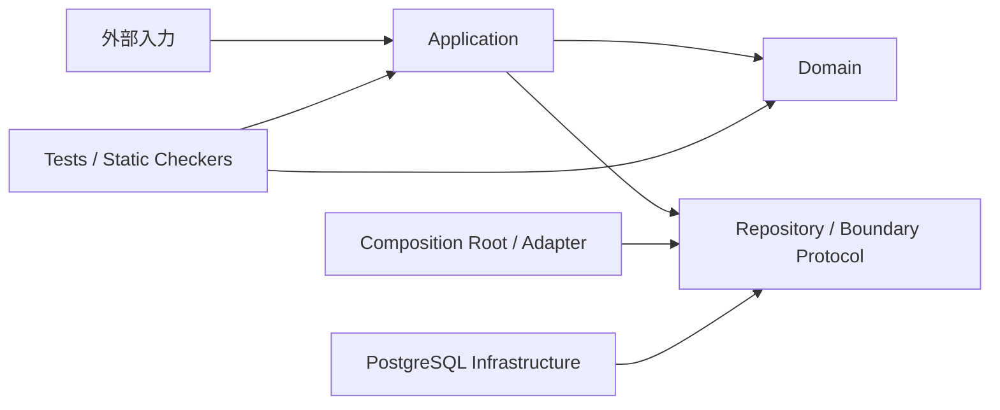

# PharmacyDomain 設計概要

この文書は、コードだけでは読み取りにくい設計の意味を扱います。
クラス・フィールド・メソッドの現在形は `app/`、実行可能な保証は `tests/` と `tools/`、
実装手順と品質ゲートは [AGENTS.md](../AGENTS.md) が正典です。

## プロジェクト目的

このプロジェクトの上位要求は一つです。

> 薬局ドメインを、技術基盤から独立したドメインモデルとして再現する。

この目的を機能別の要求一覧・要件一覧へ形式的に分解しません。具体的な業務規則は、
責務を持つコードと、その振る舞いを固定するテストで管理します。

### 再現の判定基準

- 正当な業務状態をモデルで表現できる
- 不正な業務状態を、責務を持つ境界で拒否できる
- 重要な規則を一次資料または設計判断へ遡れる
- 規則が型、構造、テスト、静的チェッカのいずれかで保護されている
- 未再現の領域を実装済みとして扱わず、未解決事項として明示する

## システム概要

薬局・調剤業務を、オニオンアーキテクチャとDDDでモデル化するPythonプロジェクトです。
本システムの中心（コアドメイン）は**「電子薬歴（服薬指導・薬学的管理指導）」および付随する調剤事実記録・患者医療プロファイル**です。
レセコン（医事会計・レセプト請求システム）の排他的な責務である調剤報酬点数算定、窓口一部負担金計算、公費上限額管理票記帳、レセプト作成はドメイン外の関心事とし、レセコンから連携される客観的調剤事実を受容して記録を完結させます（ADR-49, ADR-58）。

Domain層は外部技術に依存せず、Application層が認可、入力変換、境界参照、保存順序を調整します。

2026-09-20時点では、Identityを含む12コンテキストのDomainモデルと全コンテキストのPostgreSQL
Repositoryを実装済みです。ClaimはDomain層のみです。HTTP境界は全コンテキストの
ユースケースを公開済みで、外部IdPのJWTを検証する認証基盤も接続済みです。薬価基準・
HOTコード等の実データ取り込みは未実装です。

## ドメイン分析：電子薬歴システムを中心とする責務境界

調剤薬局における実務は、**「レセコン（医事会計・レセプト請求システム）」**と**「電子薬歴・調剤システム（本ドメインのコア）」**の2つの独立したシステム領域に大別されます。本プロジェクトは後者をコアドメインとしてモデル化しており、レセコンの責務をドメイン内に混入させないための厳格な境界を定義しています。

### 1. 責務分担表

| 責務領域 | レセコン（外部システム） | 本システム（電子薬歴・調剤ドメイン） |
| :--- | :--- | :--- |
| **処方箋受付** | 処方箋受領・入力、保険証/受給者証確認、負担割合判定 | 受付事実の参照、外部連携データ（NSIPS等）の受容 |
| **会計・公費管理** | 窓口一部負担金計算、月額自己負担上限額管理票の累積計算・記帳 | 金銭会計・上限額累積計算は扱わない（公費区分等の事実参照のみ） |
| **報酬・レセプト請求** | 調剤基本料・各種加算の点数算定判定、レセプト（診療報酬明細書）作成・オンライン請求 | 報酬算定要件・請求判定ロジックは扱わない（関知しない） |
| **調剤作業・調製** | 計量混合加算・一包化加算の算定判定、調剤機器（分包機等）への指示連携 | 1回ごとの調剤作業・変更調剤（代替/減数/調製法）・調剤鑑査の事実記録 |
| **処方監査・疑義照会** | 基本的な処方形式チェック | 薬学的処方監査（相互作用、禁忌、用量）、疑義照会履歴（薬剤師法第23条）と原本変更制限の管理 |
| **服薬指導・薬歴** | 定型指導文の簡易出力 | 薬剤師法第25条の2に基づく服薬指導、SOAP記録、残薬確認、手帳確認、指導後フォローアップ |
| **患者プロファイル** | 基本台帳（氏名、生年月日、住所、連絡先） | 確定薬歴から決定的に再構築される頭書き投影（アレルギー、副作用、既往歴、生活背景等） |
| **医療機関連携** | レセプト記載事項の連携 | 処方医への服薬情報等提供（トレーシングレポート）および医師フィードバック記録 |
| **法的文書** | 保険調剤録（薬担規則第10条）の保険項目保持 | 薬剤師法第28条に基づく調剤録記載事項の充足検証、薬歴としての3年保存 |

### 2. コンテキストマップと位置づけ

* **コアドメイン（Core Domain）**:
  * `MedicationHistory`: 服薬指導記録（SOAP、残薬、手帳）、調剤後フォローアップ、トレーシングレポート、頭書き投影
  * `Dispensing`: 1回ごとの調剤作業、変更調剤（代替・数量調整・調製方法）、調剤鑑査、処方箋整合性
  * `Prescription`: 処方箋原本、医師疑義照会履歴、後発品変更不可制限
  * `Patient`: 患者の同一性、基本情報、ライフサイクル（有効/無効/名寄せ統合）
* **支援・汎用サブドメイン（Supporting / Generic Subdomain）**:
  * `Corporate` / `Store` / `Staff`: 法人・店舗ライフサイクル、開局時間、管理薬剤師配置・専任、スタッフ資格・所属履歴
  * `Identity`: 本人・個人アカウント・法人アクセス権・招待
  * `MedicineCatalog`: 版付き医薬品参照マスタ
* **外部境界・上流システム（Upstream / External System）**:
  * **レセコン（Receipt Computer）**:
    * 窓口受付および処方入力が完了した段階で、NSIPS（新調剤システム情報交換仕様）等を介して調剤・処方データを連携する。
    * 本システムは「1回の受付NSIPS単位」で調剤セッション（`DispensingProcess`）を開始し、薬歴（`MedicationHistoryRecord`）を記録・完結させる（ADR-49, ADR-57）。
    * `Coverage` / `Reception` / `Claim` は、将来のレセコン連携や請求資格スナップショットの保持のための境界であり、点数計算エンジンや自己負担金計算を自前で実装するものではない。

## コンテキスト

| コンテキスト | 所有する事実 |
| :--- | :--- |
| Corporate | 法人の同一性、名称、状態 |
| Store | 法人配下の店舗、保険薬局情報、開局時間、管理薬剤師在任・専任 |
| Staff | スタッフ、資格、店舗所属履歴 |
| Identity | 本人、個人アカウント、法人アクセス権、招待 |
| Patient | 患者、外部患者ID、ライフサイクル、名寄せ統合 |
| Coverage | 患者資格の台帳と有効期間 |
| Reception | 受付時に選択した資格の履歴 |
| Claim | 請求へ固定する資格スナップショット |
| Prescription | 処方箋原本と疑義照会 |
| Dispensing | 1回ごとの調剤、変更調剤、鑑査 |
| MedicationHistory | 服薬指導記録と患者医療プロファイルの投影 |
| MedicineCatalog | 法人に属さない、時点付き医薬品参照マスタ |

認証・認可はApplication層の `access_control`、コンテキスト間の実アダプタは
`app/application/composition/` に置きます。集約間は原則としてIDで参照します。

## 重要な設計判断

- 信頼済みの `ActorContext` と操作対象の `corporate_id` を分離し、HTTP入力からActorを作らない
- 他法人・未存在は同じNotFound系例外へ畳み、対象の存在を隠す
- 集約は不変オブジェクトとし、状態変更は新しいインスタンスを返す
- 複数集約の整合性はDomain Service、存在・認可・外部参照はApplication Boundaryが担う
- 日付・時刻は暗黙の「現在」を使わず、適用日または注入したClockを使う
- Coverageの選択元IDと請求値は、同じ枠の中で分離不能に保持する
- 医薬品マスタは非テナントの版付き参照データとし、過去判定は対象時点の版を引く
- 用量は `float` ではなく `Decimal` を使う
- 判定不能な医薬品規制区分は「非該当」にせず、fail-closedで拒否する
- 患者医療プロファイルは薬歴から再構築できる投影とし、独立した真実を持たせない（誤登録取消や疾患状態変更も薬歴の確定時差分として投影する）
- 薬歴を中心に据え、外部から届く受付NSIPS単位で記録を完結させる（分割・リフィルの複数回またぎ追跡は特別実装しない）
- 電子薬歴（服薬指導・薬学的管理指導）をコアドメインとし、調剤報酬算定・会計金銭・公費上限額管理票記帳・レセプト作成はレセコンの排他的な責務として除外する（ADR-58）
- 患者集約は `ACTIVE` / `INACTIVE` / `MERGED` のライフサイクルを持ち、名寄せは過去の事実を改変しない非破壊的マージ（統合元を凍結）とする（ADR-56）
- 店舗のライフサイクル（開局・休止・閉局）と閉局取消（特権訂正操作）を管理し、管理薬剤師の配置義務（在任日判定）および専任義務（自然人単位の排他制約）を店舗状態と独立して管理する（ADR-42, ADR-43）

背景と判断履歴は [設計判断](decisions.md) を参照してください。

## 文書

| 文書 | 扱う内容 |
| :--- | :--- |
| [Domain層](ddd/domain.md) | コンテキスト境界とDomain設計の原則 |
| [Application層](ddd/application.md) | ユースケース、認可、Boundary、保存順序 |
| [Corporate](ddd/corporate.md) | 法人の同一性、ライフサイクル、テナント認可境界 |
| [Store](ddd/store.md) | 店舗ライフサイクル、開局時間、管理薬剤師の配置・専任 |
| [Patient](ddd/patient.md) | 患者ライフサイクル、非破壊的名寄せ、外部患者ID |
| [Prescription](ddd/prescription.md) | 処方箋原本・疑義照会・外部規格 |
| [Dispensing](ddd/dispensing.md) | 調剤セッション・変更調剤・鑑査 |
| [MedicationHistory](ddd/medication_history.md) | 薬歴・頭書き投影・法的根拠 |
| [一次資料](references/README.md) | 参照した法令・公的規格とローカル資料 |
| [設計判断](decisions.md) | ADRと判断の変更履歴 |

## 未解決事項

- 全コンテキストの本番Repository、DB制約、楽観ロック、テナント境界は実装済み。実PostgreSQL結合テストで確認済み
- Claimは到達可能なUseCaseが無いため、HTTPルートも持たない（Domain層のみ）
- 外部IdPのJWTから `ActorContext` を作る認証基盤は実装済み。`OIDC_*` 未設定なら既定実装が常に401を返す。ログイン画面・リフレッシュ・失効（ログアウト）と、実IdP製品への接続確認は残る
- 薬価基準・HOTコード等からMedicineCatalogへ取り込むInfrastructureがない
- Prescriptionの公費枠とCoverage台帳を接続するComposition Adapterは実装済み
- Dispensing完了とPrescription更新、MedicationHistory確定と頭書き保存は PostgreSQL の同一 Unit of Work で一体化した。HTTPルートへも接続済みで、HTTP経由でも1トランザクションであること（失敗時に両集約が巻き戻ること）を実PostgreSQLの結合テストで確認済み
- リフィル処方箋と分割調剤の併用可否には原典確認が残る（受付NSIPS単位で完結させるため、複数回またぎ追跡は一旦保留）
- 調剤録の記載事項充足検証は実装済み（保険調剤録の保険項目は対象外）。法定3年保存の運用がない

各項目の文脈は対応するコンテキスト文書に記載します。

## 実装と検証

- 現在の実装: `app/domain/`、`app/application/`、`app/infrastructure/postgres/`、`migrations/`
- 実行可能な契約: `tests/domain/`、`tests/application/`、`tests/contracts/`
- アーキテクチャ検査: `tools/check_imports.py`、`tools/check_lcom.py`、`tools/check_fake_conformance.py`
- コマンドとCI: [AGENTS.md](../AGENTS.md)、`.github/workflows/quality-gate.yml`

現在の振る舞いを調べるときは、対象コードと対応テストを直接確認します。
