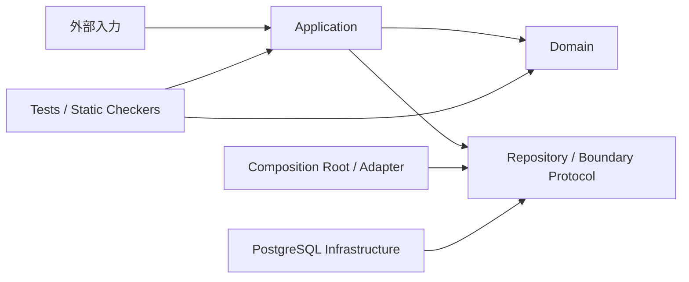

# PharmacyDomain 設計概要

この文書は、コードだけでは読み取りにくい設計の意味を扱います。
クラス・フィールド・メソッドの現在形は `app/`、実行可能な保証は `tests/` と `tools/`、
実装手順と品質ゲートは [AGENTS.md](../AGENTS.md) が正典です。

## プロジェクト目的

このプロジェクトの上位要求は一つです。

> 薬局ドメインを、技術基盤から独立したドメインモデルとして再現する。

この目的を機能別の要求一覧・要件一覧へ形式的に分解しません。具体的な業務規則は、
責務を持つコードと、その振る舞いを固定するテストで管理します。

### 再現の判定基準

- 正当な業務状態をモデルで表現できる
- 不正な業務状態を、責務を持つ境界で拒否できる
- 重要な規則を一次資料または設計判断へ遡れる
- 規則が型、構造、テスト、静的チェッカのいずれかで保護されている
- 未再現の領域を実装済みとして扱わず、未解決事項として明示する

## システム概要

薬局・調剤業務を、オニオンアーキテクチャとDDDでモデル化するPythonプロジェクトです。
Domain層は外部技術に依存せず、Application層が認可、入力変換、境界参照、保存順序を調整します。

2026-08-30時点では、11コンテキストのDomainモデルと全コンテキストのPostgreSQL
Repositoryを実装済みです。ClaimはDomain層のみです。業務HTTPルートと認証基盤、
薬価基準・HOTコード等の実データ取り込みは未実装です。

## コンテキスト

| コンテキスト | 所有する事実 |
| :--- | :--- |
| Corporate | 法人の同一性、名称、状態 |
| Store | 法人配下の店舗と保険薬局情報 |
| Staff | スタッフ、資格、店舗所属履歴 |
| Patient | 患者と外部患者ID |
| Coverage | 患者資格の台帳と有効期間 |
| Reception | 受付時に選択した資格の履歴 |
| Claim | 請求へ固定する資格スナップショット |
| Prescription | 処方箋原本と疑義照会 |
| Dispensing | 1回ごとの調剤、変更調剤、鑑査 |
| MedicationHistory | 服薬指導記録と患者医療プロファイルの投影 |
| MedicineCatalog | 法人に属さない、時点付き医薬品参照マスタ |

認証・認可はApplication層の `access_control`、コンテキスト間の実アダプタは
`app/application/composition/` に置きます。集約間は原則としてIDで参照します。

## 重要な設計判断

- 信頼済みの `ActorContext` と操作対象の `corporate_id` を分離し、HTTP入力からActorを作らない
- 他法人・未存在は同じNotFound系例外へ畳み、対象の存在を隠す
- 集約は不変オブジェクトとし、状態変更は新しいインスタンスを返す
- 複数集約の整合性はDomain Service、存在・認可・外部参照はApplication Boundaryが担う
- 日付・時刻は暗黙の「現在」を使わず、適用日または注入したClockを使う
- Coverageの選択元IDと請求値は、同じ枠の中で分離不能に保持する
- 医薬品マスタは非テナントの版付き参照データとし、過去判定は対象時点の版を引く
- 用量は `float` ではなく `Decimal` を使う
- 判定不能な医薬品規制区分は「非該当」にせず、fail-closedで拒否する
- 患者医療プロファイルは薬歴から再構築できる投影とし、独立した真実を持たせない

背景と判断履歴は [設計判断](decisions.md) を参照してください。

## 文書

| 文書 | 扱う内容 |
| :--- | :--- |
| [Domain層](ddd/domain.md) | コンテキスト境界とDomain設計の原則 |
| [Application層](ddd/application.md) | ユースケース、認可、Boundary、保存順序 |
| [Prescription](ddd/prescription.md) | 処方箋原本・疑義照会・外部規格 |
| [Dispensing](ddd/dispensing.md) | 調剤セッション・変更調剤・鑑査 |
| [MedicationHistory](ddd/medication_history.md) | 薬歴・頭書き投影・法的根拠 |
| [一次資料](references/README.md) | 参照した法令・公的規格とローカル資料 |
| [設計判断](decisions.md) | ADRと判断の変更履歴 |

## 未解決事項

- 全コンテキストの本番Repository、DB制約、楽観ロック、テナント境界は実装済み。実PostgreSQL結合テストで確認済み
- 業務ユースケースを接続するHTTPルートとComposition Rootがない
- 薬価基準・HOTコード等からMedicineCatalogへ取り込むInfrastructureがない
- Prescriptionの公費枠とCoverage台帳を接続するComposition Adapterは実装済み
- Dispensing完了とPrescription更新、MedicationHistory確定と頭書き保存は PostgreSQL の同一 Unit of Work で一体化した。HTTPルートへの接続は未実装
- リフィル処方箋と分割調剤の併用可否には原典確認が残る
- MedicationHistoryを法定調剤録の代替にするための項目充足検証と、3年保存の運用がない

各項目の文脈は対応するコンテキスト文書に記載します。

## 実装と検証

- 現在の実装: `app/domain/`、`app/application/`、`app/infrastructure/postgres/`、`migrations/`
- 実行可能な契約: `tests/domain/`、`tests/application/`、`tests/contracts/`
- アーキテクチャ検査: `tools/check_imports.py`、`tools/check_lcom.py`、`tools/check_fake_conformance.py`
- コマンドとCI: [AGENTS.md](../AGENTS.md)、`.github/workflows/quality-gate.yml`

現在の振る舞いを調べるときは、対象コードと対応テストを直接確認します。
