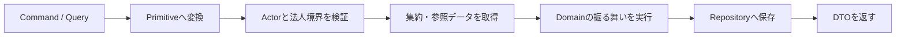

# Application層の設計概要

Application層は、入力をドメインの型へ変換し、認可、参照、状態変更、保存の順序を組み立てます。
業務上の不変条件はDomain層へ委譲し、FastAPIや具体的なDB実装には依存しません。

## ユースケースの流れ

1ユースケースを1クラスとし、入力DTOを同じモジュールに置きます。
Domain Entityは外部へ直接返さず、用途に合うDTOへ変換します。
集約の状態変更メソッドが返す新しいインスタンスを必ず保存します。

## 認証・認可とテナント境界

- 認証基盤が生成した信頼済み `ActorContext` を依存として受け取る
- CommandやQueryの `corporate_id` は操作対象であり、Actorの身元として使わない
- ベンダーシステム管理者は全法人、法人管理者は自法人だけを操作できる
- 通常操作では法人の存在と有効状態を `CorporateAccessBoundary` で確認する
- 他法人データと未存在データは同じNotFound系例外へ畳み、存在を開示しない

認可に必要なActor、記録者、記録時刻を未信頼な入力に含めません。
記録者は認可に使ったActor、記録時刻は注入した `Clock` から得ます。

## 参照Boundary

Applicationコンテキストは、他コンテキストのApplication実装やRepositoryを直接importしません。
必要な情報だけを表すProtocolへ依存し、実アダプタを `app/application/composition/` に置きます。

代表例は次のとおりです。

- Store / Staff / Patient / Coverage / Receptionから法人状態を確認する `CorporateAccessBoundary`
- Coverageから患者IDの存在だけを確認する患者参照Boundary
- Receptionから店舗、患者、資格選択を参照するBoundary
- Coverage台帳からClaim用の選択値を組み立てるComposition Adapter
- MedicineCatalogから対象時点の規制区分を導出するComposition Adapter

Boundaryの例外契約には、他法人と未存在をどのNotFound例外へ畳み込むかを明記します。

## 入力と時間

- 文字列は早い段階でDomain Primitiveへ変換する
- 任意項目の空文字・空白は共有の `to_optional_text()` で `None` に正規化する
- 用量は文字列から `Decimal` へ変換し、`float` を経由させない
- Domain/Applicationで `date.today()` やnaiveな `datetime.now()` を使わない
- 業務日をCommandで明示し、現在時刻が必要な場合だけ `Clock` を注入する

## 保存と回復

Repositoryの `save()` が一意性や期間競合の最終防衛です。
複数集約の保存を伴う処理にはまだUnit of Workがありません。

- 調剤完了と処方箋状態更新は同一トランザクションではない
- 薬歴確定では真の記録を先に保存し、投影の頭書きは後から再構築できるようにする

後者は回復可能ですが、原子性の代替ではありません。本番永続化を追加するときに
トランザクション境界と再試行方針を決める必要があります。

## 現在の外側

業務ユースケースを接続するHTTPルート、具体的Repository、Composition Rootは未実装です。
したがって、Domain/Applicationテストが通ることと、本番で認証・DB競合・トランザクションが
安全であることは分けて評価します。

現在のクラスとDTOは `app/application/`、振る舞いの保証は `tests/application/`、
依存規則は `tools/check_imports.py` を確認してください。
