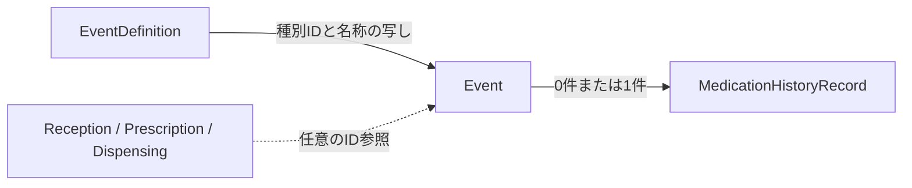

# CareEventコンテキスト概要

CareEventは、患者に対して行った業務機会の発生と種別を記録します。処方箋受付、服薬期間中の
フォローアップ、電話フォローアップ、来局相談、在宅訪問、オンライン服薬指導の標準種別と、
法人独自の種別を扱います。SOAP等の薬剤師記載はこのコンテキストに含めず、Eventに結び付く
`MedicationHistoryRecord` が所有します。

## 集約と関係

- `EventDefinition` は標準種別または法人独自種別を表します。標準種別はmigrationで登録され、改名・無効化できません。法人独自種別は法人管理権限で作成・改名・無効化できます。
- `Event` は患者、法人、実施店舗、種別、発生日時、登録日時を持ちます。種別名はEvent作成時の写しを保持し、後から定義名を変えても過去の表示は変わりません。
- 受付、処方箋、調剤、関連元EventのID参照は業務上存在する場合だけ持ちます。一般相談等に架空の処方・調剤IDを要求しません。
- `MedicationHistoryRecord.event_id` がEventを参照します。Event側は薬歴集約を保持せず、薬歴はなくてもEventだけを登録できます。同じEventに薬歴を複数作ることはRepositoryとDBの一意制約で拒否します。

## 日時と既存記録

新規Eventにはタイムゾーン付きの `occurred_at` を要求します。`created_at` は注入Clockによる登録
日時です。薬歴の指導日時 `counseled_at` は別の事実であり、Eventの発生日時から自動設定・置換
しません。NSIPSの受信時刻も業務の実施日時として使いません。

既存薬歴の移行では、元データから発生日時が確定できないEventを時刻不明として保持します。
旧子フォローアップに独立した確定監査値がない場合は、対応する薬歴を `LEGACY_RECORDED`
として通常の確定済み記録と区別します。元payloadと旧ID対応は読取専用アーカイブに保存します。
時刻不明Eventを含む下書きの確定時は、利用者が確認した発生日時を必須とし、一度だけ設定します。

## 認可と店舗業務

法人独自の種別管理は法人管理者向け権限で保護し、Event作成・読取は既存の店舗権限と店舗読取
範囲へ接続します。他法人の定義・Eventは404相当で隠します。関連Event候補は同一法人・患者の
最小限のメタデータに限り、薬歴本文を含めません。

Event作成は `StoreOperation.CREATE_EVENT` の `NEW_WORK` です。店舗業務境界は作成時点の店舗が
有効であることと、その業務日の管理薬剤師在任を検証します。入力された発生日時が過去でも、
店舗状態判定にはClock由来の作成時点の業務日を使います。

## 永続化と検証範囲

`event_definitions` と `care_events` は検索に必要な識別列とpayloadを持ちます。種別が標準または
同一法人の定義であること、関連元Eventとの法人・患者一致、Eventと薬歴の1対1、受付との一意な
関連はPostgreSQL schemaとmigrationで保護します。`READ_SCOPE_KINDS` は標準・自法人の種別読取と
法人・許可店舗によるEvent読取を明示します。

Issue #45の設計判断は [ADR-61](../decisions.md#adr-61-業務イベントと薬歴記載を分離し時刻不明の旧記録を明示する) に記録しています。現在の型・UseCase・Repositoryと保証範囲はそれぞれ `app/domain/care_event/`、`app/application/care_event/`、`app/infrastructure/postgres/`、`tests/` を正とします。実運用DBへのmigration適用は別途確認が必要です。
