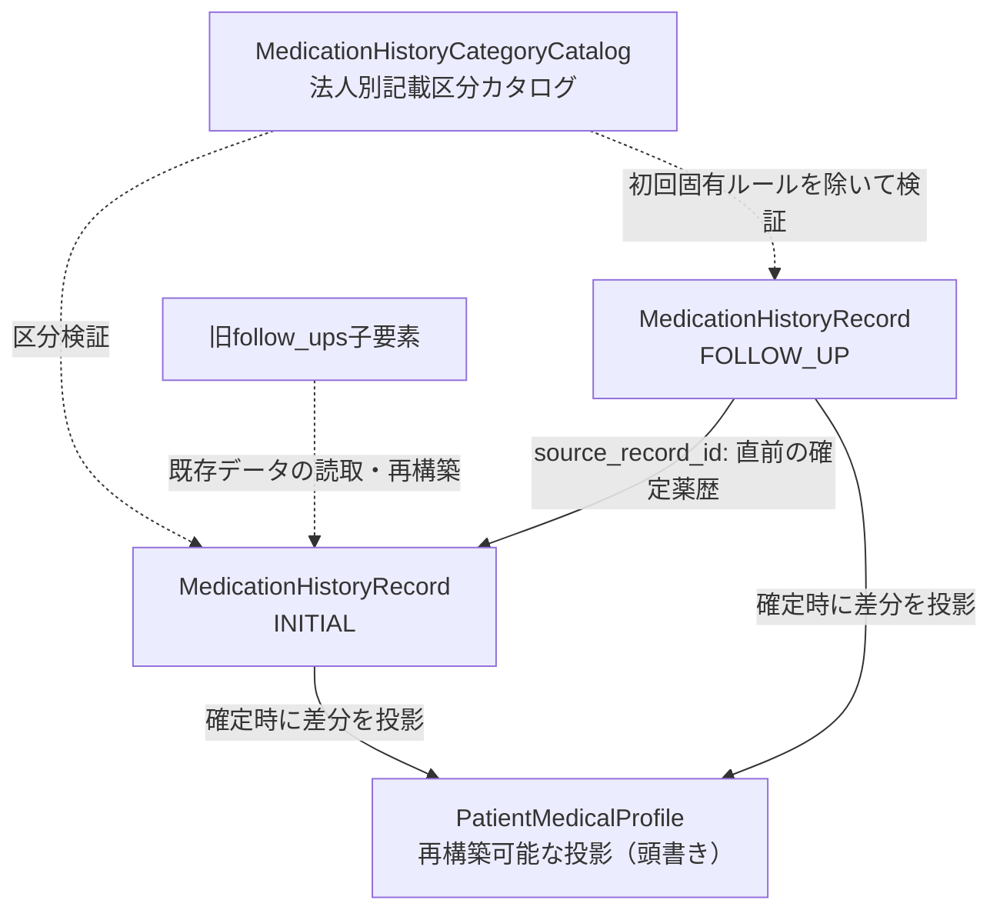

# MedicationHistoryコンテキスト概要

MedicationHistoryは、1回ごとの服薬指導記録と、患者について継続的に参照する
医療プロファイル（頭書き）を管理します。

## 3つの集約

`MedicationHistoryRecord` はSOAP、指導薬剤師、指導日時、頭書きへ反映する差分を保持する真の記録です。初回薬歴は `INITIAL`、後日の独立した服薬フォローアップは `FOLLOW_UP` として保存します。`FOLLOW_UP` は同一法人・患者の直前に確定した薬歴を `source_record_id` で参照し、患者・処方箋・調剤IDを引き継ぎます。実施店舗は記録自身の `store_id` に残るため、法人内の別店舗でも独立した記録と監査が成立します。

以前の `follow_ups` 子要素と、その子IDを参照する旧トレーシングレポートは互換読み取りデータとして残します。一括移行は行わず、新規書込は独立 `FOLLOW_UP` 薬歴へ統一します。通常の単件・患者別一覧は従来の店舗読取範囲に従い、候補取得は本文を除いた同一法人・患者の確定済メタデータだけを返します。

処方医への服薬情報等提供書である `TracingReport`（トレーシングレポート）は薬歴に保持します。新しい独立フォローアップへのレポートはその `FOLLOW_UP` 薬歴に属し、旧子要素に付いたレポート参照も再構築時に維持します。

`PatientMedicalProfile` はアレルギー、副作用、既往歴、併用薬、生活像などを
継続表示する投影です。新規項目の追加だけでなく、誤登録や否定に伴う取消、
既往疾患の状態（治癒・寛解等）の変更も薬歴の確定時差分として投影します。
独立した入力経路を持たず、確定済み薬歴の `apply(record)` だけで更新し、由来となる薬歴IDを保持します。

`MedicationHistoryCategoryCatalog` は法人ごとの薬歴記載区分（大区分・中区分）を管理する集約ルートです。
SOAP各節や指導項目の記載区分体系を法人単位で保持・検証します。

## 境界

- **コアドメインの中心**: 本コンテキストは本システム全体のコアドメインであり、薬剤師法第25条の2に基づく服薬指導、第28条に基づく調剤録記載充足、患者頭書き投影、服薬後フォローアップ、トレーシングレポートの真実の源である
- Patient、Prescription、Dispensing、Staffの詳細は保持せず、各IDで参照する
- 調剤内容との整合性と薬剤師資格は、Domain ServiceまたはApplication Boundaryで確認する
- 頭書きは患者の現在像を素早く読むための投影であり、過去記録を上書きする場所ではない（直接編集は禁止し、取消や状態変更も薬歴の確定時差分として投影する）
- 診療報酬算定、窓口負担金計算、公費上限額管理等の医事会計規則はすべてレセコンの責務であり、本コンテキストには関知させない
- `INITIAL` の店舗は紐づく調剤の実施店舗と一致させる。`FOLLOW_UP` は同一法人・患者・処方・調剤の文脈を保ったまま実施店舗をまたげる。候補取得で参照できるのは記録ID、種別、店舗、指導日時、処方・調剤ID等に限り、A店の本文閲覧権限は付与しない
- Uファイル再取込の加算比較は処方箋に対応する `INITIAL` を使い、後から作られた `FOLLOW_UP` の空の加算で差分を誤検出しない

## 記録と修正

- 下書きではSOAPの途中入力を許す。白紙確定は拒否し、`INITIAL` 固有の手帳・残薬・情報提供確認と法人の必須区分は `FOLLOW_UP` に機械的に適用しない。レビュー証跡は確定時に必要とする
- 機械検索・監査が必要な定型事項はラベル付きテキストとして残す
- 確定済み薬歴は上書きせず、修正理由、修正者、修正時刻を伴う追記で訂正する
- 追記は元のSOAPを残すが、確定時に固定した頭書き差分を後から動かさない
- 同一の調剤セッションに確定済み `INITIAL` は1件だけ作る。店舗横断の `FOLLOW_UP` は参照元と実施日時を持つ別記録なので複数確定できる
- `FOLLOW_UP` は初回調剤の加算・受付関連付けを持たず、調剤録代替の対象にしない

### 仕組みで守れない箇所

子レコードの有効性が開始・終了日から導出できる場合、重複した `is_active` を持たせません。
同じ事実を期間と真偽値の2通りで表すと、食い違いを作れるためです。

ライフサイクル方言の表は集約ルートしか見ないので、子レコードはそこに現れません。
`tests/domain/test_active_flag_placement.py` が全dataclassを走査して歯止めにしています。

## 頭書きの投影と回復

確定処理は真の記録である `INITIAL` / `FOLLOW_UP` を先に保存し、その後に頭書きを保存します。
頭書き保存に失敗しても、確定済み薬歴を順に再適用する
`RebuildPatientMedicalProfileUseCase` で回復できます。

これは投影を再構築するための回復策であり、PostgreSQL 経路では2回の保存を同じ
Unit of Work で原子的に確定します。

## 外部根拠

| 根拠 | 適用範囲 |
| :--- | :--- |
| 薬剤師法 第25条の2 | 継続的な服薬状況把握、情報提供、指導 |
| 薬剤師法 第28条・施行規則 第16条 | 調剤録の記載事項と保存 |
| 薬担規則 第10条 | 保険調剤録の整備 |
| 保険調剤の理解のために 令和8年度 | 薬剤服用歴等の記載事項 |

電子処方箋の調剤編は薬歴・SOAPの根拠資料ではありません。

## 調剤録の代替可否

薬歴を法定調剤録の代替として使えるかは、施行規則第16条第1項が定める記載事項が
揃っているかで決まります。記載事項は1つの集約に収まりません。薬名・分量・調剤量は調剤、
交付年月日・処方医・医療機関は処方箋、氏名・年齢は患者が持ちます。

薬歴ドメインは処方箋集約・患者集約を参照できないため、それらの事実は不変スナップショットで
受け取り、判定は号ごとの表を持つ Domain Service が行います。充足状態は3値で答え、
「判定できない」を「該当しない」へ倒しません。

「薬歴が未確定」「調剤が未完了」は記載事項ではないので、別の軸として報告します。

**これは報告であって強制ではありません。** 記載が足りない薬歴の確定は止めません。
医療機関の所在地が未記録であることは服薬指導そのものの瑕疵ではなく、指導記録を
残せなくするほうが害が大きいためです。

保険調剤録（薬担規則第10条）の保険固有項目は対象外です。

本コンテキストの調剤録代替可否判定は `INITIAL` を対象とし、`FOLLOW_UP` は初回調剤時の記載を
代替する記録として扱いません。ここでは独立 `FOLLOW_UP` 自体の法令上の調剤録該当性を断定しません。

## 未解決事項

- 確定と頭書きへの投影はHTTPルートから同じトランザクションで確定し、投影が失敗すれば確定ごと巻き戻ることを実DBで確認済み。外部IdPのJWTを検証する認証基盤も接続済みで、`OIDC_*` 未設定のときだけ本番入口が業務操作を401で拒否する
- 法定の3年保存を保証する永続化・運用がない
- 調剤録の記載事項の充足は判定できるが、**保険調剤録（薬担規則第10条）の保険固有項目**
  （保険者番号、被保険者記号・番号、患者負担額、請求点数）は判定していない。
  Claim / Coverage の責務であり、到達可能な Claim ユースケースがまだない
- 記載事項が揃っていない薬歴を確定できる状態は残る（判定は報告であって強制ではない）

現在の項目と振る舞いは `app/domain/medication_history/`、
ユースケースは `app/application/medication_history/`、保証範囲は対応テストを確認します。
判断履歴は [設計判断](../decisions.md) のADR-4、8、13、49、50、51、54、60を参照します。
