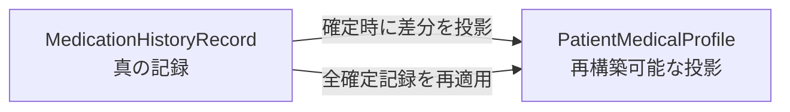

# MedicationHistoryコンテキスト概要

MedicationHistoryは、1回ごとの服薬指導記録と、患者について継続的に参照する
医療プロファイル（頭書き）を管理します。

## 2つの集約

`MedicationHistoryRecord` はSOAP、指導薬剤師、指導日時、残薬・手帳確認、
頭書きへ反映する差分を保持する真の記録です。

`PatientMedicalProfile` はアレルギー、副作用、既往歴、併用薬、生活像などを
継続表示する投影です。独立した入力経路を持たず、確定済み薬歴の
`apply(record)` だけで更新し、由来となる薬歴IDを保持します。

## 境界

- Patient、Prescription、Dispensing、Staffの詳細は保持せず、各IDで参照する
- 調剤内容との整合性と薬剤師資格は、Domain ServiceまたはApplication Boundaryで確認する
- 頭書きは患者の現在像を素早く読むための投影であり、過去記録を上書きする場所ではない
- 報酬算定や請求上の加算判定はClaimの責務である

## 記録と修正

- 下書きではSOAPの途中入力を許し、確定時にS/O/A/Pの各節が必要になる
- 機械検索・監査が必要な定型事項はラベル付きテキストとして残す
- 確定済み薬歴は上書きせず、修正理由、修正者、修正時刻を伴う追記で訂正する
- 追記は元のSOAPを残すが、確定時に固定した頭書き差分を後から動かさない
- 同一の調剤セッションに確定済み薬歴を複数作らない

### 仕組みで守れない箇所

子レコードの有効性が開始・終了日から導出できる場合、重複した `is_active` を持たせません。
同じ事実を期間と真偽値の2通りで表すと、食い違いを作れるためです。

ライフサイクル方言の表は集約ルートしか見ないので、子レコードはそこに現れません。
`tests/domain/test_active_flag_placement.py` が全dataclassを走査して歯止めにしています。

## 頭書きの投影と回復

確定処理は真の記録である薬歴を先に保存し、その後に頭書きを保存します。
頭書き保存に失敗しても、確定済み薬歴を順に再適用する
`RebuildPatientMedicalProfileUseCase` で回復できます。

これはUnit of Workがない現状での回復策であり、2回の保存を原子的にするものではありません。

## 外部根拠

| 根拠 | 適用範囲 |
| :--- | :--- |
| 薬剤師法 第25条の2 | 継続的な服薬状況把握、情報提供、指導 |
| 薬剤師法 第28条・施行規則 第16条 | 調剤録の記載事項と保存 |
| 薬担規則 第10条 | 保険調剤録の整備 |
| 保険調剤の理解のために 令和8年度 | 薬剤服用歴等の記載事項 |

電子処方箋の調剤編は薬歴・SOAPの根拠資料ではありません。
薬歴を法定調剤録の代替として利用する場合は、施行規則上の記載事項を別途満たす必要があります。

## 未解決事項

- 薬歴保存と頭書き保存を一体化するUnit of Workがない
- 法定の3年保存を保証する永続化・運用がない
- 薬歴を調剤録の代替にできるだけの記載事項を満たす検証がない
- 本番Repositoryと業務HTTPルートがない

現在の項目と振る舞いは `app/domain/medication_history/`、
ユースケースは `app/application/medication_history/`、保証範囲は対応テストを確認します。
判断履歴は [設計判断](../decisions.md) のADR-4、8、13を参照します。
