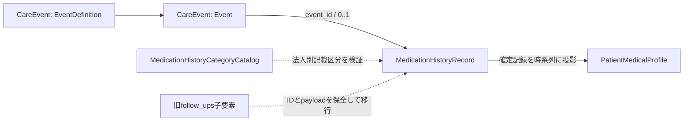

# MedicationHistoryコンテキスト概要

MedicationHistoryは、業務イベントに対して薬剤師が作成するSOAP等の記録と、薬歴から再構築して
継続的に参照する臨床医療プロファイル `PatientMedicalProfile` を管理します。患者全体のサマリ・
申し送りをスタッフが直接記録する自由記載の頭書きは、Patientコンテキストが所有する別の情報です。
業務機会の発生は独立した
[CareEventコンテキスト](care_event.md)が所有し、Eventは薬歴なしでも存在できます。

## 所有境界

```mermaid
flowchart LR
    D[CareEvent: EventDefinition] --> E[CareEvent: Event]
    E -->|event_id / 0..1| R[MedicationHistoryRecord]
    R -->|確定記録を時系列に投影| P[PatientMedicalProfile]
    C[MedicationHistoryCategoryCatalog] -.->|法人別記載区分を検証| R
    L[旧follow_ups子要素] -.->|IDとpayloadを保全して移行| R
```

`MedicationHistoryRecord` はSOAP、指導薬剤師、指導日時、レビュー・確定監査値、頭書きへ
反映する差分を保持する真の記録です。`event_id` は必須で、各Eventに対する薬歴は0件または
1件です。薬歴は法人・店舗・患者の読取範囲と投影のためのIDを保持し、調剤・処方・受付IDを
Eventから参照します。調剤録の検索に必要な調剤IDだけは、該当するEventとの一致を保存境界で
確認した上で薬歴にも検索用の写しを保持します。

旧独立薬歴はIDと監査値を保ってEvent参照へ移行します。旧 `follow_ups` 子要素は各子IDを
独立した `LEGACY_RECORDED` 薬歴へ移し、元payloadとID対応を読取専用アーカイブに残します。
旧子要素には独立した確定監査値がないため、それを通常の確定記録と同じ状態に見せません。
時刻を特定できないEventは時刻不明のまま残し、登録日時や指導日時から補いません。

処方医への服薬情報等提供書である `TracingReport`（トレーシングレポート）は薬歴に保持します。
旧子要素に付いたレポートと返答履歴は、移行後の独立薬歴へ帰属させて保存します。

`PatientMedicalProfile` はアレルギー、副作用、既往歴、併用薬、生活像などを継続表示する
投影です。新規項目の追加だけでなく、誤登録や否定に伴う取消、既往疾患の状態変更も薬歴の
有効な差分として投影します。独立した入力経路はなく、確定記録と投影可能な移行記録を
同一法人・患者の範囲から有効な指導日時順に再構築します。由来となる薬歴IDも保持します。

`MedicationHistoryCategoryCatalog` は法人ごとの薬歴記載区分（大区分・中区分）を管理する
集約ルートです。SOAP各節や指導項目の記載区分体系を法人単位で保持し、Eventの種別に
関わらず同じ規則を検証します。

## 境界

- **コアドメインの中心**: 本コンテキストは本システム全体のコアドメインであり、薬剤師法第25条の2に基づく服薬指導、第28条に基づく調剤録記載充足、患者頭書き投影、服薬後フォローアップ、トレーシングレポートの真実の源である
- Patient、Prescription、Dispensing、Staffの詳細は保持せず、各IDで参照する
- 調剤内容との整合性と薬剤師資格は、Domain ServiceまたはApplication Boundaryで確認する
- `PatientMedicalProfile` は臨床的な現在像を素早く読むための投影であり、過去記録を上書きする場所ではない（直接編集は禁止し、臨床的な取消・状態変更と原記録の訂正はそれぞれ薬歴の有効な差分へ反映する）。Patientコンテキストの自由記載の頭書きとは別であり、互いに内容を更新しない
- 診療報酬算定、窓口負担金計算、公費上限額管理等の医事会計規則はすべてレセコンの責務であり、本コンテキストには関知させない
- Event作成は `CREATE_EVENT` の新規業務として店舗境界で判定し、作成時点で有効な店舗と業務日の管理薬剤師在任を要求する。`occurred_at` が過去でも店舗状態判定は作成時の業務日で行う
- 関連Event候補は同一法人・患者のメタデータだけを返す。別店舗EventのSOAP本文は候補に含めず、通常の薬歴読取範囲も広げない
- Uファイル再取込の加算比較は処方箋受付Eventに結び付いた薬歴を使い、相談等のEventに調剤由来の加算や識別子を要求しない

## 記録と修正

- 下書きではSOAPの途中入力を許す。白紙確定は拒否し、レビュー証跡と法人の必須区分をEvent種別によらず共通に検証する
- 機械検索・監査が必要な定型事項はラベル付きテキストとして残す
- SOAPの修正は従来の追記として元の記載を残す。頭書き差分などSOAP以外の事実訂正は別のイベントとして、対象、操作、訂正前後、理由、訂正者、記録時刻を残す
- 確定済みと移行済みの薬歴だけで事実訂正を許す。下書きには従来の下書き編集を使う。移行記録に存在しない確定監査値を補わない
- 配列の原本要素は薬歴ID・項目名・位置から安定したIDを導く。追加要素には新しいIDを保存し、同名の別要素を巻き込まずに置換・取消しできる
- 原本とSOAP追記は保持し、事実訂正の列を追記順に再生して有効な値を得る。訂正後の指導者・指導日時・頭書き差分を頭書きの由来・順序・内容へ反映する。法人の必須記載区分も訂正後の有効メモで検証する
- 事実訂正は認証済み薬剤師と対象店舗の継続業務境界で許可し、薬歴と頭書きの保存を同じUnit of Workへ入れる。受付やNSIPSの原データと確定監査値は訂正しない
- Event単位の薬歴は最大1件とする。関連する処方箋・調剤があるEventだけを調剤録の代替可否判定対象とし、一般相談へ架空の調剤IDを作らない

### 仕組みで守れない箇所

子レコードの有効性が開始・終了日から導出できる場合、重複した `is_active` を持たせません。
同じ事実を期間と真偽値の2通りで表すと、食い違いを作れるためです。

ライフサイクル方言の表は集約ルートしか見ないので、子レコードはそこに現れません。
`tests/domain/test_active_flag_placement.py` が全dataclassを走査して歯止めにしています。

## 臨床医療プロファイルの投影と回復

確定処理は真の記録を保存し、その後に同一法人・患者の全投影対象記録を時系列で再生して
頭書きを保存します。事実訂正時にも患者の全投影対象から再生し、既存の頭書きIDを維持します。
頭書き保存に失敗しても、`RebuildPatientMedicalProfileUseCase` で
記録から回復できます。日時なしの下書きはタイムライン末尾に置き、確定日時・登録日時・IDで
同時刻の順序を決定します。Eventの発生日時が薬歴の指導日時を上書きすることはありません。

これは投影を再構築するための回復策であり、PostgreSQL 経路では2回の保存を同じ
Unit of Work で原子的に確定します。

## 外部根拠

| 根拠 | 適用範囲 |
| :--- | :--- |
| 薬剤師法 第25条の2 | 継続的な服薬状況把握、情報提供、指導 |
| 薬剤師法 第28条・施行規則 第16条 | 調剤録の記載事項と保存 |
| 薬担規則 第10条 | 保険調剤録の整備 |
| 保険調剤の理解のために 令和8年度 | 薬剤服用歴等の記載事項 |

電子処方箋の調剤編は薬歴・SOAPの根拠資料ではありません。

## 調剤録の代替可否

薬歴を法定調剤録の代替として使えるかは、施行規則第16条第1項が定める記載事項が
揃っているかで決まります。記載事項は1つの集約に収まりません。薬名・分量・調剤量は調剤、
交付年月日・処方医・医療機関は処方箋、氏名・年齢は患者が持ちます。

薬歴ドメインは処方箋集約・患者集約を参照できないため、それらの事実は不変スナップショットで
受け取り、判定は号ごとの表を持つ Domain Service が行います。充足状態は3値で答え、
「判定できない」を「該当しない」へ倒しません。

「薬歴が未確定」「調剤が未完了」は記載事項ではないので、別の軸として報告します。

**これは報告であって強制ではありません。** 記載が足りない薬歴の確定は止めません。
医療機関の所在地が未記録であることは服薬指導そのものの瑕疵ではなく、指導記録を
残せなくするほうが害が大きいためです。

保険調剤録（薬担規則第10条）の保険固有項目は対象外です。

調剤録の代替可否判定は処方箋受付など関連する処方箋・調剤IDを持つEventに結び付いた薬歴を
対象とします。相談・訪問など関連リソースのないEventの薬歴は調剤録の代替として扱いません。

## 未解決事項

- 確定と頭書きへの投影はHTTPルートから同じトランザクションで確定し、投影が失敗すれば確定ごと巻き戻ることを実DBで確認済み。外部IdPのJWTを検証する認証基盤も接続済みで、`OIDC_*` 未設定のときだけ本番入口が業務操作を401で拒否する
- 法定の3年保存を保証する永続化・運用がない
- 調剤録の記載事項の充足は判定できるが、**保険調剤録（薬担規則第10条）の保険固有項目**
  （保険者番号、被保険者記号・番号、患者負担額、請求点数）は判定していない。
  Claim / Coverage の責務であり、到達可能な Claim ユースケースがまだない
- 記載事項が揃っていない薬歴を確定できる状態は残る（判定は報告であって強制ではない）

現在の項目と振る舞いは `app/domain/medication_history/`、
ユースケースは `app/application/medication_history/`、保証範囲は対応テストを確認します。
判断履歴は [設計判断](../decisions.md) のADR-4、8、13、49、50、51、60、61、62を参照します。
