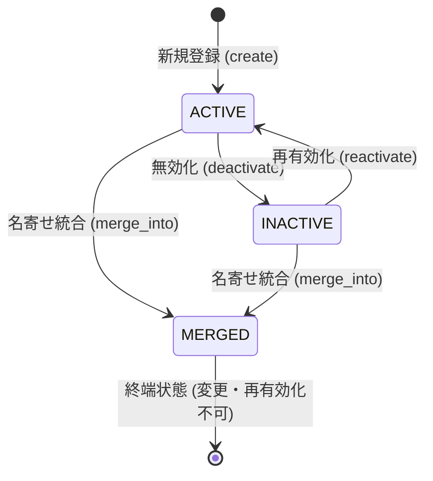

# Patientコンテキスト概要

Patientコンテキストは、調剤薬局における患者の同一性（`PatientId`）、基本属性（氏名、カナ、生年月日）、
ライフサイクル（有効 / 無効 / 名寄せ統合済）、および外部システム患者IDとの連携を管理します。

## 境界と責務

### 所有するもの / 所有しないもの

Patientコンテキストが所有するもの:

- **患者の同一性**: 法人内で一意な UUIDv7 識別子（`PatientId`）
- **患者基本情報**: 漢字氏名（`PatientName`）、カナ氏名（`PatientKanaName`）、生年月日（`PatientBirthDate`）
- **ライフサイクル状態と履歴**:
  - 利用状態（`PatientStatus`: `ACTIVE` / `INACTIVE` / `MERGED`）
  - 名寄せ統合先ID（`merged_into_id: PatientId | None`）
  - 状態変更監査ログ（`status_history: tuple[PatientStatusChange, ...]`）
- **外部患者ID**:
  - レセコンや電子カルテ等の外部システム患者IDとの紐付け（`PatientExternalIdentifier`）
  - 外部IDの有効状態と無効化履歴（付け替え・再利用を許容）

所有しないもの:

- **保険資格情報**: 保険証・受給者証の記号番号や有効期間は `Coverage` コンテキストが所有
- **臨床情報・病歴・アレルギー**: 薬歴および患者医療プロファイル（頭書き）は `MedicationHistory` コンテキストが所有
- **処方・調剤記録**: `Prescription` および `Dispensing` コンテキストが所有
- **受付記録**: 店舗での来局・資格確認の事実は `Reception` コンテキストが所有

他コンテキスト（Coverage, Reception, Prescription, Dispensing, MedicationHistory）は、患者集約を直接保持せず、`PatientId` による ID 参照のみを行います。

## ドメインモデルと不変条件

### 1. 患者集約ルート（`Patient`）

患者は `@dataclass(frozen=True, eq=False, kw_only=True)` の不変エンティティです。
状態の変更は新しいインスタンスを生成して返却します。

#### 不変条件
- **マージ状態と統合先IDの相互拘束**:
  - `status == PatientStatus.MERGED` であることと `merged_into_id is not None` であることは必要十分条件です。
  - 非マージ状態（`ACTIVE` または `INACTIVE`）では `merged_into_id` は必ず `None` でなければなりません。
- **自己マージ禁止**:
  - `merged_into_id != id` であり、自身を統合先として指定することはできません。
- **凍結と属性変更ブロック**:
  - `status == PatientStatus.MERGED` の患者は終端状態であり、氏名変更（`change_names`）や生年月日変更（`change_birth_date`）、再度の名寄せ、再有効化、無効化をすべて拒否（`PatientStateConflictError`）します。

### 2. 名寄せ・重複統合の非破壊的設計

調剤薬局では、同一人物が誤って別患者として登録された場合の名寄せ統合（マージ）が必要とされます。
しかし、過去に発行された処方箋原本、調剤鑑査記録、服薬指導薬歴は公的・法的な証跡であり、過去データの外部キーを機械的に一括書き換えする「破壊的マージ」は過去の事実を改変するリスクを伴います。

したがって、本システムでは**非破壊的マージ**を採用しています：

1. **統合元集約の凍結**:
   統合元（source）患者集約を `MERGED` 状態へ遷移させ、`merged_into_id` に統合先（target）の患者IDを記録して保存します。
2. **過去データの保持**:
   過去の処方・調剤・薬歴データが持つ `patient_id` は書き換えません。当時の事実をそのまま保存し、統合元の患者集約を参照した際に `merged_into_id` を介して現在の有効な患者情報へと辿ることができます。
3. **多重防御（`PatientMergeService`）**:
   2集約に跨るマージ操作は、無状態ドメインサービス `PatientMergeService` が以下の条件を検証します：
   - **法人一致**: `source.corporate_id == target.corporate_id`（他法人患者との統合禁止）
   - **同一患者の排除**: `source.id != target.id`
   - **統合先端の有効性**: `target.is_active is True`（無効患者や統合済み患者を統合先とすることは不可）

### 3. 外部患者ID（`PatientExternalIdentifier`）

外部システム（レセコン、電子カルテ等）で発番されたIDと自社患者IDを紐付けます。

- **1対1対応の原則**: 同一システム名において、有効な外部患者IDは1人の患者にのみ紐付けられます。
- **無効化と再利用**:
  誤った紐付けを解消するために外部IDを無効化（`deactivate`）できます。
  無効化された外部患者IDは、他の患者集約へ再度紐付ける（付け替える）ことが可能です。

## ユースケースと境界

### Application層
- **患者登録・照会**:
  - `RegisterPatientUseCase`: 新規患者の登録（初期状態は `ACTIVE`）。
  - `GetPatientUseCase`: 患者情報の取得（ステータス、統合先ID、監査履歴を含むDTOを返却）。
- **属性変更**:
  - `ChangePatientNamesUseCase`: 氏名・カナの変更（`MERGED` 患者は拒否）。
  - `ChangePatientBirthDateUseCase`: 生年月日の変更または解除（`MERGED` 患者は拒否）。
- **ライフサイクル操作**:
  - `DeactivatePatientUseCase`: 患者の無効化（利用停止）。すでに `INACTIVE` の場合は冪等として成功。
  - `ReactivatePatientUseCase`: 患者の再有効化。すでに `ACTIVE` の場合は冪等として成功。
  - `MergePatientsUseCase`: 名寄せ統合。2患者を取得し、`PatientMergeService` で統合した上で双方を原子的保存。
- **外部患者ID操作**:
  - `RegisterPatientExternalIdentifierUseCase`: 外部IDの紐付け。
  - `DeactivatePatientExternalIdentifierUseCase`: 外部IDの紐付け解除（無効化）。
  - `GetPatientExternalIdentifierUseCase` / `ListPatientExternalIdentifiersUseCase`: 外部IDの取得・一覧。

### テナント境界と認可
- 操作対象の法人の有効性は `CorporateAccessBoundary` を介して検証します。
- 存在しない患者や他法人の患者へのアクセスは、情報の存在を秘匿するためすべて `PatientNotFoundError`（HTTP 404）として処理します。

## HTTP API（Presentational層）

FastAPIルータ（`app/presentational/routers/patient.py`）により、以下のエンドポイントが公開されています：

| メソッド | パス | 説明 | 成功ステータス |
| :--- | :--- | :--- | :--- |
| `POST` | `/corporates/{cid}/patients` | 患者新規登録 | 201 Created |
| `GET` | `/corporates/{cid}/patients/{pid}` | 患者取得 | 200 OK |
| `PATCH` | `/corporates/{cid}/patients/{pid}/names` | 氏名変更 | 204 No Content |
| `PATCH` | `/corporates/{cid}/patients/{pid}/birth-date` | 生年月日変更 | 204 No Content |
| `POST` | `/corporates/{cid}/patients/{pid}/deactivation` | 患者無効化 | 204 No Content |
| `POST` | `/corporates/{cid}/patients/{pid}/reactivation` | 患者再有効化 | 204 No Content |
| `POST` | `/corporates/{cid}/patients/{pid}/merge` | 名寄せ統合 | 200 OK |
| `POST` | `/corporates/{cid}/patients/{pid}/external-identifiers` | 外部患者ID登録 | 201 Created |
| `GET` | `/corporates/{cid}/patients/{pid}/external-identifiers` | 外部患者ID一覧 | 200 OK |
| `POST` | `/corporates/{cid}/patient-external-identifiers/{id}/deactivation` | 外部患者ID無効化 | 204 No Content |

状態の競合（統合済み患者に対する更新、自己マージ等）は、すべて `PatientStateConflictError` から HTTP 409 Conflict へ自動変換されます。

## 永続化と後方互換性

- **JSONBエンティティマッピング**:
  PostgreSQLの `patients` テーブルにおいて、集約データは JSONB ペイロードとして永続化されます。
- **スキーマレス後方互換性**:
  集約の追加フィールド（`status=PatientStatus.ACTIVE`, `merged_into_id=None`, `status_history=()`）には dataclass の既定値が設定されているため、過去に保存された既存の JSONB レコードを読み込んだ際にも自動的に補完され、マイグレーションなしで完全な後方互換性が維持されます。
