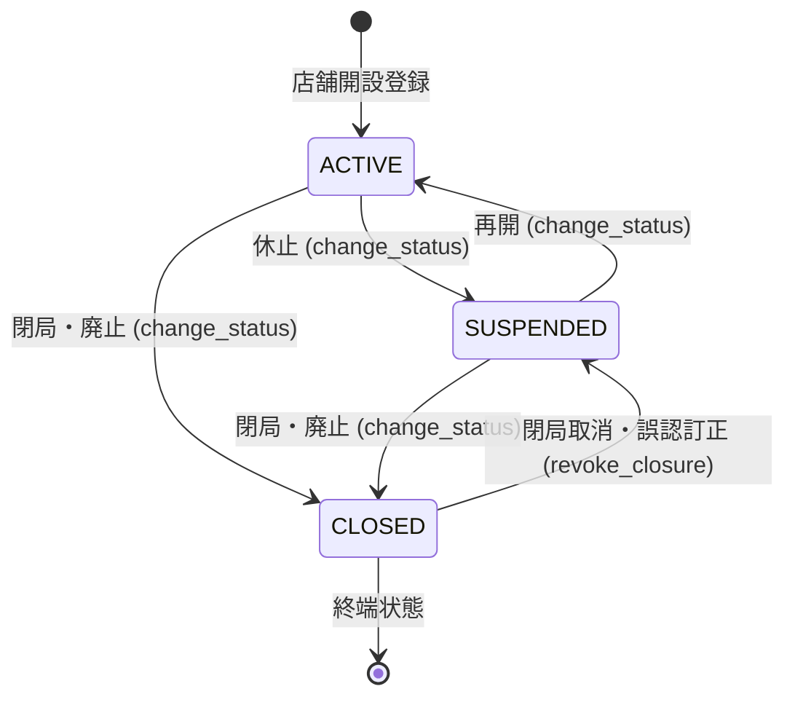

# Storeコンテキスト概要

Storeコンテキストは、調剤薬局法人の配下に属する物理的店舗（薬局）の同一性（`StoreId`）、
基本情報、保険薬局指定番号、開局時間、店舗状態（開局・休止・閉局）、および医薬品医療機器等法（薬機法）に基づく管理薬剤師の任命と専任を管理します。

## 境界と責務

### 所有するもの / 所有しないもの

Storeコンテキストが所有するもの:

- **店舗の同一性**: 法人内で一意な UUIDv7 識別子（`StoreId`）
- **店舗基本情報**:
  - 店舗名称（`StoreName`、`StoreKanaName`、`StoreRomajiName`）
  - 内部管理コード（`StoreCode`）
  - 所在地（`StoreAddress`: 郵便番号、住所）
  - 連絡先（`StoreContactInfo`: 電話番号、FAX番号、メールアドレス）
  - 保険薬局指定番号（`InsurancePharmacyNumber`）
- **店舗ライフサイクル**:
  - 状態（`StoreStatus`: `ACTIVE` / `SUSPENDED` / `CLOSED`）
  - 閉局の取消操作（`revoke_closure`）
- **開局時間と判定**:
  - 週間開局スケジュールおよび特例日（`BusinessHours`）
  - 特定日時における開局状態判定（`opening_state_at`: `OPEN` / `CLOSED` / `UNKNOWN`）
- **管理薬剤師任命**:
  - 店舗管理者・管理薬剤師の在任期間履歴（`StoreManagerAssignment`）
  - 薬機法に基づく専任・在任の検証

所有しないもの:

- **法人（Corporate）**: 店舗が属する法人の情報（`CorporateId` による ID 参照のみ）
- **スタッフ（Staff）の雇用・資格・配属**: スタッフの資格や主所属・兼務履歴は `Staff` コンテキストが所有
- **患者・受付・調剤・薬歴**: すべてID参照とし、店舗集約内に他集約のエンティティを保持しない

## ドメインモデルと不変条件

### 1. 店舗ライフサイクル（`StoreStatus`）

店舗は医薬品販売・保険調剤の許可を都道府県・厚生局から受けて運営されるため、明確な状態遷移を持ちます。

- **`ACTIVE`（有効・開局中）**: 通常の業務が可能な状態。新規受付・調剤開始が可能。
- **`SUSPENDED`（休止中）**: 店舗改装や一時休業などにより新規受付を停止している状態。過去の調剤継続業務のみ許可。
- **`CLOSED`（閉局・廃止）**: 廃止届が出された終端状態。すべての業務操作が停止。
- **閉局の取消（`revoke_closure`）**:
  閉局は廃止届を伴う重大な法的手続きであるため、通常のステータス変更メソッド（`change_status`）では元に戻せません。誤操作是正のための特権訂正操作として `revoke_closure()` を提供します。戻す先は `ACTIVE` ではなく **`SUSPENDED`** とします（閉局時に管理薬剤師の任命が打ち切られているため、有効に戻すと任命なしの店舗が即座に業務を受け付けてしまう事故を防ぎます）。

### 2. 開局時間（`BusinessHours`）と3値判定

- **週次スケジュールと特例日**:
  月曜日から日曜日までの全7曜日の開局時間帯（空なら定休日）と、特定日付の特例開局・臨時休業（祝日や盆正月等）を保持します。祝日の自動判定は内蔵せず（法改正や天文計算によるズレを避けるため）、特例日として登録します。
- **時間帯の半開区間**:
  開局時間帯は終了時刻を含まない半開区間 `[start_time, end_time)` で扱います。昼休み（9:00〜13:00、14:00〜19:00）で 13:00 が重複しないようにします。24時は終端の `00:00` として表現します。
- **3値による開局判定**:
  `Store.opening_state_at(business_now)` は `OPEN` / `CLOSED` / `UNKNOWN` を返します。
  開局時間が未設定の場合に「開いている」と誤判定しないよう、未登録時は `UNKNOWN` とします。また店舗が `ACTIVE` でない場合は開局スケジュールに関わらず常に `CLOSED` と判定します。

### 3. 管理薬剤師の配置と専任（薬機法第7条）

薬機法第7条では、薬局ごとに管理薬剤師を設置すること（第1項配置義務）、および他の薬局等との兼務を禁止すること（第3項専任義務）が定められています。

- **新規業務と継続業務の分離**:
  管理薬剤師の在任は、店舗状態とは独立した軸として判定します。新規受付や調剤開始などの「新規業務」は管理薬剤師が在任する業務日のみ許可されます。一方で、既に行われた調剤の鑑査や薬歴の確定・訂正などの「継続業務」は、不在を理由に記録を凍結させないため許可されます。
- **自然人（`PersonId`）単位での専任制約**:
  専任義務は法人内のスタッフではなく「自然人」にかかります。そのため、グループ内の別法人で異なるスタッフIDを持つ同一人物が、複数店舗で管理薬剤師を兼任することを防ぐため、排他制約の鍵は **法人IDを含めず、自然人単位（`person_id`）** で管理します。
- **複合外部キーによる完全一致**:
  スタッフIDと本人IDの組 `(staff_id, person_id)` で `staff_person_links` を参照する複合外部キーにより、実在しないスタッフや本人の取り違えをDB制約で確実に排除します。

## ユースケースと境界

### Application層
- `RegisterStoreUseCase`: 店舗新規登録。
- `GetStoreUseCase`: 店舗情報取得。
- `ListStoresUseCase`: 自法人の店舗一覧（カーソルページネーション対応）。
- `ChangeStoreStatusUseCase`: 店舗状態の変更（休止・閉局等）。
- `RevokeStoreClosureUseCase`: 閉局の取消（ベンダーシステム管理者専用）。
- `UpdateBusinessHoursUseCase`: 開局時間スケジュールの設定・更新。
- `ManageStoreManagerUseCase`: 管理薬剤師の任命登録、任命解除、履歴一覧取得。

### 認可と二重防御
- 店舗ロール（`STORE_OPERATOR`, `STORE_VIEWER`）のアクセスは、`AuthorizationService` による認可と、リポジトリ取得クエリ（`RepositoryReadScope`）によるSQLレベルの条件絞り込みの二重で防衛します。

## 永続化

- PostgreSQLの `stores` テーブルで永続化されます。
- 開局時間などの柔軟な構造は JSONB カラム（`payload`）に保持し、dataclass の既定値によりマイグレーション不要で後方互換性を保証します。
- 管理薬剤師任命は `store_manager_assignments` テーブルにて、自然人単位の排他制約（`EXCLUDE USING gist` または一意インデックス）により期間重複を物理的に防止します。
