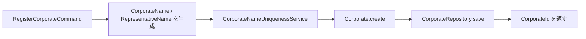
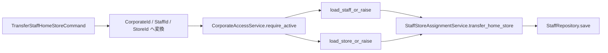

# Application層の実装ガイドライン

Application層は、外部から受け取った入力をドメインモデルの操作へ変換し、処理の順序を組み立てる層です。
業務ルールそのものをApplication層に集めるのではなく、集約・値オブジェクト・ドメインサービスへ委譲します。

---

## 1. 基本原則

- 1つのユースケースを1つのApplicationサービス（UseCaseクラス）として表現し、1ファイルに Command DTO と UseCase を同居させる。
- CommandやResponse DTOを使い、ドメインエンティティを外部境界へ直接返さない。
- 入力値はユースケースの早い段階でDomain PrimitiveやValue Objectへ変換する。
- 集約の状態変更は、属性への直接代入ではなくドメインメソッドを呼び出す。集約は不変なので、**戻り値を必ず受け直す**。
- 永続化はRepositoryの抽象に依存し、データベースやWebフレームワークをApplication層へ持ち込まない。
- 複数ユースケースに共通する処理は小さなヘルパー（`support.py`）へ切り出す。ただし、全ユースケースを1つの巨大なサービスへ統合しない。
- 認証済み操作主体は `ActorContext` として認証基盤から受け取り、Command / Queryの対象法人IDとは分離する。未信頼のHTTP入力からActorContextを生成しない。
- Store / Staff / Patient / Coverage / Reception は法人アクセス境界を Protocol（`CorporateAccessBoundary`）として受け取り、法人コンテキストの実装には依存しない。実装を注入するのは Composition Root。Coverageは `PatientReferenceBoundary` で患者IDの存在だけを確認し、Receptionは店舗・患者・資格選択の参照Boundaryだけを受け取る。
- ReceptionとCoverageの接続は `app/application/composition/coverage_selection_adapter.py` に閉じ込める。Domain層でもCoverageからPatient Aggregate/RepositoryとClaim/Reception、ClaimからCoverage/Reception、ReceptionからCoverage台帳やPatient/Store Aggregate/Repositoryへの直接importを禁止し、`tools/check_imports.py` で検出する。

Application層の責務は「何を、どの順番で呼ぶか」です。法人名の重複や法人名の妥当性などの判断は、Domain層へ委譲します。

## 2. 構成要素

| 構成要素 | 現在の実装 | 責務 |
| :--- | :--- | :--- |
| Command DTO | `RegisterCorporateCommand`、`ChangeCorporateNameCommand`、`ChangeRepresentativeCommand` など | ユースケースへの入力を不変なデータとして表現する |
| Query DTO | `GetStoreQuery`、`ListStoresQuery`、`GetStaffQuery`、`ListStaffsQuery`、`GetPatientQuery` | 参照系ユースケースへの入力を表現する |
| UseCase | `RegisterCorporateUseCase` など | 入力変換、集約取得、ドメイン操作、保存の順序を調整する |
| Repository | `CorporateRepository`、`StoreRepository`、`StaffRepository`、`PatientRepository` | 集約の取得・保存・検索を抽象化する |
| Catalog Repository | `StoreCatalogRepository`、`StaffCatalogRepository` | 一覧系ユースケースが使う列挙操作 |
| Domain Service | `CorporateNameUniquenessService`、`StaffStoreAssignmentService` など | リポジトリを使う一意性ルールや集約間ルールを実行する |
| Access Control | `ActorContext`、`AuthorizationService`、`CorporateAccessBoundary`（`access_control/`）、`CorporateAccessService`（`corporate/`） | 操作主体のロール・法人スコープ、対象法人の存在・有効状態を検証する。認可に使った同じActorをReceptionの監査へ渡す |
| Response DTO | `CorporateResponseDto`、`StoreDto` / `StoreSummaryDto`、`StaffDto` / `StaffSummaryDto`、`PatientDto`、`PatientExternalIdentifierDto`、`PatientCoverageDto` | APIや画面へ返す読み取り専用のデータを表現する |
| 共通処理 | `load_corporate_or_raise()`、`load_active_corporate_or_raise()`、`load_store_or_raise()`、`load_staff_or_raise()`、`load_patient_or_raise()`、`load_coverage_or_raise()`、`to_optional_text()`（`app/base/application/support.py`） | 集約取得・法人の有効状態検証・未存在時の例外処理・任意項目の正規化を共通化する |

Command / Query / Response DTO はいずれも `@dataclass(frozen=True, kw_only=True)` で、Response DTO は `from_entity()` クラスメソッドを持ちます。

各コンテキストのユースケース一覧は、[ナレッジベースの実装マップ](../index.md#現在の実装マップ)にまとめています。

## 3. 現在の法人ユースケース

実装場所は `app/application/corporate/` です。ユースケースごとにファイルを分けています。
`__init__.py` でユースケース、DTO、`CorporateAccessService`、例外、サポート関数を再エクスポートしています。
ただし Store / Staff / Patient / Coverage / Reception はこの `__init__.py` を経由せず、`access_control` の `CorporateAccessBoundary`（Protocol）にだけ依存します。
なお法人コンテキスト内のモジュールは、自パッケージの `__init__.py` ではなくサブモジュールを直接 import します（部分初期化による循環を避けるため）。

| ファイル | クラス | 処理 |
| :--- | :--- | :--- |
| `register_corporate.py` | `RegisterCorporateUseCase` | 法人名と代表者名を検証し、新しい法人を登録する |
| `change_corporate_name.py` | `ChangeCorporateNameUseCase` | 法人を取得し、重複確認後に法人名を変更する |
| `change_representative.py` | `ChangeRepresentativeUseCase` | 法人を取得し、代表者名を変更する |
| `get_corporate.py` | `GetCorporateUseCase` | 法人を取得し、`CorporateResponseDto`へ変換する |
| `change_corporate_status.py` | `ChangeCorporateStatusUseCase` | ベンダーシステム管理者だけが法人を有効化・無効化する |

### 3.1 登録の処理フロー



`RegisterCorporateUseCase`は、次の順序を守ります。

1. Commandの文字列から`CorporateName`と`CorporateRepresentativeName`を生成する。
2. `CorporateNameUniquenessService`で法人名の重複を確認する。
3. `Corporate.create()`でID（UUIDv7）を持つ集約を生成する。
4. `CorporateRepository.save()`で新規登録する。
5. 生成された`CorporateId`を返す。

### 3.2 更新の処理フロー

法人名変更と代表者変更は、共通して次の流れで処理します。

1. CommandのIDを`CorporateId.parse()`で変換する。
2. 新しい値をDomain Primitive / Value Objectへ変換する。
3. `CorporateAccessService.require_active()`でActor権限を確認し、有効な法人集約を取得する。
4. **現在値と等しければ、何もせずに戻る**（保存を省く）。
5. 法人名変更の場合のみ、`CorporateNameUniquenessService`を呼び出す。自分自身のIDは`excluding_id`で除外する。
6. `corporate = corporate.change_name(...)` のように、変更後の**新しい集約を受け直す**。
7. `CorporateRepository.save()`で保存する。

集約は frozen なので、`corporate.change_name(new_name)` の戻り値を捨てると変更は失われます。

### 3.3 取得の処理フロー

`GetCorporateUseCase`はドメインエンティティをそのまま返しません。

1. IDを`CorporateId`へ変換する。
2. `CorporateAccessService.require_existing()`でActor権限を確認し、状態にかかわらず法人を取得する（状態表示・状態変更用）。
3. `CorporateResponseDto.from_entity()`でレスポンスDTOへ変換する。

`GetCorporateUseCase.execute()`だけはQuery DTOを取らず、法人IDの文字列を直接受け取ります。
店舗・スタッフ・患者の参照系は`GetStoreQuery` / `GetStaffQuery` / `GetPatientQuery`を受け取る形に揃っています。

### 3.4 店舗・スタッフのユースケースで追加される順序

テナント境界を持つコンテキストでは、まず `CorporateAccessService.require_active()` で認可済みの対象法人を確認し、集約取得を `load_store_or_raise()` / `load_staff_or_raise()` で行います。
Command / Queryの `corporate_id` は対象法人を表し、操作主体そのものを表しません。集約間に跨る操作（配属・異動・兼務）は、
`Staff` と `Store` の両方をロードしてから `StaffStoreAssignmentService` に渡します。



## 4. 依存性注入

ユースケースは必要な依存をコンストラクタで受け取ります。リポジトリやドメインサービスはアプリケーションレベル（シングルトン）で保持可能ですが、**`ActorContext`、`AuthorizationService`、および `CorporateAccessService` は必ずリクエスト毎（Per-request）に解決・構築**してユースケースに注入します。

```python
# --- アプリケーション起動時 (シングルトン) ---
repository = CorporateRepositoryImplementation(...)
uniqueness_service = CorporateNameUniquenessService(repository)

# --- HTTPリクエスト毎 (Per-request Scope) ---
# current_user は認証基盤が「署名・有効期限・失効を検証済み」の認証主体。
# HTTPヘッダーやリクエストボディの値を直接 ActorContext へ渡してはならない
# （未検証のJWTクレームをそのまま権限情報として扱うことになるため）。
# ロールと所属法人は、認証基盤が保証した属性からのみ決定する。
current_user = authenticate(request)  # 検証に失敗した場合はここで401
if current_user.is_vendor_admin:
    actor = ActorContext.vendor_system_admin(principal_id=current_user.id)
else:
    actor = ActorContext.corporate_admin(
        principal_id=current_user.id,
        corporate_id=current_user.corporate_id,
    )
authorization = AuthorizationService(actor)
corporate_access = CorporateAccessService(repository, authorization)

register = RegisterCorporateUseCase(repository, uniqueness_service, corporate_access)
change_name = ChangeCorporateNameUseCase(
    repository, uniqueness_service, corporate_access
)
change_representative = ChangeRepresentativeUseCase(repository, corporate_access)
get_corporate = GetCorporateUseCase(corporate_access)
```

集約を跨ぐユースケースは、複数のRepositoryとDomain Serviceを受け取ります。

```python
register_staff = RegisterStaffUseCase(
    staff_repository,
    store_repository,
    StaffCodeUniquenessService(staff_repository),
    StaffStoreAssignmentService(),
    corporate_access,
)
```

一覧系ユースケースは `XxxCatalogRepository` だけを受け取ります（`ListStoresUseCase` / `ListStaffsUseCase`）。

Composition Root（WebルートやDIコンテナなど）でこの組み立てを行い、ユースケース自身が具象Repositoryやデータベース接続を生成しないようにします。**現時点でComposition Rootは実装されていません。**

## 5. 例外の扱い

### 5.1 分類

| 例外 | 発生場所 | 意味 | 想定HTTP |
| :--- | :--- | :--- | :--- |
| `DomainValidationError` | Domain Primitive、ID変換（`parse()`） | 入力値そのものが不正 | 400 |
| `CorporateNotFoundError` | `load_corporate_or_raise()` | IDの形式は正しいが該当法人が無い（`NotFoundError`を継承） | 404 |
| `TenantBoundaryNotFoundError` | `AuthorizationService` | 法人管理者が別法人を指定した。存在を推測させない | 404 |
| `AuthorizationError` | `AuthorizationService` | 同一法人内で許可されていない操作を試みた | 403 |
| `CorporateInactiveError` | `CorporateAccessService.require_active()` | 対象法人が無効状態で通常操作を受け付けない | 409 |
| `ValueError` | `AuthorizationService.require_vendor_system_admin()` | ベンダー専用以外の権限を要求した（開発設定エラー） | 500 |
| `StoreNotFoundError` | `load_store_or_raise()` | 店舗が無い、または別法人に所属している | 404 |
| `StaffNotFoundError` | `load_staff_or_raise()` | スタッフが無い、または別法人に所属している | 404 |
| `PatientNotFoundError` | `load_patient_or_raise()` | 患者が無い、または別法人に所属している | 404 |
| `CorporateNameAlreadyExistsError` | `CorporateNameUniquenessService`、永続化層 | 同名の別法人が存在する | 409 |
| `StoreNameAlreadyExistsError` | `StoreNameUniquenessService`、永続化層 | 同一法人内に同名の店舗が存在する | 409 |
| `StoreCodeAlreadyExistsError` | `StoreCodeUniquenessService`、永続化層 | 同一法人内に同一コードの店舗が存在する | 409 |
| `InsurancePharmacyNumberAlreadyExistsError` | `InsurancePharmacyNumberUniquenessService`、永続化層 | 保険薬局指定番号が別の店舗で使用されている | 409 |
| `StaffCodeAlreadyExistsError` | `StaffCodeUniquenessService`、永続化層 | 同一法人内に同一コードのスタッフが存在する | 409 |
| `InvalidCorporateAssignmentError` | `StaffStoreAssignmentService` | 別法人の店舗を割り当てようとした | 409 |
| `AffiliationDateConflictError` / `ConcurrentStoreConflictError` / `PrimaryAffiliationDuplicationError` | `StaffStoreAssignmentService`、`Staff` | 所属履歴の日付・重複の矛盾 | 409 |

Note: `Permission` Enum は `policy.py` で `_VENDOR_ONLY_PERMISSIONS` と `_CORPORATE_ADMIN_PERMISSIONS` の2集合に明示分類され、全網羅性（Exhaustiveness）と排他性をモジュール読込時の明示的な `RuntimeError` チェックで保証します。最適化実行（`python -O`）でもチェックは省略されません。

「入力値が不正（400）」と「対象が見つからない（404）」は別の例外型で表します。両者を
`DomainValidationError`にまとめると、外側のWeb/API層がステータスコードを決められません。

`StoreNotFoundError` / `StaffNotFoundError`は、別法人のデータを指定した場合にも送出します。「権限が無い」と
「存在しない」を区別して返すと、他テナントのIDの存在を推測できてしまうためです。

Application層は例外を握りつぶさず、外側のWeb/API層でHTTPステータスやエラーレスポンスへ変換します。

一意性の事前確認は利用者向けの早期エラー検出です。並行リクエストに対する最終的な一意性は、実際の永続化層のユニーク制約でも保証します。

### 5.2 例外クラスの構成（現状の注意点）

Application層の例外は `app/base/application/exceptions.py` の
`ApplicationError` / `NotFoundError`（404相当） / `AuthorizationError`（403相当）を基底とします。
ただし、404系の継承元は現状揃っていません。

| 例外 | 継承元 |
| :--- | :--- |
| `CorporateNotFoundError` | `NotFoundError` |
| `StoreNotFoundError` | `StoreApplicationError`（→ `ApplicationError`） |
| `StaffNotFoundError` | `StaffApplicationError`（→ `ApplicationError`） |
| `PatientNotFoundError` | `PatientApplicationError`（→ `ApplicationError`） |

`NotFoundError`を捕まえるだけでは店舗・スタッフの404を拾えないため、Web層を実装する際は
このどちらに合わせるかを決める必要があります。

また `app/domain/staff/exceptions.py` にも `StaffNotFoundError`（`StaffDomainError`系）が存在します。
ユースケースが送出するのは `app/application/staff/exceptions.py` の同名例外です。import 元に注意してください。

### 5.3 任意項目の空文字の扱い

外部から渡る任意項目は、`to_optional_text()` で
**空文字・空白のみを`None`へ正規化してから**Domain Primitiveへ変換します。

登録では空文字を「未設定」、変更では「不正な値」と読むといった食い違いがあると、同じ画面から
送られた同じ値が登録では通り変更では検証エラーになります。境界で1度だけ正規化し、以降は
「未設定は`None`だけ」という前提で扱います。したがって、更新ユースケースにおける
`None`・空文字・空白のみは、いずれも同じ「解除」を意味します。

定義は Shared Kernel の `app/base/application/support.py` に1つだけ置き、
`store` / `staff` / `coverage` の各 `support.py` はそれを再エクスポートします。
コンテキストごとに複製すると正規化ルールの変更が片方だけに入り、同じ空文字が
店舗では項目解除・資格では検証エラーという分岐を生むためです。

### 5.4 「変更が無ければ保存しない」判定

集約側には同値チェックを置かず、ユースケースが現在値と比較して早期リターンします。

- 法人（`ChangeCorporateNameUseCase` / `ChangeRepresentativeUseCase`）と
  店舗の`ChangeStore*`6ユースケースは実装済みです。
- **スタッフの変更系ユースケースには未実装で、常に`save()`を呼びます。**

### 5.5 Patientコンテキストのユースケース

患者ユースケースは `app/application/patient/` に配置し、Domain層の `PatientRepository`
と `access_control` の `CorporateAccessBoundary` Protocolだけへ依存します。処理対象の
`corporate_id` はCommand / Queryから受け取りますが、操作主体の認証情報は含めません。

| ファイル | クラス | 処理 |
| :--- | :--- | :--- |
| `register_patient.py` | `RegisterPatientUseCase` | 氏名と任意の生年月日を検証し、患者番号を採番して患者を登録する |
| `change_patient_names.py` | `ChangePatientNamesUseCase` | 法人境界を確認し、患者氏名を変更する |
| `change_patient_birth_date.py` | `ChangePatientBirthDateUseCase` | 生年月日を設定または `None` で解除する |
| `get_patient.py` | `GetPatientUseCase` | 患者を取得し、`PatientDto`へ変換する |
| `register_patient_external_identifier.py` | `RegisterPatientExternalIdentifierUseCase` | 連携先ごとの外部患者IDを登録する |
| `list_patient_external_identifiers.py` | `ListPatientExternalIdentifiersUseCase` | 患者に紐付く外部患者IDを一覧する |
| `deactivate_patient_external_identifier.py` | `DeactivatePatientExternalIdentifierUseCase` | 外部患者ID対応付けを無効化する |

登録・変更・取得の順序は、`CorporateId.parse()`、`CorporateAccessBoundary.require_active()`、
`PatientId.parse()`、`load_patient_or_raise()`、Domain操作、Repository保存またはDTO変換です。
存在しない患者と別法人の患者は `PatientNotFoundError` に統一し、他テナントの存在を
推測できないようにします。非アクティブ法人の通常操作は `require_active()` で拒否します。

Patientは氏名・任意の生年月日・不変の法人内患者番号を保持します。外部患者IDは別Aggregateで
扱い、Coverageは別コンテキストの `PatientCoverage` として `PatientId` のみで関連付けます。
Prescriptionは別コンテキストとして扱い、患者集約ではなく `PatientId` のみを参照します。

`RegisterPatientExternalIdentifierUseCase` の早期重複判定は、`get_active_by_source()` が
有効行を返したときに `PatientExternalIdentifierAlreadyExistsError` を送出します。
無効化済みの行を衝突扱いにすると、誤紐付けを無効化した後に正しい患者へ付け替える経路が
なくなり、その外部IDが恒久的に使えなくなるためです。並行登録の最終防衛はRepositoryの
原子的な `save()` 契約であり、read-check-writeだけでは保証しません。

### 5.6 Coverageコンテキストのユースケース

Coverageユースケースは `app/application/coverage/` に配置し、`PatientCoverageRepository`、
`PatientCoverageConflictService`、`CorporateAccessBoundary`、`PatientReferenceBoundary` を
コンストラクタから受け取ります。保険・公費の詳細は資格種別に応じて値オブジェクトへ変換し、
医療保険は期間重複を、公費は同一順位の期間重複を登録・期間変更前に検証します。医療保険1件と
第一公費・第二公費のような複数公費の組み合わせは、CoverageのDomain Serviceで検証してから
Claim側のスナップショットへ変換します。

| ファイル | クラス | 処理 |
| :--- | :--- | :--- |
| `register_patient_coverage.py` | `RegisterPatientCoverageUseCase` | 患者資格を登録し、`PatientCoverageDto`を返す |
| `get_patient_coverage.py` | `GetPatientCoverageUseCase` | 患者資格を取得し、DTOへ変換する |
| `list_patient_coverages.py` | `ListPatientCoveragesUseCase` | 患者単位の資格一覧を返す |
| `change_patient_coverage_period.py` | `ChangePatientCoveragePeriodUseCase` | 適用期間を変更し、競合を再検証する |
| `deactivate_patient_coverage.py` | `DeactivatePatientCoverageUseCase` | 資格を無効化する |

Coverageは他法人の資格を404相当へ隠蔽し、非アクティブ法人の通常操作を拒否します。登録Commandは
`activated_on`、無効化Commandは `effective_on` を必須で受け取ります。DTOは現在時点のboolではなく
`activated_on` / `deactivated_on` を返し、適用日の判定を呼び出し側へ明示させます。

### 5.7 Receptionコンテキストのユースケース

Receptionユースケースは `app/application/reception/` に配置し、
`CoverageSelectionRecordRepository`、`CorporateAccessBoundary`、店舗・患者の存在確認Boundary、
`CoverageSelectionBoundary` / `CoverageValidityBoundary` を受け取ります。登録は
`MANAGE_RECEPTION`、最新候補の参照は `VIEW_RECEPTION` を要求し、資格台帳の権限と分離します。

| ファイル | クラス | 処理 |
| :--- | :--- | :--- |
| `record_coverage_selection.py` | `RecordCoverageSelectionUseCase` | 適用日と資格IDを検証し、認可ActorとClock由来の監査値で選択履歴を保存する |
| `get_last_coverage_selection.py` | `GetLastCoverageSelectionUseCase` | 最新履歴の元IDとSnapshotを今回の適用日で再検証した候補として返す |
| `get_coverage_selection.py` | `CoverageSelectionRecordDto` | 元ID列・Snapshot・業務日・監査値を外部向けDTOへ変換する |

最新履歴は自動適用値ではありません。`GetLastCoverageSelectionQuery` は今回の適用日を必須で
受け取り、`CoverageValidityBoundary.is_selection_valid()` へ元ID列とSnapshotの再検証を
委ねた結果を `LastCoverageSelectionCandidateDto.is_still_valid` として返します。フラグが `False`
の候補を自動適用してはならず、呼び出し元は資格一覧から再選択させます。「再検証してから使う」
という規則をDTOの型に載せます。

参照Boundary（`StoreReferenceBoundary` / `PatientReferenceBoundary` /
`CoverageSelectionBoundary` / `CoverageValidityBoundary`）はProtocolの `Raises:` に例外契約を
持ちます。他テナントのデータや未存在は403ではなく404相当の `ReceptionStoreNotFoundError` /
`ReceptionPatientNotFoundError` / `ReceptionCoverageSelectionError` へ畳み込み、`AuthorizationError`
を送出しません（他法人のIDの存在が呼び出し元へ漏れます）。再検証の結果も真偽値へ畳み込み、
存在の有無を例外で区別しません。

`RecordCoverageSelectionCommand` には記録者・記録時刻を置きません。記録者は認可に使った同じ
`CorporateAccessBoundary.actor`、記録時刻は注入した `Clock` から取得します。実行時Clockは
Composition層の `SystemUtcClock` だけが `datetime.now(UTC)` を呼びます。Claimには現在、
Snapshot以外の到達可能なApplicationユースケースを置かず、Claim権限も定義しません。

## 6. テスト方針

- CommandからDomain Primitiveへ変換できることを確認する。
- Repositoryへ正しく保存されることを確認する。
- 重複値、未存在、不正な入力を確認する。
- 更新ユースケースでは、変更後の状態が再取得できることを確認する。
- 取得ユースケースでは、Response DTOの値を確認する。
- Domain層のテストでは実際の集約・Value Objectを使い、Application層ではインメモリRepositoryを使う。

現在のテストは次の場所にあります。

- `tests/application/corporate/` — 登録、名称変更、代表者変更、取得
- `tests/application/store/` — 登録、店舗名／コード／住所／連絡先／指定番号の変更、取得、一覧、保存の省略（`test_change_skips_save.py`）
- `tests/application/staff/` — 登録、氏名変更、資格更新、無効化、取得、一覧、主所属異動
- `tests/fakes/` — インメモリRepository、`tests/factories/` — 集約の組み立てヘルパー

店舗・スタッフのユースケースでは、テナント境界（別法人のデータを操作・参照できないこと）を必ず検証します。

## 7. 避ける設計

- 登録・更新・取得を1つの`CorporateService`クラスへ詰め込む。
- Application層から集約をそのままAPIレスポンスとして返す（`RegisterStaffUseCase`が`Staff`を返しているのは現状の例外であり、揃えるべき対象）。
- `corporate.change_name(...)` の戻り値を捨てて、元のインスタンスを保存する。
- 法人名の重複チェックをApplicationサービスだけに実装する。
- 新規登録と更新の両方を表すRepository操作を`add()`と呼ぶ。現在は意図を明確にするため`save()`を使う。
- 一覧系ユースケースで`list_all()`を使う。テナント境界を越えるため`list_by_corporate_id()`を使う。

ユースケースを分けたまま、必要であれば外側にFacadeやDI設定を置きます。内部の責務分割と、外部からの利用窓口は別の問題として扱います。
