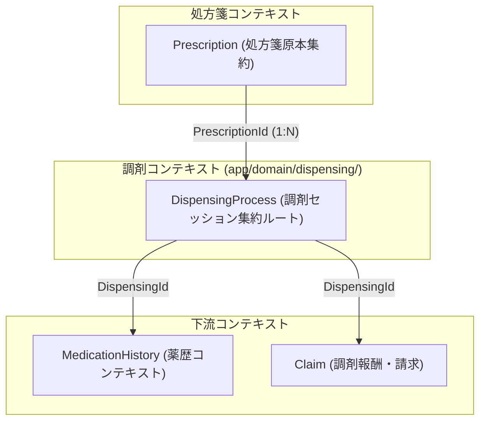
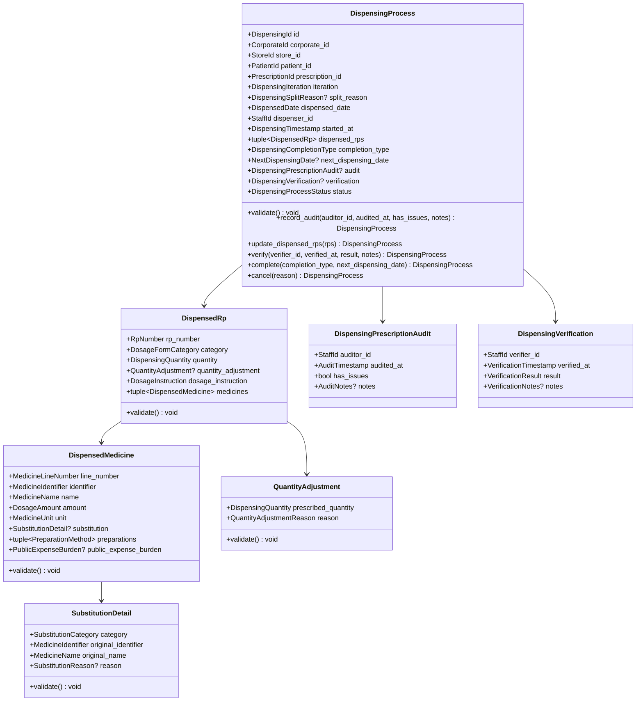
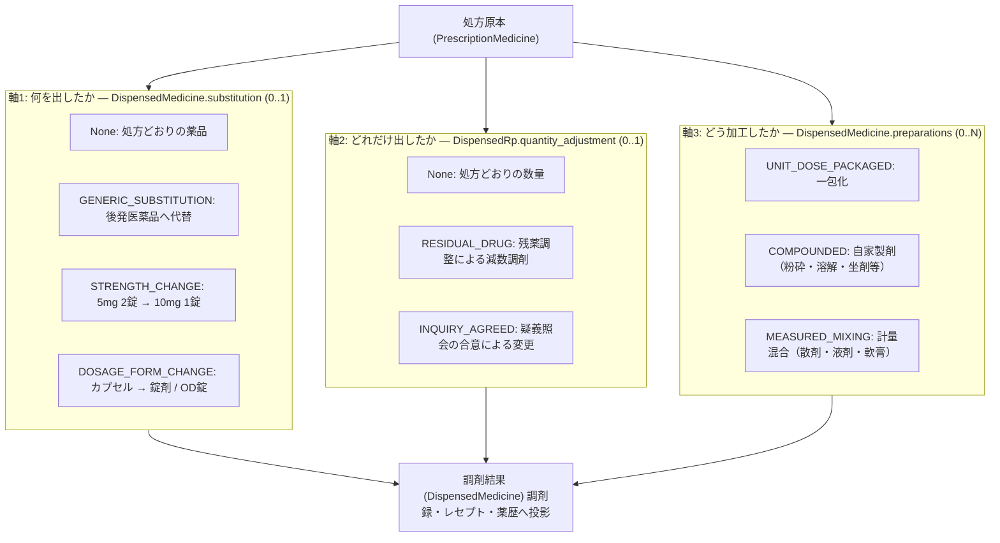
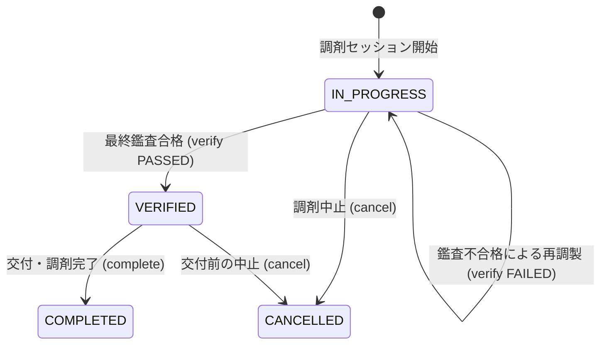

# 調剤（Dispensing）コンテキスト 詳細仕様書 & ドメイン設計ガイドライン

> **本文書のステータス**: `draft`（設計のみ・未実装）。`app/domain/dispensing/` は存在しない。実装着手時は [§8 実装時に更新が必要な強制点](#8-実装時に更新が必要な強制点) を必ず参照すること。

## 1. 概要と境界定義（Bounded Context）

### 1.1 責務と位置づけ
調剤（`Dispensing`）コンテキストは、処方箋原本（`Prescription`）に基づき、薬局店舗内で行われる**「1回ごとの物理的・技術的な調剤作業、変更調剤、および最終調剤鑑査」**を管理する整合性境界です。

| 規格・法令 | 本モデルでの適用範囲 |
| :--- | :--- |
| **薬剤師法** 第19条（非薬剤師調剤の禁止）、第23条（処方箋による調剤・同意なき変更の禁止）、第26条（処方箋への記入・署名押印） | 調剤・鑑査を行う者の資格要件と記録義務 |
| **厚労省 保険調剤の理解のために（令和8年度）** | リフィル処方箋、分割調剤（注9・注10・注11）、減数調剤、調剤技術料の加算要件 |
| **厚労省 電子処方箋管理サービス 記録条件仕様（調剤編）Ver.2.2** | 調剤結果情報のレコード構造。`リフィル処方箋情報レコード(521)`、`疑義照会結果レコード(511)`、`薬品レコード(201)` |

> **変更調剤に対応する規格上のコード体系は存在しない。** 調剤編の別表は 1:性別 / 2:患者特記種別 / 3:都道府県 / 4:点数表 / 5:剤形コード（調剤結果）/ 6:伝達事項種別 / 7:疑義照会種別 の7つのみで、「後発品へ変更した」ことを表すコードは無い。調剤結果情報は**実際に調剤した薬品を記録するだけ**であり、処方原本との差分は処方箋文書との突合で表現される。
> 本コンテキストの `SubstitutionDetail` は、調剤録・レセプト・薬歴が必要とする**ドメイン固有の概念**であり、規格の写像ではない。規格に対応する別表を探しても見つからない。



### 1.2 1枚の処方箋に対して調剤が複数回発生する4つの経路

1枚の処方箋（`Prescription`）に対し、調剤行為（`DispensingProcess`）は複数回発生します。**回数の上限も算定方法も経路ごとに異なるため、`iteration` だけでは表現できません。**

| 経路 | `split_reason` | 回数 | 根拠・算定 |
| :--- | :--- | :--- | :--- |
| 通常処方箋 | `None` | 1回 | — |
| リフィル処方箋 | `None`（`Prescription.management_info.refill` が非 `None`） | 総使用回数 2〜3回 | 調剤を行うごとに処方箋受付回数1回として取扱う |
| 長期保存の困難性等による分割調剤 | `LONG_TERM_STORAGE` | 2回目以降。**回数上限の定めなし**。14日分を超える投薬が対象 | 調剤基本料「注9」。調剤基本料は初回のみ算定 |
| 後発医薬品の試用のための分割調剤 | `GENERIC_TRIAL` | **「2回目の調剤を行った場合に限り」＝実質2分割** | 調剤基本料「注10」 |
| 医師の分割指示による分割調剤 | `PRESCRIBER_INSTRUCTED` | 3回まで。**注9・注10 に該当する場合を除く** | 調剤基本料「注11」。**合算点数を分割回数で除する**（小数点以下第一位を四捨五入） |

- 注9・注10・注11 のうち複数の分割調剤を**同一保険薬局・同一日**に行う場合は「注11」の点数により算定する。この判定は Claim コンテキストの責務。
- 注9 の2回目以降と注10 の2回目を同一保険薬局・同一日に行う場合は、いずれか一方の点数のみを算定する。

#### 前提: 本コンテキストは自局実施分のみを保持する

保険調剤の理解のために は「異なる保険薬局で分割調剤を行う場合は、各保険薬局においてそれぞれ調剤基本料を算定できる」「患者が次回の調剤を他の保険薬局において受けることを申し出た場合は、調剤の状況とともに必要な情報を当該他の保険薬局に提供する」と定めており、**リフィル・分割の各回が別薬局で行われうる**。

本コンテキストは**自局で実施した回のみ** `DispensingProcess` として保持する。他薬局での実施回は集約として存在しない。したがって `list_by_prescription()` が返す件数は、その処方箋の総調剤回数と一致しない場合がある。他薬局実施回の把握が業務要件として必要になった時点で、`Prescription` 側の受領情報として別途設計する。

---

## 2. 集約構造とクラス図



### 2.1 調剤終了区分と次回調剤予定日

調剤編 `リフィル処方箋情報レコード(521)` に対応する。

| 項目 | 規格の定義 | 本モデル |
| :--- | :--- | :--- |
| 調剤回数 | 当該リフィル処方箋に対する何回目の調剤か | `iteration` |
| 調剤終了区分 | `1`: 調剤回数が総使用回数に達した場合**または達していないが次回以降の調剤が不要となった場合**<br/>`2`: 上記以外 | `completion_type`: `COMPLETED` / `CONTINUES` |
| 次回調剤予定日 | 調剤終了区分に `2` を記録した場合、次回の調剤予定日を `YYYYMMDD` で記録 | `next_dispensing_date` |

- **`Prescription` を `DISPENSED` へ遷移させる契機は `completion_type == COMPLETED` である**。「`iteration == total_refill_count` に達したこと」ではない。規格が「達していないが次回以降の調剤が不要となった場合」も終了として扱うため。
- 次回調剤予定日は薬局が**記録する**値であり、投薬期間から計算した値ではない。リフィルの前後7日判定（§5 不変条件 #5）は、前回セッションが記録したこの値を基準とする。

### 2.2 用語の区別: 処方鑑査と調剤鑑査

| 型 | 対象 | タイミング |
| :--- | :--- | :--- |
| `DispensingPrescriptionAudit` | 処方内容そのもの（相互作用・重複投薬・用量） | 調剤調製の**前** |
| `DispensingVerification` | 調製された薬剤が処方どおりか（最終鑑査） | 調剤調製の**後**、交付の前 |

---

## 3. 変更調剤（Substitution）モデル — 3つの独立した軸

医師の処方原本と、薬局で実際に調剤される薬剤との差異を表現します。

**これらは互いに排他ではありません。** 同一の薬品に対して「後発品へ変更し」「残薬分を減らし」「一包化する」ことは同時に起こります。したがって単一の enum では表現できず、性質の異なる3つの軸に分解します。



### 3.1 軸1: 代替調剤（`SubstitutionCategory`）

処方された薬品**そのものを別の薬品に置き換えた**場合にのみ記録する。

| 値 | 内容 |
| :--- | :--- |
| `GENERIC_SUBSTITUTION` | 先発医薬品から後発医薬品への変更調剤（処方医が変更不可としていない場合） |
| `STRENGTH_CHANGE` | 規格変更調剤（例: 5mg 2錠から 10mg 1錠） |
| `DOSAGE_FORM_CHANGE` | 剤形変更調剤（例: 普通錠から口腔内崩壊錠・散剤） |

- **`ORIGINAL_AS_PRESCRIBED` という値は持たない。** 処方どおりの場合は `substitution is None` である。「処方どおり」を表す値と `None` の両方があると、同じ事実に2通りの表現ができてしまう。
- `SubstitutionDetail` が存在するとき `original_identifier` / `original_name` は**必須**（何から変えたか分からない代替調剤は記録として無意味）。
- `Prescription` 側の `GenericSubstitutionRestriction`（別表16 の 3〜6・8）と矛盾する代替は許されない。これは処方箋集約を参照するため Domain Service が判定する（§5 不変条件 #8）。

### 3.2 軸2: 数量調整（`QuantityAdjustmentReason`）

保険調剤の理解のために（令和8年度）の定義:

> 処方箋に記載された医薬品について、**用法及び用量の変更は行わずに投与日数等を減らす調剤**（以下「減数調剤」という。）

| 値 | 内容 |
| :--- | :--- |
| `RESIDUAL_DRUG` | 残薬確認に基づく減数調剤（処方箋の「調剤する薬剤を減量した上で保険医療機関に情報提供」欄の指示による） |
| `INQUIRY_AGREED` | 疑義照会の結果、処方医の合意を得て数量を変更した場合 |

- 数量は `DispensedRp` の属性であり（`調剤数量` は JAHIS・調剤編とも RP 単位のフィールド）、`QuantityAdjustment` は「処方時の数量」を併せて保持する。処方時の数量を持たないと、減数したことを後から検証できない。
- **用法・用量（`dosage_instruction`・各薬品の `amount`）は変更しない。** 変更が必要なら疑義照会を経た処方変更である。
- 数量を `0` に削減することはできない（0にするなら処方箋の事前照会・削除が必要）。

### 3.3 軸3: 調製方法（`PreparationMethod`）

薬品自体は処方どおりで、**調製の仕方**が加わるもの。複数同時に成立する（0..N）。

| 値 | 内容 |
| :--- | :--- |
| `UNIT_DOSE_PACKAGED` | 一包化（服用時点ごとに一包化する） |
| `COMPOUNDED` | 自家製剤（錠剤粉砕、点眼剤溶解、坐剤の基剤添加等） |
| `MEASURED_MIXING` | 計量混合（2種類以上の医薬品（液剤・散剤・軟膏等）を計量し混合する） |

---

## 4. 加算の算定可否は Claim コンテキストの責務

調製方法は加算の算定要件と対応するが、**算定可否の判定は本コンテキストの不変条件ではない**。`DispensingProcess` は「何をしたか」のみを記録し、点数計算はしない。

Claim 側が持つべき排他ルール（保険調剤の理解のために 令和8年度）:

1. **自家製剤加算を算定した場合には、計量混合調剤加算は算定できない。**（自家製剤加算 (12) オ）
2. **外来服薬支援料2 を算定した範囲の薬剤については、自家製剤加算及び計量混合調剤加算は算定できない。**（外来服薬支援料2 (8)）
3. 同一保険薬局で同一処方箋に係る分割調剤（注9・注10）をした上で、2回目以降の調剤について一包化を行った場合は、1回目の調剤から通算した日数に対応する点数から前回までに請求した点数を減じて得た点数を加算する。

`UNIT_DOSE_PACKAGED` は外来服薬支援料2 に対応するため、`preparations` に `UNIT_DOSE_PACKAGED` と `COMPOUNDED` / `MEASURED_MIXING` が同時に含まれること自体は**ドメインとしては正当**（実際に一包化も粉砕も行いうる）。算定時にどれを取るかを Claim が決める。ここで排他にすると、実施した事実を記録できなくなる。

---

## 5. ドメイン不変条件（Invariants Checklist）

**守り手**の列は `Aggregate.validate()` / `Domain Service` / `Boundary` / `Repository契約` の4種に限る。

| # | 不変条件 | 守り手 | 必要な参照 |
| :---: | :--- | :--- | :--- |
| 1 | `iteration` は 1 以上の正の整数 | `DispensingIteration.validate()` | — |
| 2 | `split_reason == GENERIC_TRIAL` のとき `iteration <= 2`。`PRESCRIBER_INSTRUCTED` のとき `iteration <= 3`。`LONG_TERM_STORAGE` は上限なし（`iteration >= 2`） | `DispensingProcess.validate()` | — |
| 3 | `iteration` が `Prescription` 側の指示（`refill.total_refill_count` / `split.total_split_count`）の範囲内であること | Domain Service | `Prescription` 集約 |
| 4 | `completion_type == CONTINUES` ⟺ `next_dispensing_date is not None` | `DispensingProcess.validate()` | — |
| 5 | リフィル・分割の**1回目**の調剤日は処方箋の使用期間内であること（「1回目の調剤を行うことが可能な期間については、使用期間に記載されている日までとする」） | Domain Service | `Prescription.period` |
| 6 | リフィル**2回目以降**の調剤日は、前回セッションが記録した `next_dispensing_date` の**前後7日以内**であること | Domain Service | 同一処方箋の前回 `DispensingProcess` |
| 7 | 減数調剤（`QuantityAdjustment`）では用法・用量を変更せず、数量のみを減らす。`quantity < prescribed_quantity` かつ `quantity > 0` | `DispensedRp.validate()` | — |
| 8 | 代替調剤が処方箋の `GenericSubstitutionRestriction`（後発品変更不可・剤形変更不可・含量規格変更不可・先発医薬品患者希望）に反しないこと | Domain Service | `Prescription` の該当薬品 |
| 9 | `SubstitutionDetail` が存在するとき `original_identifier` / `original_name` が欠落しないこと | `SubstitutionDetail.validate()` | — |
| 10 | `dispenser_id` と `verification.verifier_id` はいずれも薬剤師資格（`StaffQualification.PHARMACIST`）を保持する保険薬剤師であること | Domain Service | `Staff` 集約 |
| 11 | 調剤を行った本人（`dispenser_id`）と鑑査を行った本人（`verifier_id`）が**それぞれ**記録されていること（管理薬剤師による一括代行署名の禁止） | `DispensingProcess.validate()` | — |
| 12 | `DispensingProcessStatus.COMPLETED` へ遷移するには `DispensingVerification.result == PASSED` が記録済みであること | `DispensingProcess.complete()` | — |
| 13 | `dispensed_rps` は1件以上。`RpNumber` は処方箋の Rp 番号に対応すること | 件数は `DispensingProcess.validate()`<br/>対応は Domain Service | `Prescription.rps` |

> #3・#5・#6・#8・#13 は `Prescription` 集約または兄弟セッションを参照する。**集約単独では判定できないため `validate()` に書いてはならない。** `DispensingConsistencyService`（無状態 Domain Service）が本物の集約を受け取って判定する（AGENTS.md「複数集約ルール」）。

### 5.1 状態遷移



| 状態（`DispensingProcessStatus`） | 説明 |
| :--- | :--- |
| `IN_PROGRESS` | 調剤調製中。処方鑑査・調製・変更調剤の記録が可能 |
| `VERIFIED` | 最終鑑査に合格。交付待ち |
| `COMPLETED` | 患者へ交付済みの終端状態。参照のみ |
| `CANCELLED` | 調剤中止の終端状態。参照のみ |

---

## 6. Repository Protocol の設計

```python
from typing import Protocol

from app.domain.corporate.primitives import CorporateId
from app.domain.dispensing.dispensing_process import DispensingProcess
from app.domain.dispensing.primitives import DispensingId
from app.domain.patient.primitives import PatientId
from app.domain.prescription.primitives import PrescriptionId
from app.domain.store.primitives import StoreId


class DispensingProcessRepository(Protocol):
    """調剤セッション集約の取得・永続化を行うドメインリポジトリ Protocol。"""

    async def get(
        self,
        *,
        corporate_id: CorporateId,
        dispensing_id: DispensingId,
    ) -> DispensingProcess | None:
        """指定された法人境界内で調剤セッションを取得する。他法人の場合は None を返す契約。"""
        ...

    async def list_by_prescription(
        self,
        *,
        corporate_id: CorporateId,
        prescription_id: PrescriptionId,
    ) -> list[DispensingProcess]:
        """同一処方箋に紐付く自局の全調剤セッションを iteration 昇順で取得する。

        他薬局で実施された回は含まれない（§1.2 の前提を参照）。
        """
        ...

    async def save(self, process: DispensingProcess) -> None:
        """調剤セッション集約を原子的に保存する。

        同一 (corporate_id, prescription_id, iteration) の重複を、同じ集約IDを
        除外した上で原子的に拒否する契約とする。Applicationの事前readは
        早期エラー用であり原子性の代替ではない。
        """
        ...
```

> **import 元に注意**: `CorporateId` / `PatientId` / `StoreId` は Shared Kernel ではなく各コンテキストの `primitives` に定義されている（実例: `app/domain/reception/repository.py`）。

---

## 7. Application層で必要になる権限

到達可能な UseCase を実装する時点で定義する。定義だけを先に置かない。

| 権限 | 対象操作 |
| :--- | :--- |
| `MANAGE_DISPENSING` | 調剤セッションの開始・変更調剤の記録・鑑査・完了 |
| `VIEW_DISPENSING` | 調剤セッションの参照 |

---

## 8. 実装時に更新が必要な強制点

| 更新対象 | 内容 |
| :--- | :--- |
| `pyproject.toml` `[tool.import_rules.forbidden]` | `app.domain.dispensing` から MedicationHistory / Claim / Coverage 台帳 / Patient・Store の Aggregate への直接依存を禁止。`Prescription` 集約は Domain Service が引数で受け取るため直接 import は不要 |
| `tests/domain/test_lifecycle_dialects.py` の `LIFECYCLE_DIALECTS` | **`"DispensingProcess": "status_enum"` の行を追加**。表に行が無い集約は必ず落ちる |
| `tests/contracts/test_repository_contracts.py` | `save()` の `(corporate_id, prescription_id, iteration)` 重複拒否契約を追加。`tests/fakes/` 配下は自動列挙されるため、Fake を追加すれば全実装に課される |
| `pyproject.toml` `[tool.fake_rules]` | `tests/fakes/` に `InMemoryDispensingProcessRepository` を置く際にパスを追加 |
| `okf/ddd/domain.md` §1.1 / §7 / §8 | コンテキスト相関図・ライフサイクル方言表・リポジトリ一覧に Dispensing を追加 |
| `AGENTS.md`「コンテキストは…7つ」 | コンテキスト数と一覧を更新 |
| `okf/index.md` | 「現在の実装マップ」へ Dispensing を追加し、本文書の `status` を `active` へ変更 |
