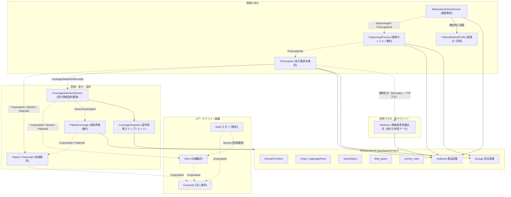
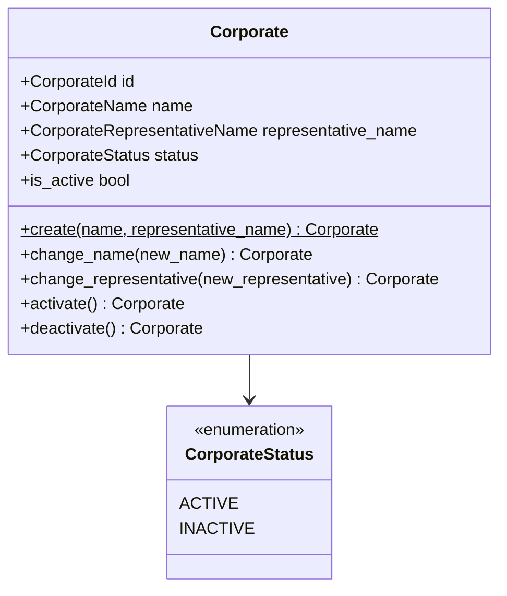
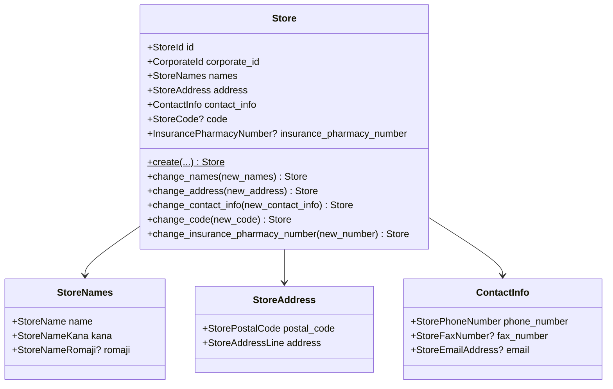
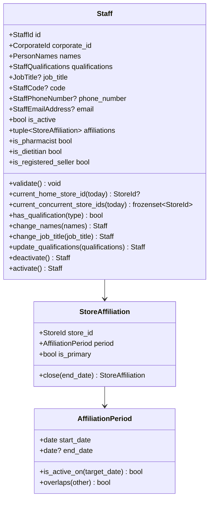
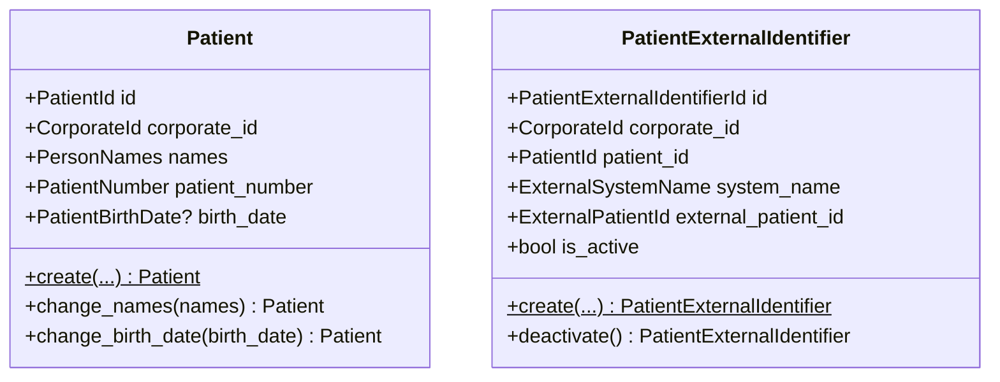
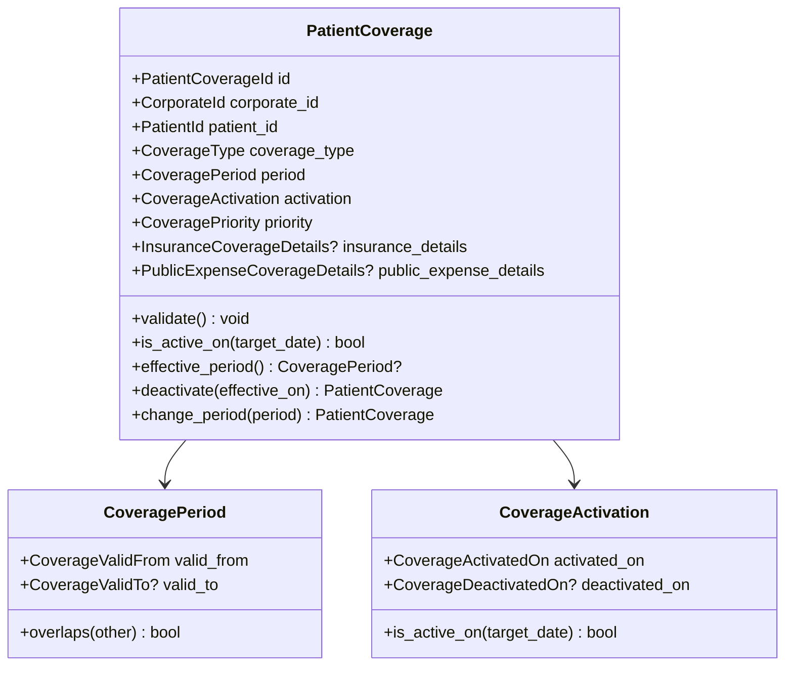
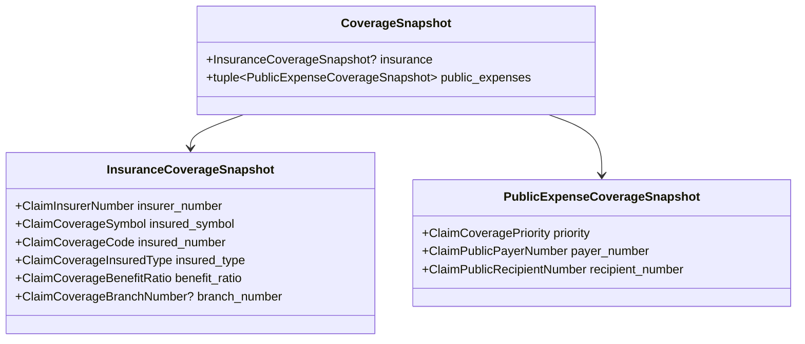

# Domain層 実装ガイドライン & 詳細仕様書

PharmacyDomain プロジェクトにおけるドメイン層（Domain Layer）の設計思想、アーキテクチャ原則、基底クラス体系、および全7コンテキスト（`Corporate` / `Store` / `Staff` / `Patient` / `Coverage` / `Reception` / `Claim`）と Shared Kernel の詳細仕様をまとめた正典ドキュメントです。

ドメイン層はオニオンアーキテクチャの最内周に位置し、外部フレームワーク（FastAPI, DB/SQLAlchemy等）および Application 層に一切依存しません。

---

## 1. 構成要素と基本原則

### 1.1 ドメイン層の構造とコンテキスト相関図



> **薬品語彙・用法語彙は Shared Kernel に置く。** どちらも「どの集約の同一性でもない」語彙であり、
> 3コンテキストが同じものを必要とする。所有コンテキストへ置くと、薬歴が「他院で買ったOTCの名前」を
> 表すために Prescription を import することになり、依存が語彙の実態と食い違う（`okf/log.md` ADR-9）。

### 1.2 DDD 構成要素

| 構成要素 | 概要 | 主な特徴・識別方法 |
| :--- | :--- | :--- |
| **Domain Primitive** | 単一の値をカプセル化する最小単位の値オブジェクト | `DomainPrimitive[T]` を継承。`@dataclass(frozen=True)`（`kw_only`なし）。不変、自動正規化・バリデーション。`Base*` は直接使わず派生させる。 |
| **Value Object** | ドメインの概念を表す値の組み合わせ | `ValueObject` を継承。`@dataclass(frozen=True, kw_only=True)`。不変、属性値による等価性比較、`field_guard` による型保証。 |
| **Domain Entity** | ライフサイクルと識別子（ID）を持つオブジェクト | `Entity[ID]` を継承。`@dataclass(frozen=True, eq=False, kw_only=True)`。IDによる同一性比較。状態変更は新しいインスタンスを返す。 |
| **Aggregate Root** | 整合性境界を守るルートエンティティ | `AggregateRoot[ID]` を継承。リポジトリで直接永続化・再構築される単位。 |
| **Domain Service** | 単一のオブジェクトに属さないドメイン知識・業務ロジック | 無状態（Stateless）。リポジトリ等を利用した重複チェック、複数集約の整合性検証など。 |
| **Domain Repository** | 集約を取得・保存するための抽象インターフェース | `Protocol`で定義し、Domain層はデータベースやORMの詳細を知らない。 |

### 1.3 依存と参照の絶対規則
1. **集約間はID参照のみ**: 他集約のエンティティインスタンスを直接プロパティとして保持してはならない。
2. **コンテキスト間直接依存の禁止**:
   - `Coverage` は `Patient` 集約/Repository、`Claim`、`Reception` を直接 import しない。
   - `Claim` は `Coverage`、`Reception`、`Patient`、`Store` の集約/Repository を直接 import しない。
   - `Reception` は `Coverage` 台帳、`Patient`、`Store` の集約/Repository を直接 import しない。
   - これらは `tools/check_imports.py`（静的チェッカ）が自動検証する。
3. **共有ルールの配置**: 2つ以上のコンテキスト間で共通するロジック（例: 公費順位の規則）は、コンテキスト間の横断依存を作らず `app/base/domain/`（Shared Kernel）に配置する。

---

## 2. Shared Kernel (`app/base/domain/`)

### 2.1 基底クラス体系

| クラス / 関数 | 定義場所 | 責務・特徴 |
| :--- | :--- | :--- |
| `DomainPrimitive[T]` | `primitives/base.py` | 単一の値を包む値オブジェクト。`@dataclass(frozen=True)`。`__post_init__` で `_normalize()` → `validate()` を実行。 |
| `Entity[ID]` | `entity.py` | 識別子（ID）を持つエンティティの基底。`@dataclass(frozen=True, eq=False, kw_only=True)`。同一性は `(type(self), self.id)` のみで判定。 |
| `AggregateRoot[ID]` | `entity.py` | 整合性境界を守るルート集約の標識。リポジトリが直接永続化・取得する対象。ドメインイベント配送機構は持たない。 |
| `ValueObject` | `value_object.py` | 複数フィールドを持つ複合値オブジェクトの基底。`__post_init__` で `_normalize_fields()` → `ensure_declared_field_types()` → `validate()` を順次実行。 |
| `ensure_declared_field_types()` | `field_guard.py` | クラスのMROおよび型注釈を解決し、フィールド値の実行時型を自動検証する共通ガード。 |
| `find_priority_violation()` | `priority_rules.py` | 順位列が「第一順位から欠番なく連続し、上限件数以下で重複がないこと」を判定する純粋関数。 |
| `DomainError`, `DomainValidationError` | `exceptions.py` | ドメイン層の基底例外およびバリデーションエラー。 |

### 2.2 共通 Domain Primitive (`primitives/primitives.py` & `person_primitives.py`)

- `EntityUUID`: UUIDv7 を強制する識別子基底（`identifier_name` クラス変数でエラーメッセージの項目名を指定）。
- `EntityStringId`: 空でない文字列識別子の基底。
- `BaseNormalizedString`: 文字列の前後空白を除去する基底。
- `BasePostalCode`: 郵便番号（7桁またはハイフン付きを `XXX-XXXX` に正規化）。
- `BaseAddress`: 住所文字列（最大200文字）。
- `BaseFreeText`: 自由記述テキスト（最大2000文字）。
- `BaseDate`: 日付型（`date` 型のみを許可し、`datetime` の誤混入を厳格に拒否）。
- `BaseTelephoneNumber`: 電話番号（0始まりの10桁または11桁、`field_name` でTEL/FAXを区別）。
- `BaseEmailAddress`: メールアドレス（RFC準拠の正規表現チェック、最大254文字）。
- `BaseNonNegativeInt` / `BasePositiveInt`: 0以上の整数 / 1以上の整数。
- `BaseNonNegativeDecimal` / `BasePositiveDecimal`: 0以上 / 0超の `Decimal`（整数部・小数部の桁数を `ClassVar` で指定）。**用量に `float` は使わない**（`okf/log.md` ADR-10）。`float` からの生成は桁数チェックが弾く。
- `BaseAwareTimestamp`: タイムゾーン付き日時（UTCへ正規化。naive は「どのタイムゾーンで記録されたか」を復元できず監査に使えないので拒否）。
- `ensure_digits()`: レセプト番号の桁数（保険者番号6/8桁など）を検証する共通関数。Coverage と Claim の重複を集約したもの。
- `BasePersonName` / `BasePersonNameKana`: 人名（漢字・カナ。カナはNFKCで半角カナを全角カタカナへ自動正規化）。
- `PersonNamePart` / `PersonNameKanaPart`: 姓・名それぞれの単一パーツ。

### 2.3 薬品語彙 (`medicine.py`) と用法語彙 (`dosage.py`)

Prescription / Dispensing / MedicationHistory の3コンテキストが共有する。**所有者のいない語彙**なので、
所有コンテキストからの import ではなく Shared Kernel に置く（`PatientId` のような「集約の同一性」とは扱いが違う）。

| ファイル | 主な型 |
| :--- | :--- |
| `medicine.py` | `MedicineCodeType` / `MedicineCode` / `MedicineIdentifier` / `MedicineName` / `MedicineUnit` / `DosageAmount` / `SingleDoseAmount` / `ConversionFactor` / `DispensingQuantity` / `RpNumber` / `MedicineLineNumber` / `DosageFormCategory` / `PublicExpenseBurden` |
| `dosage.py` | `DosageCodeType` / `DosageCode` / `DosageName` / `DailyFrequency` / `DosageInstruction` |

薬品の**規制区分**（`MedicineClassification` / `MedicineRestrictionFlag`）はここに置かない。
これは「Prescription が Boundary から受け取る問い合わせ結果の形」であって共有語彙ではなく、
`app/domain/prescription/value_objects.py` にある（`okf/log.md` ADR-14）。
各フラグが `UNKNOWN` を持つのは、医薬品マスタを引けなかったときに「該当しない」と黙って
答えないための fail-closed 設計である（ADR-11）。

### 2.4 共通 Value Object (`value_object.py`)

- `PersonName`: `last_name: PersonNamePart`, `first_name: PersonNamePart`（`full_name` プロパティを提供）。
- `PersonNameKana`: `last_name: PersonNameKanaPart`, `first_name: PersonNameKanaPart`（`full_name` カナを提供）。
- `PersonNames`: `kanji: PersonName`, `kana: PersonNameKana`（人名一式を束ねる複合VO）。

---

## 3. Domain Primitive の設計原則

単一の値（文字列、数値、日付など）に対する不確実性を取り除き、自己検証を行うオブジェクトです。

### 3.1 特徴と正規化・検証の順序
- **不変（Immutable）**: `@dataclass(frozen=True)` を付与し、生成後に内部の値を変更できません。
- **位置引数で生成する**: `StoreName("サンプル薬局")` のように書きます（`kw_only=True` を付けない）。
- **`__post_init__` の実行順序**:
  1. `_normalize(self.value)` を呼ぶ。
  2. 正規化結果が元の値と異なる場合だけ、`object.__setattr__` で `value` を1度だけ書き戻す。
  3. `validate()` を実行する。

### 3.2 `Base*` は直接インスタンス化しない
`Base*` の接頭辞が付いたプリミティブは**継承専用**です。フィールドの型として直接使わず、コンテキストごとに派生クラス（`StorePhoneNumber`, `StoreFaxNumber`, `StaffPhoneNumber`, `StaffEmailAddress`, `InsurancePharmacistRegistrationNumber` 等）を定義します。TELとFAXの取り違えを型で防ぎ、エラーメッセージに内部クラス名を出さないためです。

### 3.3 エラーメッセージの項目名
全プリミティブ共通の項目名の仕組みは持たず、次の2つのみ用意されています：
- `EntityUUID.identifier_name`: ID系メッセージ（`法人IDはUUID v7である必要があります。`）
- `BaseTelephoneNumber.field_name`: TEL/FAXの区別（`FAX番号は0で始まる10桁または11桁の…`）
- これ以外のプリミティブは `validate()` 内に日本語メッセージを直接記述します。

---

## 4. Value Object (値オブジェクト) の設計原則

### 4.1 特徴
- **不変性**: `@dataclass(frozen=True, kw_only=True)` を付与し、状態変更を禁止。
- **交換可能性**: 値の変更が必要な場合は新しいインスタンスに置き換える。
- **等価性比較**: 保持する属性の値がすべて一致していれば同値。
- **型ガード (`ensure_declared_field_types`)**: `ValueObject.__post_init__` が `_normalize_fields()` → 宣言型照合 → `validate()` の順に実行。具象クラスは `__post_init__` を上書きせずフックを使用する。

### 4.2 ファーストクラスコレクション
複数個の値をまとめて扱う概念はリストを裸で持たず、コレクション自体をValue Objectにします（例: `StaffQualifications`）。

---

## 5. Domain Entity および Aggregate Root の設計原則

### 5.1 特徴
- **同一性（Identity）**: `Entity.__eq__` は「同一クラスかつ同一ID」だけを見るため、**変更前後のインスタンスは等値**になります。値の比較にはフィールドを用います。
- **基底クラス**: `Entity[ID]` または `AggregateRoot[ID]` を継承し、`@dataclass(frozen=True, eq=False, kw_only=True)` を付与。
- **不変（Immutable）と受け直し**: 集約も frozen です。状態変更メソッド（`change_*`）は `dataclasses.replace()` で**新しいインスタンスを返す**ため、呼び出し側は必ず戻り値を受け直します。

```python
# 呼び出し側は必ず戻り値を受け直す
store = store.change_code(new_code)
await repository.save(store)
```

- **`change_*` に同値チェックを置かない**: 「変わっていないなら何もしない」判定はユースケース側の関心（保存省略）であり、集約側には置かず常に新しいインスタンスを返します。
- **導出プロパティ**: 現在値を専用フィールドで持たず、履歴から導出できるものは導出メソッド（`current_home_store_id(today)` 等）とします。導出メソッドは例外を送出しない全域関数とします。
- **ドメインモデル貧血症の防止**: データと振る舞いを一体化し、述語ロジックや計算はオブジェクト自身に配置します。

---

## 6. Domain Service

エンティティや値オブジェクトの責務にするのが不自然なロジックや、複数の集約を跨ぐ業務ルールを記述します。

### 6.1 全 Domain Service 一覧

| クラス | 実装場所 | 役割 |
| :--- | :--- | :--- |
| `CorporateNameUniquenessService` | `app/domain/corporate/services.py` | 法人名の一意性（システム全体） |
| `StoreNameUniquenessService` | `app/domain/store/services.py` | 店舗名の一意性（法人単位） |
| `StoreCodeUniquenessService` | `app/domain/store/services.py` | 店舗コードの一意性（法人単位） |
| `InsurancePharmacyNumberUniquenessService` | `app/domain/store/services.py` | 保険薬局指定番号の一意性（システム全体） |
| `StaffCodeUniquenessService` | `app/domain/staff/services.py` | スタッフコードの一意性（法人単位） |
| `StaffStoreAssignmentService` | `app/domain/staff/services.py` | スタッフの配属・異動・兼務の調整（集約間整合性） |
| `PatientCoverageConflictService` | `app/domain/coverage/services.py` | 同一患者・制度・順位の実効期間競合検証 |
| `CoverageSelectionService` | `app/domain/coverage/combination.py` | 明示された元資格IDから適用日の不変な選択投影を構築 |

### 6.2 複数集約ルールにおける Domain Service の役割
複数集約に跨る検証（例: スタッフと店舗の法人一致）は、エンティティ内に他集約を import せず、無状態な Domain Service（`StaffStoreAssignmentService`）が本物の集約を受け取って検証・調整します。戻り値も新しい集約インスタンスを返します。

---

## 7. 集約のライフサイクル表現（4方言）

無効化の表し方は4方言に限られ、`tests/domain/test_lifecycle_dialects.py` がこの割り当てを凍結しています。

`dated_activation` は**語彙が集約ごとに違う**（資格は有効化/無効化、医薬品マスタは収載/経過措置）。分類器は認める語彙の組を `_DATED_ACTIVATION_VOCABULARIES` に列挙しており、新しい語彙で日付つき無効化を実装するときはここへ組を足す（足さないと `none` と誤分類される）。

| 方言 | 表現 | 該当する集約 | 一意キー再利用 | 理由・業務判断 |
| :--- | :--- | :--- | :---: | :--- |
| `none` | 無効化の概念を持たない | `Store`, `Patient`, `CoverageSelectionRecord` | - | 閉局・患者削除の要求ユースケースが未導入のため。 |
| `none` | 無効化の概念を持たない | `PatientMedicalProfile` | - | 頭書きは薬歴からの投影なので「無効化」という状態が無い。要素の終了は併用薬の `ended_on` など要素側の期間で表す。 |
| `active_flag` | `is_active: bool` | `Staff` | **不可** | 過去の調剤録・監査証跡の追跡性を保護するため、スタッフコードは再利用させない。 |
| `active_flag` | `is_active: bool` | `PatientExternalIdentifier` | **可** | 誤った患者へ紐付けた外部IDを無効化してから正しい患者へ付け替えるため。 |
| `status_enum` | `status: CorporateStatus` | `Corporate` | - | ベンダー管理者専用の有効化・無効化制御。 |
| `status_enum` | `status: PrescriptionStatus` | `Prescription` | - | 受付済 → 調剤可能 → 調剤済。「疑義照会中」は状態にせず `has_open_inquiry` から導出する。 |
| `status_enum` | `status: DispensingProcessStatus` | `DispensingProcess` | - | 調製中 → 最終鑑査済 → 交付済。鑑査不合格は状態を戻さず調製中に留める。 |
| `status_enum` | `status: MedicationHistoryStatus` | `MedicationHistoryRecord` | - | 下書き → 確定済。確定後の修正は `amend()` による追記のみ（3年保存の監査に耐えるため）。 |
| `dated_activation` | `activation: CoverageActivation` | `PatientCoverage` | - | `[activated_on, deactivated_on)` による半開区間管理。 |
| `dated_activation` | `effective_period: MedicineEffectivePeriod` | `Medicine` | - | 収載日〜経過措置期限。**期限当日までは使えるので閉区間** `[listed_on, withdrawn_on]` であり、資格の半開区間とは区間の取り方が違う。 |

---

## 8. Domain Repository

Domain Repository は集約を永続化・再構築するための抽象（`Protocol`）です。

### 8.1 リポジトリ一覧

| リポジトリ Protocol | 実装場所 | 役割・契約 |
| :--- | :--- | :--- |
| `CorporateRepository` | `app/domain/corporate/repository.py` | `get(corporate_id)`, `save(corporate)`, `exists_by_name(name, excluding_id)` |
| `CorporateCatalogRepository` | `app/domain/corporate/repository.py` | `list_all()`（起動時・特権用途専用） |
| `StoreRepository` | `app/domain/store/repository.py` | `get(store_id)`, `save(store)`, 各種 `exists_by_*` |
| `StoreCatalogRepository` | `app/domain/store/repository.py` | `list_by_corporate_id(corporate_id)`, `list_all()` |
| `StaffRepository` | `app/domain/staff/repository.py` | `get(*, corporate_id, staff_id)`（他法人データは `None` 返却契約）, `save(staff)`, `exists_by_code` |
| `StaffCatalogRepository` | `app/domain/staff/repository.py` | `list_by_corporate_id(corporate_id)`, `list_all()` |
| `PatientRepository` | `app/domain/patient/repository.py` | `get(*, corporate_id, patient_id)`, `save(patient)`, `allocate_patient_number(corporate_id)` |
| `PatientExternalIdentifierRepository` | `app/domain/patient/repository.py` | `get()`, `get_active_by_source()`, `list_by_patient()`, `save()`（有効行原子的重複拒否） |
| `PatientCoverageRepository` | `app/domain/coverage/repository.py` | `get()`, `list_by_patient()`, `save()`（実効期間原子的競合拒否） |
| `CoverageSelectionRecordRepository` | `app/domain/reception/repository.py` | `save(record)`（履歴保存・一意制約なし）, `get_latest(*, corporate_id, store_id, patient_id)` |
| `PrescriptionRepository` | `app/domain/prescription/repository.py` | `get()`, `get_by_document_number()`, `list_by_patient()`, `save()`（**電子処方箋のときだけ**引換番号の原子的重複拒否） |
| `DispensingProcessRepository` | `app/domain/dispensing/repository.py` | `get()`, `list_by_prescription()`（`iteration` 昇順・自局分のみ）, `save()`（`(corporate_id, prescription_id, iteration)` の原子的重複拒否） |
| `MedicationHistoryRepository` | `app/domain/medication_history/repository.py` | `get()`, `get_by_dispensing()`（確定済のみ）, `list_by_patient()`（`counseled_at` 降順）, `save()`（同一調剤の**確定済**の原子的重複拒否） |
| `PatientMedicalProfileRepository` | `app/domain/medication_history/repository.py` | `get_by_patient()`（未投影は `None`）, `save()`（`patient_id` の原子的重複拒否） |
| `MedicineCatalogRepository` | `app/domain/medicine_catalog/repository.py` | **法人IDを取らない**。`get()`, `find_effective(identifier, as_of)`, `list_versions()`, `save()`（同一薬品コードの収載期間の原子的重複拒否） |

---

## 9. 各コンテキストの詳細仕様

### 9.1 Corporate（法人）コンテキスト (`app/domain/corporate/`)

マルチテナントの最上位境界であり、法人のライフサイクルを管理します。



- **集約ルート**: `Corporate` (`id`, `name`, `representative_name`, `status=ACTIVE`)
- **プリミティブ / VO**: `CorporateId` (UUIDv7), `CorporateStatus` (`active` / `inactive`), `CorporateName` (1..100文字), `CorporateRepresentativeName` (`PersonName` 派生)
- **Domain Service**: `CorporateNameUniquenessService` (システム全体一意性)
- **不変条件**: 法人名は空不可・100文字以内。代表者名は姓名必須。

---

### 9.2 Store（店舗）コンテキスト (`app/domain/store/`)

法人の傘下に開設される調剤薬局店舗を管理します。



- **集約ルート**: `Store` (`id`, `corporate_id`, `names`, `address`, `contact_info`, `code=None`, `insurance_pharmacy_number=None`)
- **一意性スコープ**:
  - `StoreName`, `StoreCode`: **法人単位**で一意（他法人の同名・同コードは許可）。
  - `InsurancePharmacyNumber`: **システム全体**で一意（半角数字10桁。上2桁=都道府県コード01〜47、3桁目='4'調剤）。
- **プリミティブ / VO**: `StoreId`, `StorePostalCode`, `StoreAddressLine`, `StorePhoneNumber`, `StoreFaxNumber`, `StoreEmailAddress`, `StoreNames`, `StoreAddress`, `ContactInfo`, `InsurancePharmacyNumber`。

---

### 9.3 Staff（スタッフ）コンテキスト (`app/domain/staff/`)

薬局スタッフの資格情報および店舗配属・異動・兼務履歴を管理します。



- **集約ルート**: `Staff` (`id`, `corporate_id`, `names`, `qualifications`, `job_title`, `code`, `phone_number`, `email`, `is_active`, `affiliations`)
- **所属履歴の不変条件 (`Staff.validate`)**:
  1. `is_primary=True` の所属は、店舗を問わず期間 `[start_date, end_date]` が互いに1日も重ならない（`PrimaryAffiliationDuplicationError`）。
  2. 同一 `store_id` に対する所属は、主所属・兼務を問わず期間が互いに1日も重ならない（`ConcurrentStoreConflictError`）。
- **資格体系 (`StaffQualifications`)**:
  - `PharmacistProfile`（`PharmacistLicenseNumber`, `InsurancePharmacistRegistration`, `CertifiedPharmacistInfo`, `HealthSupportPharmacistInfo`）
  - `DietitianProfile`（`DietitianRegistrationNumber`, `is_registered_dietitian`）
  - `RegisteredSellerProfile`（`SellerRegistrationNumber`）
- **Domain Service**: `StaffStoreAssignmentService`（法人一致検証、主所属異動時の旧主所属クローズ、兼務追加・解除）。

---

### 9.4 Patient（患者）コンテキスト (`app/domain/patient/`)

法人単位の患者台帳および外部システムとのID連携を管理します。



- **集約ルート**:
  - `Patient`: 患者基本情報。氏名、生年月日（`PatientBirthDate`）、不変の法人内患者番号（`PatientNumber`）。
  - `PatientExternalIdentifier`: 外部システム患者IDマッピング（`active_flag` 方言）。
- **外部IDの有効行一意性**: `is_active=True` の行にのみ一意性を要求し、無効化後の再利用を許可。

---

### 9.5 Coverage（患者資格台帳）コンテキスト (`app/domain/coverage/`)

患者が保有する保険証および公費受給者証の台帳を管理します。



- **時間境界と実効期間**:
  - 制度期間 `CoveragePeriod`: 閉区間 `[valid_from, valid_to]`
  - 有効化区間 `CoverageActivation`: 半開区間 `[activated_on, deactivated_on)`（無効化発効日当日は無効）
  - 実効期間 `effective_period()`: 両者の交差（Intersection）。
- **適用順位と競合ルール**:
  - 医療保険: 優先順位 `1` 固定。
  - 公費: 優先順位 `1..4`。
  - `PatientCoverageConflictService`: 同一患者・同一制度・同一優先順位の実効期間競合を拒否。
- **レセプト番号桁数**: 保険者番号（6/8桁）、公費負担者番号（8桁）、公費受給者番号（7桁）、枝番（2桁）。
- **選択投影**: `CoverageCombination` & `CoverageSelectionService`（元IDと不変値の投影構築）。

---

### 9.6 Reception（受付）コンテキスト (`app/domain/reception/`)

受付業務における保険・公費の資格選択履歴を管理します。

```mermaid
classDiagram
    class CoverageSelectionRecord {
        +CoverageSelectionRecordId id
        +CorporateId corporate_id
        +StoreId store_id
        +PatientId patient_id
        +CoverageAppliedOn applied_on
        +CoverageSelection selection
        +CoverageRecordedAt recorded_at
        +OperatorPrincipalId recorded_by
        +snapshot CoverageSnapshot
        +source_coverage_ids tuple~SourceCoverageId~
    }
    class CoverageSelection {
        +SelectedInsuranceSource? insurance
        +tuple~SelectedPublicExpenseSource~ public_expenses
        +snapshot CoverageSnapshot
        +source_coverage_ids tuple~SourceCoverageId~
    }
    class SelectedInsuranceSource {
        +SourceCoverageId source_coverage_id
        +InsuranceCoverageSnapshot values
    }
    class SelectedPublicExpenseSource {
        +SourceCoverageId source_coverage_id
        +PublicExpenseCoverageSnapshot values
        +priority ClaimCoveragePriority
    }
    CoverageSelectionRecord --> CoverageSelection
    CoverageSelection --> SelectedInsuranceSource
    CoverageSelection --> SelectedPublicExpenseSource
```



- **枠構造による不可分バインディング**: `SelectedInsuranceSource` / `SelectedPublicExpenseSource` により元資格IDと請求スナップショットを 1:1 で束縛。
- **導出プロパティ**: `snapshot` と `source_coverage_ids` は枠構造からの導出値であり、独立記憶域を持たない。
- **監査情報**: 業務日 `applied_on`、UTC記録日時 `recorded_at`、操作者 `recorded_by`。

---

### 9.7 Claim（請求）コンテキスト (`app/domain/claim/`)

請求・調剤時点で固定（凍結）されるスナップショットを定義します。



- **スナップショットの必須項目**: `InsuranceCoverageSnapshot.benefit_ratio` は患者負担額決定のため**必須**。
- **順位規則の最終防衛**: 公費は第一公費から欠番なく連続（Shared Kernel の `find_priority_violation`）。
- **番号桁数の防衛線**: `ClaimInsurerNumber`(6/8桁), `ClaimPublicPayerNumber`(8桁), `ClaimPublicRecipientNumber`(7桁), `ClaimCoverageBranchNumber`(2桁)。

### 9.8 Prescription（処方箋）コンテキスト (`app/domain/prescription/`)

医師・歯科医師が交付した処方箋原本の完全性と、薬剤師法第24条に基づく疑義照会を管理する。
詳細は [処方箋コンテキスト 詳細仕様書](prescription.md)。

- **集約**: `Prescription`（`PrescriptionRp` → `PrescriptionMedicine` の2段の入れ子と、`PrescriptionInquiry`（Entity）を持つ）。
- **受領元で使えるコードが違う**: `MedicineCodeType` は JAHIS（紙）で7種、電子処方箋（処方編 別表15）で3種。`source_type` と組み合わせて初めて判定できる。
- **「疑義照会中」を状態にしない**: `has_open_inquiry` から導出する。状態にすると、照会解決後の戻り先が `status` だけで決まらず、「照会中なのに未回答0件」という矛盾が構築できてしまう。
- **集約を跨ぐ検証**: 麻薬3項目の必須（#5）、リフィル適用除外（#6）、公費負担の裏付け（#7）、照会実施者の資格（#8）は Domain Service が本物の値を受け取って判定する。

### 9.9 Dispensing（調剤）コンテキスト (`app/domain/dispensing/`)

1枚の処方箋に対する**1回ごと**の調剤作業・変更調剤・最終鑑査を管理する。
詳細は [調剤コンテキスト 詳細仕様書](dispensing.md)。

- **集約**: `DispensingProcess`（`DispensedRp` → `DispensedMedicine`）。1処方箋に対し 1..N。
- **変更調剤は3軸**: 何を出したか（`substitution`）/ どれだけ出したか（`quantity_adjustment`）/ どう加工したか（`preparations`）。互いに排他ではないので単一の列挙では表現できない。
- **調剤終了区分が処方箋を終わらせる**: `completion_type == COMPLETED` が `Prescription` を調剤済へ進める契機であり、「調剤回数が総使用回数に達したこと」ではない。
- **加算の算定可否は持たない**: Claim コンテキストの責務。ここで排他にすると、実際に行った調製を記録できなくなる。

### 9.10 MedicationHistory（薬歴・服薬指導）コンテキスト (`app/domain/medication_history/`)

服薬指導記録（SOAP）と患者の継続的医療プロファイル（頭書き）を管理する。
詳細は [薬歴コンテキスト 詳細仕様書](medication_history.md)。

- **集約は2つ**: `MedicationHistoryRecord`（真の記録）と `PatientMedicalProfile`（**投影**）。
- **頭書きは薬歴から決定的に再構築できる**: 状態変更は `apply(record)` だけで、由来（`ProfileProvenance`）は薬歴から組み立てる。これにより `save(record)` → `save(profile)` の後者が失敗しても回復できる（`UnitOfWork` の代わり）。
- **確定後は追記のみ**: `amend()` は元の SOAP を書き換えず積む。調剤録は3年保存であり、遡って書き換えられる記録は監査に耐えない。
- **併用薬に `is_active` を持たせない**: 継続中かは `ended_on` から導出する。子レコードなので方言表では守れず、`tests/domain/test_active_flag_placement.py` が代わりに守る。

### 9.11 MedicineCatalog（医薬品マスタ）コンテキスト (`app/domain/medicine_catalog/`)

薬価基準収載品目の**版付きの参照データ**。**このコンテキストだけがテナント境界を持たない。**

- **集約**: `Medicine`（`MedicineEffectivePeriod` を持つ）。状態変更コマンドは無い。
- **法人IDを持たない**: 薬価基準は国が定めるので法人ごとに違わない。`corporate_id` を付けて法人ごとに複製すると、改定のたびに全テナント分を更新する羽目になる。「自局で採用している薬か」はテナントごとの判断だが、それは別集約（自局採用薬・未実装）の責務。
- **時点で引く**: `find_effective(identifier, as_of)`。麻薬指定も経過措置期限も改定で変わるので、「今」で引くと過去の処方を新しいマスタで判定してしまう。処方箋の判定に渡すのは**交付日**である。
- **収載期間は閉区間**: `[listed_on, withdrawn_on]`。経過措置期限は「その日まで使える」を意味するため、資格の半開区間とは区間の取り方が違う。同じ形にすると期限当日の調剤を誤って弾く。
- **生の事実だけを持つ**: 剤形・効能・麻薬区分・投与量限度。「リフィル適用除外の貼付剤か」は薬価基準ではなくリフィルの規則が定める組み合わせなので、`app/application/composition/medicine_restriction_adapter.py`（腐敗防止層）が導出する。
- **権限**: 取り込み・参照とも `MANAGE_MEDICINE_CATALOG`（ベンダーシステム管理者専用）。法人管理者に与えると、1法人の操作で全法人のマスタが変わる。

---

## 10. Domain層のテスト構成

Domain層のテストでは、集約やValue Objectをモックせず、実際のオブジェクトを使って振る舞いを検証します。

| ファイル | 検証対象 | 主な検証観点 |
| :--- | :--- | :--- |
| `tests/domain/corporate/test_corporate.py` | Corporate | 法人集約の生成、UUIDv7採番、各 `change_*` の不変更新、同一性比較 |
| `tests/domain/corporate/test_corporate_services.py` | Corporate | `CorporateNameUniquenessService`（同名拒否、自己除外） |
| `tests/domain/corporate/test_corporate_status.py` | Corporate | `activate()`, `deactivate()`, `is_active` 状態遷移 |
| `tests/domain/store/test_store.py` | Store | 店舗集約の生成、各 `change_*`（名称・所在地・連絡先・コード・指定番号） |
| `tests/domain/store/test_store_primitives.py` | Store | 店舗プリミティブ（郵便番号、電話・FAX、指定番号の桁数・調剤区分4）の境界値 |
| `tests/domain/store/test_store_services.py` | Store | 店舗名・店舗コード（法人内一意）、保険薬局指定番号（システム一意） |
| `tests/domain/staff/test_staff.py` | Staff | スタッフ集約生成、資格判定プロパティ、導出メソッド（主所属・兼務） |
| `tests/domain/staff/test_staff_invariants.py` | Staff | 所属履歴の期間重複禁止（主所属間、同一店舗間）、`replace()` 時の不変条件 |
| `tests/domain/staff/test_staff_repository.py` | Staff | `StaffRepository` の法人境界（他法人データへの `None` 返却契約） |
| `tests/domain/staff/test_staff_services.py` | Staff | `StaffCodeUniquenessService`, `StaffStoreAssignmentService`（法人一致、異動日整合） |
| `tests/domain/coverage/test_coverage_invariants.py` | Coverage | 資格順位、保険者番号・公費番号桁数、期間交差（実効期間）、競合サービス |
| `tests/domain/reception/test_coverage_selection.py` | Reception | 枠構造の正規化、元ID重複拒否、スナップショット導出、UTC記録時刻 |
| `tests/domain/claim/test_claim_invariants.py` | Claim | 請求スナップショットの公費順位連続性（1..4）、番号桁数、給付割合必須性 |
| `tests/domain/test_lifecycle_dialects.py` | 横断 | 全集約のライフサイクル方言一致、4方言の排他性、一意キー再利用設定 |
| `tests/domain/test_priority_rules.py` | Shared Kernel | 公費順位の共通検証関数（上限、重複、第一順位連続性） |
| `tests/domain/test_person_names.py` | Shared Kernel | 氏名・カナの正規化（全角化）、型ガードによる生文字列代入拒否 |
| `tests/domain/test_error_messages.py` | 共通例外 | ドメイン例外の日本語既定メッセージとエラーコードの網羅性 |
| `tests/contracts/test_repository_contracts.py` | 永続化契約 | Fakeリポジトリの原子的一意性制約、自己衝突除外、法人境界契約 |
