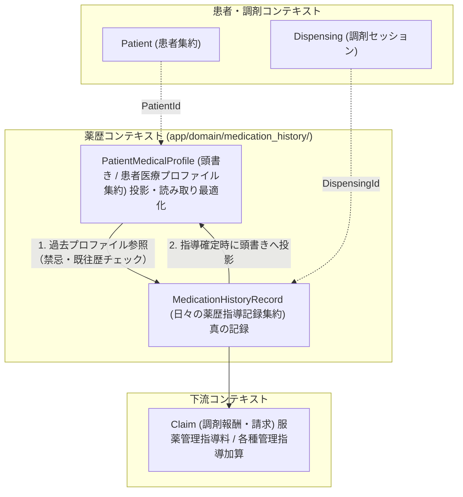
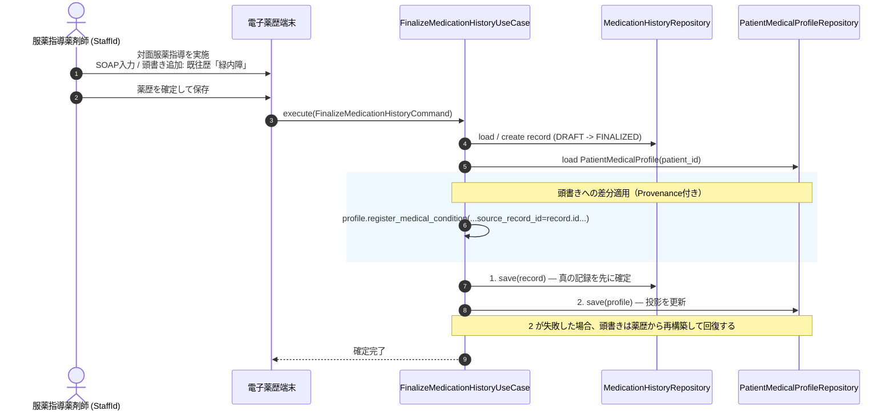
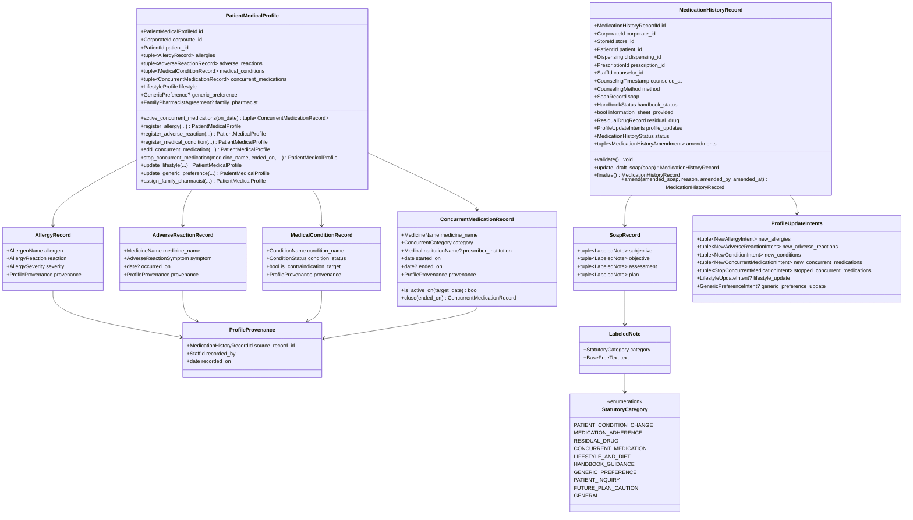
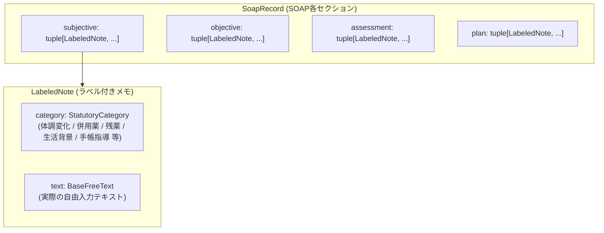

# 薬歴・服薬指導（MedicationHistory）コンテキスト 詳細仕様書 & ドメイン設計ガイドライン

> **本文書のステータス**: `draft`（設計のみ・未実装）。`app/domain/medication_history/` は存在しない。実装着手時は [§8 実装時に更新が必要な強制点](#8-実装時に更新が必要な強制点) を必ず参照すること。

## 1. 概要と境界定義（Bounded Context）

### 1.1 責務と位置づけ
薬歴・服薬指導（`MedicationHistory`）コンテキストは、薬局における**「患者への服薬指導・薬学的知見に基づく指導記録（SOAP）」**および**「患者固有の継続的医療プロファイル（頭書き / フェイスシート）」**を管理する整合性境界です。

| 規格・法令 | 本モデルでの適用範囲 |
| :--- | :--- |
| **薬剤師法 第25条の2** | 情報の提供及び指導の義務。第2項は「患者の当該薬剤の使用の状況を**継続的かつ的確に**把握する」義務であり、頭書きが存在する法的根拠 |
| **薬剤師法 第28条** / **薬剤師法施行規則 第16条** | 調剤録の備付・記載事項・3年保存 |
| **薬担規則 第10条** | 保険調剤録の整備 |
| **保険調剤の理解のために（令和8年度）第2節 薬学管理料 通則(4)** | 薬剤服用歴等の記載事項（§2 に全項目を掲載） |

> **電子処方箋管理サービス 記録条件仕様（調剤編）は本コンテキストの根拠ではない。** 同仕様には「薬歴」「服薬指導」「SOAP」「服薬管理」の語が一度も現れず、薬歴に対応するレコードも別表も存在しない。準拠先として挙げてはならない。

> **調剤録と薬歴の関係**: 保険調剤の理解のために は「この調剤録は、調剤済となった処方箋又は患者の服薬状況や指導内容等を記録したもの（薬剤服用歴等）に調剤録と同様の事項を記入したものをもって**代えることができる**」と定める。すなわち薬歴は調剤録を兼ねうる。本コンテキストを法定調剤録の代替として使う場合、調剤録の記載事項（施行規則第16条）を満たす必要がある。



### 1.2 2つの集約の役割分担

1. **`MedicationHistoryRecord`（日々の薬歴指導記録集約 — 真の記録）**:
   - 処方箋・調剤セッションに対する1回ごとの服薬指導（SOAP形式）、指導薬剤師（`StaffId`）、残薬・手帳確認結果を管理します。
   - **本コンテキストにおける唯一の真実の源（source of truth）**。
2. **`PatientMedicalProfile`（頭書き / 患者医療プロファイル集約 — 投影）**:
   - 電子薬歴の画面上部・左側に常時固定表示される「患者鑑・頭書き」。
   - アレルギー歴、副作用歴、既往歴・禁忌疾患、他院併用薬・OTC、生活像、後発医薬品に対する意向、かかりつけ薬剤師契約を管理します。
   - **薬歴の列から決定的に再構築できる投影であり、独立した真実を持たない**（§2.2）。
   - **由来追跡（Provenance）**: 各項目が「どの薬歴で、誰が、いつ登録したか」の根拠（`source_record_id`）を保持します。

---

## 2. 薬歴と頭書きの関係

### 2.1 薬剤服用歴等の法定記載事項

保険調剤の理解のために（令和8年度）第2節 薬学管理料 通則(4)。**頭書きの各要素は、この列挙のどこに対応するかで正当性が決まる。**

| 記載事項 | 本モデルでの担当 |
| :--- | :--- |
| ア 患者の基礎情報（氏名、生年月日、性別、被保険者証の記号番号、住所、緊急連絡先） | `Patient` / `Coverage` コンテキスト（ID参照） |
| イ 処方及び調剤内容等（処方した保険医療機関名、処方医氏名、処方日、調剤日、調剤した薬剤、**処方内容に関する照会の要点**等） | `Prescription` / `Dispensing` コンテキスト（ID参照） |
| ウ（イ）患者の体質（**アレルギー歴、副作用歴等を含む**）、薬学的管理に必要な患者の**生活像**、**後発医薬品の使用に関する患者の意向** | `AllergyRecord` / `AdverseReactionRecord` / `LifestyleProfile` / `GenericPreference` |
| ウ（ロ）疾患に関する情報（**既往歴、合併症及び他科受診において加療中の疾患**を含む） | `MedicalConditionRecord` |
| ウ（ハ）**併用薬**（要指導医薬品、一般用医薬品、**医薬部外品**及び健康食品を含む）等の状況、**服用薬と相互作用が認められる飲食物の摂取状況** | `ConcurrentMedicationRecord` / `LifestyleProfile` |
| ウ（ニ）服薬状況 | `SoapRecord`（S / O） |
| ウ（ホ）**残薬状況（残薬がないときは、その旨を記載すること）** | `ResidualDrugRecord`（**必須**。§5 不変条件 #3） |
| ウ（ヘ）患者の服薬中の体調の変化（副作用が疑われる症状など）、患者又はその家族等からの相談事項の要点 | `SoapRecord`（S / A） |
| ウ（ト）**手帳活用の有無**（活用しなかった場合はその理由と**患者への指導の有無**。複数の手帳を所有しており1冊にまとめなかった場合は、その理由） | `HandbookStatus`（§3.2） |
| エ 今後の継続的な薬学的管理及び指導の留意点 | `SoapRecord`（P） |
| オ **指導した保険薬剤師の氏名** | `counselor_id` |

同(5) は「単に全て記載するのではなく、**その要点を記載**することで差し支えない」「**定型文を用いて画一的に記載するのではなく**、指導等を行った保険薬剤師が必要事項を判断して記載する」「指導後**速やかに**記載を完了させる」と定める。同(6) により保存期間は最終記入日から3年間。

### 2.2 頭書きは薬歴からの投影である（原子性に関する設計判断）

薬歴の確定と同時に頭書きを更新するが、**2つの集約を1トランザクションで原子的に保存する契約は置かない**。

本リポジトリに `UnitOfWork` は存在しない（`app/base/domain/entity.py` の docstring が「発行先（`UnitOfWork` のコミット後にイベントを配送する経路）が存在しない」と明記しており、実装も無い）。永続化実装が1つも無い段階で UnitOfWork を導入するのは先回りである（AGENTS.md「到達可能なClaim UseCaseがない間はClaim権限を定義しない」と同じ判断）。

**代わりに、頭書きを投影と定義することで整合性を回復可能にする。**

- 真は `MedicationHistoryRecord`。`profile_updates`（`ProfileUpdateIntents`）に頭書きへの差分がすべて記録されている。
- `PatientMedicalProfile` は、その患者の全薬歴を `counseled_at` 昇順に畳み込めば**決定的に再構築できる**。
- したがって保存順序は `save(record)` → `save(profile)` とする。前者が成功し後者が失敗した場合、頭書きは薬歴から再構築して回復する。逆順にすると、根拠のない頭書きレコードが残る。
- **`PatientMedicalProfile` に、薬歴に由来しない直接編集を許してはならない**（許した瞬間に再構築が不可能になり、投影であるという前提が崩れる）。§5 不変条件 #6。



---

## 3. クラス構造と詳細設計



### 3.1 `PatientMedicalProfile` の識別子

`id` は `PatientMedicalProfileId`（UUIDv7）であり、`PatientId` を流用しない。

- 他集約のIDを自分のIDにすると、`XxxId.generate()` を用いる既存の Domain Primitive 規約から外れる。
- 患者の統合・削除が発生したときに、プロファイルの同一性をどう扱うかが決まらなくなる。
- 患者との1:1関係は `patient_id` への一意制約（Repository契約）で表現する。これは `PatientExternalIdentifier` が採る既存の作法と同じ。

### 3.2 `ConcurrentMedicationRecord` に `is_active` を持たせない

**併用薬の有効・無効は `ended_on` から導出する。** 独立した `is_active: bool` フィールドは持たない。

- `ended_on is None`（継続中）と `is_active == True` は同じ事実であり、2つ持てば必ず食い違う。`ended_on >= started_on` だけを検証しても、`ended_on` が入っているのに `is_active == True` という状態は防げない。
- 判定は `is_active_on(target_date)` として**適用日を引数で受け取る全域関数**にする。`date.today()` の暗黙利用は ruff `DTZ011` が禁止しており、遡及判定（過去のある日に併用していたか）は相互作用チェックで実際に必要になる。
- **注意**: この `is_active` は集約ルートではなく子レコードのフィールドであるため、`tests/domain/test_lifecycle_dialects.py` の分類対象（`AggregateRoot` サブクラスのフィールド）に入らない。つまり**うっかり足しても pytest では落ちない**。この文書と設計レビューだけが歯止めになる。

### 3.3 お薬手帳の管理状況（`HandbookStatus`）

法定記載事項ウ（ト）は3つの独立した情報を要求する。1つの enum では表現できない。

| 属性 | 内容 |
| :--- | :--- |
| `presented` | 手帳の提示・活用の有無 |
| `not_presented_reason` | 活用しなかった場合の理由（持参忘れ、手帳不要の意向等） |
| `guidance_provided` | 活用しなかった場合に**患者への指導を行ったか** |
| `multiple_handbooks_not_consolidated_reason` | 複数の手帳を所有しており1冊にまとめなかった場合の理由 |

### 3.4 残薬状況（`ResidualDrugRecord`）

法定記載事項ウ（ホ）は「**残薬がないときは、その旨を記載すること**」と明示している。したがって `residual_drug` は `Optional` ではなく**必須**であり、「残薬なし」を表す値を持つ。

| 属性 | 内容 |
| :--- | :--- |
| `has_residual_drugs` | 残薬の有無 |
| `quantity` | 残薬の数量（日数/回数）。`has_residual_drugs == True` のとき必須 |
| `reason` | 発生理由。`has_residual_drugs == True` のとき必須 |

### 3.5 併用薬の分類（`ConcurrentCategory`）

法定記載事項ウ（ハ）の列挙に対応させる。

| 値 | 内容 |
| :--- | :--- |
| `PRESCRIPTION` | 他院・他科の処方薬 |
| `GUIDANCE_REQUIRED` | 要指導医薬品 |
| `OTC` | 一般用医薬品 |
| `QUASI_DRUG` | 医薬部外品 |
| `HEALTH_FOOD` | 健康食品 |

「服用薬と相互作用が認められる飲食物の摂取状況」（同項後段）は薬品ではないため `LifestyleProfile` 側で扱う。

### 3.6 薬歴の状態（`MedicationHistoryStatus`）

| 値 | 説明 |
| :--- | :--- |
| `DRAFT` | 下書き。SOAP の上書き編集が可能 |
| `FINALIZED` | 確定済。直接の上書き不可。修正は `amend()` による追記のみ |

確定済薬歴の修正は `MedicationHistoryAmendment`（追記日時・追記者・追記理由・修正後SOAP）として**追記**し、元の記録を保持する。調剤録は3年間の保存義務があり、遡って書き換えられる記録は監査に耐えない。

### 3.7 法定ラベル付きテキスト（`LabeledNote`）と監査・検索性

薬歴の自由記述テキスト（SOAP）に対し、ユーザー（薬剤師）が法で定められた項目のラベル（`StatutoryCategory`）を任意に付与・構造化できる仕様とします。



#### A. 法定カテゴリ（`StatutoryCategory`）の定義

保険調剤の理解のために（令和8年度）第2節 薬学管理料 通則(4) に基づく分類：

| カテゴリ値 | 日本語ラベル | 法的根拠・実務上の用途 |
| :--- | :--- | :--- |
| `PATIENT_CONDITION_CHANGE` | 体調変化・副作用確認 | ウ（ヘ）「患者の服薬中の体調の変化（副作用が疑われる症状など）」 |
| `MEDICATION_ADHERENCE` | 服薬状況・遵守 | ウ（ニ）「服薬状況」 |
| `RESIDUAL_DRUG` | 残薬状況・理由 | ウ（ホ）「残薬状況（残薬が生じている場合はその理由）」 |
| `CONCURRENT_MEDICATION` | 併用薬・他院処方・OTC | ウ（ハ）「併用薬等の状況」 |
| `LIFESTYLE_AND_DIET` | 生活状況・飲食物相互作用 | ウ（イ）「生活像」および「相互作用が認められる飲食物」 |
| `HANDBOOK_GUIDANCE` | お薬手帳の活用・指導 | ウ（ト）「手帳活用の有無、指導の要点」 |
| `GENERIC_PREFERENCE` | 後発医薬品使用意向 | ウ（イ）「後発医薬品の使用に関する患者の意向」 |
| `PATIENT_INQUIRY` | 患者・家族相談事項 | ウ（ヘ）「患者又はその家族等からの相談事項の要点」 |
| `FUTURE_PLAN_CAUTION` | 今後指導留意点・フォロー | エ「今後の継続的な薬学的管理及び指導の留意点」 |
| `GENERAL` | 一般・指定なし | 特定の法定カテゴリに縛られない自由記述（既定値） |

#### B. 導入による3大実務メリット
1. **個別指導（厚生局監査）での防御力**:
   - 指導官から「体調変化の確認はどこか」と問われた際、長文の文章内から探す必要がなく、`【体調変化】` ラベルにより一目で確認可能。
2. **聞き取り漏れを防ぐ入力テンプレート**:
   - UI上でタグボタン（「体調変化」「併用薬」等）を押すことで、何を聞き取るべきかのチェックリストとして機能し、入力枠が即座に生成される。
3. **過去薬歴の「項目別串刺し検索」**:
   - 「過去1年間の【体調変化・副作用】の記録のみを抽出」「【残薬理由】のみを一覧表示」といった高度な薬学的フォローアップが可能。

---

## 4. 頭書き要素の由来追跡（Provenance）仕様

頭書きに登録されたすべての医学的所見には、**「どの薬歴記録に基づいているか」**という根拠（`ProfileProvenance`）が刻まれます。頭書きが投影であること（§2.2）は、すべての要素が由来を持つことによって初めて成立します。

| 頭書き要素 | 管理内容 | 薬歴ソフトでの画面活用 |
| :--- | :--- | :--- |
| `AllergyRecord` | アレルゲン（ペニシリン系、卵等）、症状（皮疹、アナフィラキシー等）、重篤度 | 頭書きのアレルギーから、聞き取り時のSOAP薬歴へ1クリックでジャンプ |
| `AdverseReactionRecord` | 医薬品名、副作用症状（胃痛、発熱、浮腫等）、発現時期 | 処方鑑査で該当薬剤・同効薬が出た際に「誰がいつ登録した副作用歴か」を添えて警告 |
| `MedicalConditionRecord` | 疾患名（緑内障、前立腺肥大、喘息等）、状態、禁忌対象フラグ | 禁忌チェックの根拠を即座に確認可能 |
| `ConcurrentMedicationRecord` | 医薬品名/OTC名、分類、処方元医療機関、開始日、終了日 | 併用薬の重複・相互作用チェック。飲み切り終了時は `close(ended_on)` |

`ProfileProvenance` は `source_record_id` / `recorded_by` / `recorded_on` の3項目からなり、**いずれも必須**（Optional にしない）。1つでも欠けると投影の再構築ができなくなる。

---

## 5. ドメイン不変条件（Invariants Checklist）

**守り手**の列は `Aggregate.validate()` / `Domain Service` / `Boundary` / `Repository契約` の4種に限る。

| # | 不変条件 | 守り手 | 必要な参照 |
| :---: | :--- | :--- | :--- |
| 1 | `counselor_id` は薬剤師資格（`StaffQualification.PHARMACIST`）を保持する保険薬剤師 | Domain Service | `Staff` 集約 |
| 2 | `finalize()` 時、`SoapRecord` の S / O / A / P の各セクションが最低1件の `LabeledNote`（textが空文字でないもの）を持つ | `MedicationHistoryRecord.finalize()` | — |
| 3 | `residual_drug` は必須。`has_residual_drugs == True` のとき数量と発生理由が必須（法定記載事項ウ（ホ）「残薬がないときは、その旨を記載すること」） | `ResidualDrugRecord.validate()` | — |
| 4 | 手帳を活用しなかった場合、理由と患者への指導の有無が記録されている。複数手帳を1冊にまとめなかった場合はその理由も記録されている | `HandbookStatus.validate()` | — |
| 5 | `ConcurrentMedicationRecord` は `ended_on is None` または `ended_on >= started_on` | `ConcurrentMedicationRecord.validate()` | — |
| 6 | 頭書きのすべての要素が `ProfileProvenance`（`source_record_id` / `recorded_by` / `recorded_on`）を持つ。薬歴に由来しない直接編集は許可しない | `PatientMedicalProfile.validate()` | — |
| 7 | 確定済（`FINALIZED`）の薬歴は `update_draft_soap()` を受け付けない。修正は `amend()` による追記のみ | `MedicationHistoryRecord.update_draft_soap()` | — |
| 8 | `dispensing_id` が指す調剤セッションが同一法人・同一患者のものであること | Domain Service | `DispensingProcess` 集約 |
| 9 | `PatientMedicalProfile.patient_id` は法人内で一意 | Repository契約 | — |
| 10 | 同一 `dispensing_id` に対する `FINALIZED` の薬歴は1件以下 | Repository契約 | — |

> #1・#8 は他集約を参照するため `validate()` に書いてはならない。#9・#10 は Application の事前 read では原子性を担保できないため、`save()` が同じ集約IDを除外した上で原子的に拒否する契約とする（AGENTS.md「Repositoryの最終防衛」）。

---

## 6. Repository Protocol の設計

```python
from typing import Protocol

from app.domain.corporate.primitives import CorporateId
from app.domain.dispensing.primitives import DispensingId
from app.domain.medication_history.medication_history_record import (
    MedicationHistoryRecord,
)
from app.domain.medication_history.patient_medical_profile import PatientMedicalProfile
from app.domain.medication_history.primitives import MedicationHistoryRecordId
from app.domain.patient.primitives import PatientId


class MedicationHistoryRepository(Protocol):
    """薬歴指導記録集約の取得・永続化を行うドメインリポジトリ Protocol。"""

    async def get(
        self,
        *,
        corporate_id: CorporateId,
        record_id: MedicationHistoryRecordId,
    ) -> MedicationHistoryRecord | None:
        """薬歴指導記録を取得する。他法人の場合は None を返す契約。"""
        ...

    async def get_by_dispensing(
        self,
        *,
        corporate_id: CorporateId,
        dispensing_id: DispensingId,
    ) -> MedicationHistoryRecord | None:
        """調剤セッションに紐付く薬歴指導記録を取得する。"""
        ...

    async def list_by_patient(
        self,
        *,
        corporate_id: CorporateId,
        patient_id: PatientId,
    ) -> list[MedicationHistoryRecord]:
        """患者の薬歴タイムラインを counseled_at 降順で取得する。"""
        ...

    async def save(self, record: MedicationHistoryRecord) -> None:
        """薬歴指導記録を保存する。

        同一 dispensing_id に対する FINALIZED の記録が2件以上にならないよう、
        同じ集約IDを除外した上で原子的に拒否する契約とする。
        """
        ...


class PatientMedicalProfileRepository(Protocol):
    """患者医療プロファイル集約（頭書き）の取得・永続化を行うドメインリポジトリ Protocol。"""

    async def get_by_patient(
        self,
        *,
        corporate_id: CorporateId,
        patient_id: PatientId,
    ) -> PatientMedicalProfile | None:
        """患者の頭書きを取得する。未作成の場合は None を返す。

        頭書きは薬歴からの投影であるため、None のときは空プロファイルを
        生成してよい（欠損ではなく「まだ投影されていない」を意味する）。
        """
        ...

    async def save(self, profile: PatientMedicalProfile) -> None:
        """患者の頭書きを保存する。

        corporate_id と patient_id の組の重複を、同じ集約IDを除外した上で
        原子的に拒否する契約とする。
        """
        ...
```

> **import 元に注意**: `CorporateId` / `PatientId` / `StoreId` は Shared Kernel ではなく各コンテキストの `primitives` に定義されている（実例: `app/domain/reception/repository.py`）。

---

## 7. Application層で必要になる権限

到達可能な UseCase を実装する時点で定義する。定義だけを先に置かない。

| 権限 | 対象操作 |
| :--- | :--- |
| `MANAGE_MEDICATION_HISTORY` | 薬歴の作成・確定・追記、頭書きの更新 |
| `VIEW_MEDICATION_HISTORY` | 薬歴・頭書きの参照 |

---

## 8. 実装時に更新が必要な強制点

| 更新対象 | 内容 |
| :--- | :--- |
| `pyproject.toml` `[tool.import_rules.forbidden]` | `app.domain.medication_history` から Claim / Coverage 台帳 / Patient・Store の Aggregate への直接依存を禁止。`Dispensing` は `DispensingId` のみを参照する |
| `tests/domain/test_lifecycle_dialects.py` の `LIFECYCLE_DIALECTS` | **`"MedicationHistoryRecord": "status_enum"` と `"PatientMedicalProfile": "none"` の2行を追加**。表に行が無い集約は必ず落ちる |
| `tests/contracts/test_repository_contracts.py` | `PatientMedicalProfileRepository.save()` の `patient_id` 一意契約、`MedicationHistoryRepository.save()` の `dispensing_id` 一意契約を追加 |
| `pyproject.toml` `[tool.fake_rules]` | `tests/fakes/` に2つの InMemory 実装を置く際にパスを追加 |
| `okf/ddd/domain.md` §1.1 / §7 / §8 | コンテキスト相関図・ライフサイクル方言表・リポジトリ一覧に MedicationHistory を追加 |
| `AGENTS.md`「コンテキストは…7つ」 | コンテキスト数と一覧を更新 |
| `okf/index.md` | 「現在の実装マップ」へ MedicationHistory を追加し、本文書の `status` を `active` へ変更 |

> **`is_active` に関する注意（§3.2 の再掲）**: `ConcurrentMedicationRecord` は集約ルートではないため、`is_active: bool` を足しても `test_lifecycle_dialects.py` は落ちない。仕組みで守れない箇所なので、レビュー時に必ず確認すること。
