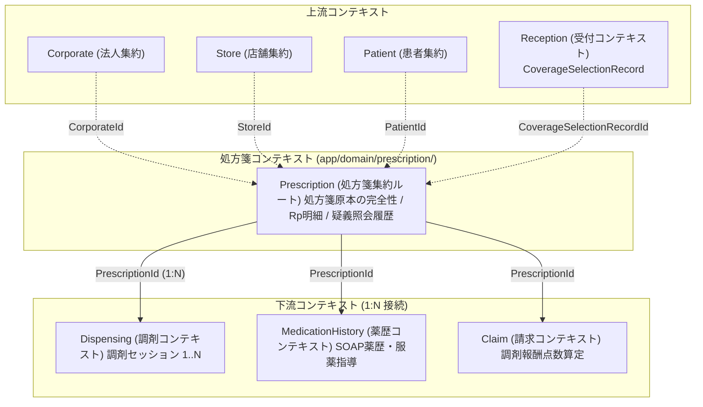
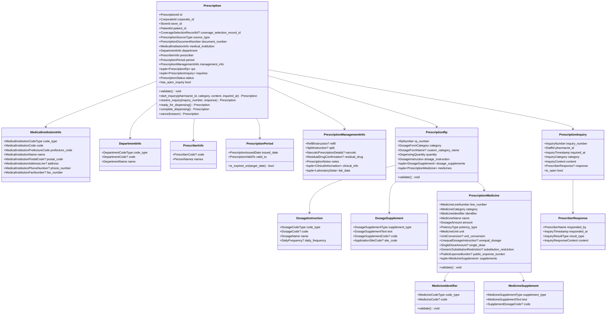
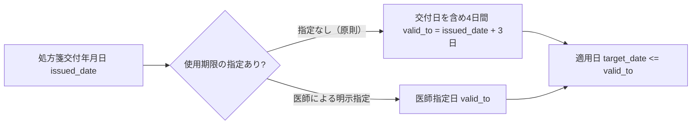
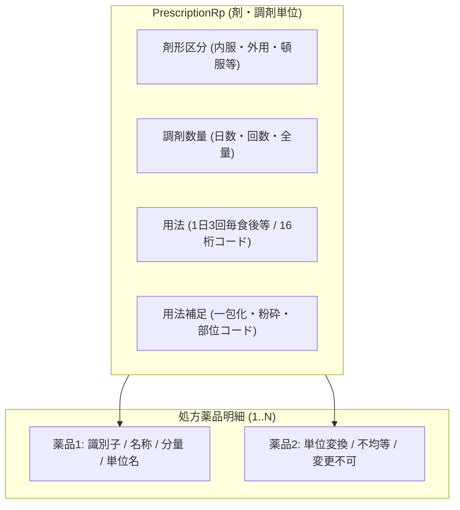
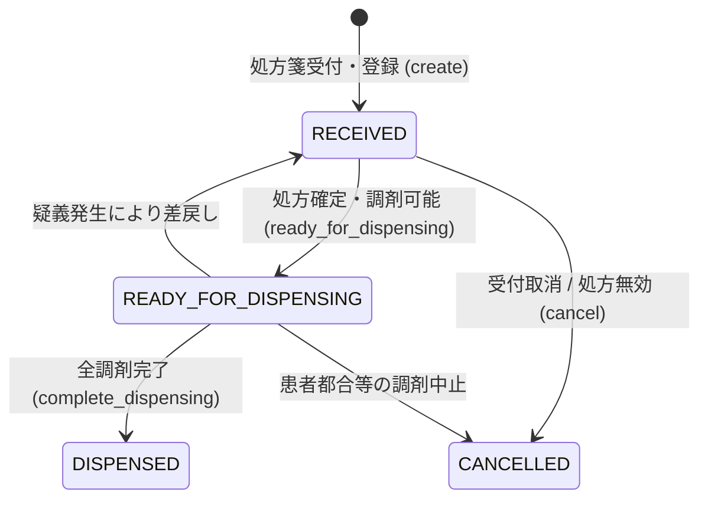

# 処方箋（Prescription）コンテキスト 詳細仕様書 & ドメイン設計ガイドライン

> **本文書のステータス**: `active`（実装済み）。実装は `app/domain/prescription/` と `app/application/prescription/` にある。
> 設計と実装が食い違ったときは**実装が正**であり、本文書を直す。実装が守っている強制点は [§8](#8-実装済みの強制点) を参照。

## 1. 概要と境界定義（Bounded Context）

### 1.1 責務と位置づけ
処方箋（`Prescription`）コンテキストは、医師・歯科医師によって交付された**「処方箋原本の完全性」**および**「薬剤師法第24条に基づく疑義照会（Inquiry）」**を管理する整合性境界です。

本モデルが参照する公的標準規格と、それぞれの適用範囲：

| 規格 | 本モデルでの適用範囲 |
| :--- | :--- |
| **JAHIS 院外処方箋２次元シンボル記録条件規約 Ver.1.11** | 紙処方箋の2次元バーコード。レコード番号（No.1, 101, 111, 181, 201, 231, 281 等）と、その備考欄に定義されるコード値 |
| **厚労省 電子処方箋管理サービス 記録条件仕様（処方編）Ver.2.4** | 電子処方箋。**別表1〜16** のコード体系。JAHISと同じレコード番号を使うが、**使用可能なコード値の集合が異なる**（§3.1 の注記を参照） |
| **厚労省 電子処方箋管理サービス 記録条件仕様（調剤編）Ver.2.2** | `疑義照会結果レコード(511)`。疑義照会は規格上は調剤側の記録である（§3.6 を参照） |
| **厚労省 保険調剤の理解のために（令和8年度）** | 使用期間、リフィル処方箋、分割調剤、減数調剤の業務要件 |



### 1.2 設計方針と境界の分離（神集約の排除）
1. **処方原本と調剤行為の分離**:
   - `Prescription` 集約は「医師が発行した処方内容」と「医師への疑義照会結果」のみを保持します。
   - 実際の調剤調製、調剤鑑査（最終鑑査）、服薬指導、薬歴SOAP入力は下流の `Dispensing` / `MedicationHistory` コンテキストへ分離し、**リフィル処方箋や分割調剤における 1:N の調剤セッション**を自然に扱える構造とします。
2. **集約間は ID 参照のみ**:
   - `CorporateId`, `StoreId`, `PatientId`, `CoverageSelectionRecordId` のみを保持します（[§3.1.2 参照する他コンテキストの型](#312-参照する他コンテキストの型)）。
3. **紙・電子処方箋の統一**:
   - JAHIS 2次元シンボル（紙処方箋）と電子処方箋（引換番号/管理サービスID）のデータ構造を共通のドメイン語彙へ正規化します。
   - ただし**両者で使用可能なコード値の集合が異なる**ため、`PrescriptionSourceType` に応じた検証を集約が行います（§5 不変条件 #9）。

---

## 2. 処方箋集約のクラス構造



---

## 3. ドメイン構成要素の仕様詳細

### 3.1 識別子および分類用 Enum / Primitive

> **別表番号の出典について（重要）**
> JAHIS Ver.1.11 の付録別表は **別表1:都道府県コード / 別表2:年号区分コード / 別表3:診療科コード / 別表4:レセプト種別コード（医科）の4つのみ**であり、剤形区分・薬品コード種別などはレコードの**備考欄にインライン定義**されている。
> 一方、電子処方箋（処方編）Ver2.4 は **別表1〜16** を持ち、こちらに剤形区分（別表13）・薬品コード種別（別表15）・薬品補足区分（別表16）が定義されている。
> **両規格はレコード番号を共有するが別表番号は共有しない。** 本表では出典を規格名まで明記する。

| クラス名 | 型 / 基底 | 規格 / 定義仕様 | 業務上の役割・不変条件 |
| :--- | :--- | :--- | :--- |
| `PrescriptionId` | `EntityUUID` | UUIDv7 | 処方箋集約の一意識別子。 |
| `PrescriptionSourceType` | `StrEnum` | `PAPER_QR` / `ELECTRONIC` | 処方箋の受領元形式（紙処方箋2次元シンボル / 電子処方箋管理サービス）。**使用可能なコード値の集合を決定する**（不変条件 #9）。 |
| `PrescriptionStatus` | `StrEnum` | `RECEIVED` / `READY_FOR_DISPENSING` / `DISPENSED` / `CANCELLED` | 処方箋原本のライフサイクル状態（§4）。疑義照会中は状態ではなく `has_open_inquiry` で導出する。 |
| `PrescriptionDocumentNumber` | `DomainPrimitive[str]` | 最大36文字 | 処方箋ID。電子処方箋引換番号（16桁数字）または電子処方箋管理サービス発行UUID（36文字）または紙処方箋番号。 |
| `MedicalInstitutionCodeType` | `StrEnum` | `MEDICAL` (1:医科) / `DENTAL` (3:歯科) / `HOME_VISIT` (6:訪問) | 医療機関コード種別。JAHIS レコードNo.1 備考欄「1:医科、3:歯科、6:訪問、省略:医科」。省略時は医科として正規化する。 |
| `MedicalInstitutionCode` | `DomainPrimitive[str]` | 半角英数字7桁（JAHIS レコードNo.1 `X7`） | 保険医療機関コード（レセプト提出用コード）。 |
| `MedicalInstitutionPrefectureCode` | `DomainPrimitive[str]` | 半角数字2桁（01〜47） | 医療機関都道府県コード（JAHIS 別表1 / 処方編 別表2）。 |
| `DepartmentCodeType` | `StrEnum` | `NONE` (1:コードなし) / `STANDARD` (2:診療科コード) | 診療科コード種別（JAHIS レコードNo.4 備考欄「3〜8:将来統一コードを想定」/ 処方編 別表3）。 |
| `DepartmentCode` | `DomainPrimitive[str]` | 半角英数字 最大6桁（JAHIS レコードNo.4 `X6`） | 診療科コード。値は JAHIS 別表3 / 処方編 別表4（01:内科, 02:精神科, 09:小児科, 10:外科, 19:皮膚科, 23:産婦人科, 26:眼科, 27:耳鼻いんこう科, 31:麻酔科 等）。**フィールド長は6桁だが別表の値は2桁**である点に注意。 |
| `DosageFormCategory` | `StrEnum` | `INTERNAL` (1:内服) / `PRN` (2:頓服) / `TOPICAL` (3:外用) / `INTERNAL_DROPS` (4:内服滴剤) / `INJECTION` (5:注射) / `SUPPLY` (6:医療材料) / `OTHER` (9:不明) | 剤形区分（処方）。**処方編 別表13** / JAHIS レコードNo.101 備考欄。両規格で値は一致する。 |
| `MedicineCategory` | `StrEnum` | `PHARMACEUTICAL` (1:医薬品) / `SUPPLY` (2:特定器材・医療材料) / `NON_INSURANCE` (3:自費・非保険薬) | 薬品・器材情報区分（JAHIS レコードNo.201）。 |
| `MedicineCodeType` | `StrEnum` | 下表のとおり**規格により使用可能な値が異なる** | 薬品コード種別。**処方編 別表15** / JAHIS レコードNo.201 備考欄。 |
| `PotencyType` | `StrEnum` | `TARIFF` (1:薬価単位) / `POTENCY` (2:力価単位) | 力価フラグ（JAHIS レコードNo.201 備考欄）。 |
| `DosageCodeType` | `StrEnum` | `NONE` (1:コードなし) / `JAMI` (2:JAMI用法コード) / `EP_MASTER` (3:電子処方箋用法マスタ) | 用法コード種別。JAHIS は `1` / `2`（`3〜8` は将来予約）、処方編は **`3` 固定**。 |
| `MedicineSupplementType` | `StrEnum` | `UNIT_DOSE` (1:一包化) / `CRUSHED` (2:粉砕) / `JAMI_SUPPLEMENT` (7:JAMI補足用法) | 薬品補足区分のうち**調製指示**にあたる値（処方編 別表16 / JAHIS レコードNo.281）。変更制限（3〜6・8）は `GenericSubstitutionRestriction` が担う（§3.5.D）。 |

#### `MedicineCodeType` の規格別の可否

処方編 別表15 は、JAHIS で有効な一部のコード体系を明示的に排除している。**この差分を吸収せずに単一 enum として扱うと、電子処方箋に送信不能なコードを凍結できてしまう。**

| コード | 内容 | JAHIS Ver.1.11（紙） | 処方編 Ver2.4（電子） |
| :---: | :--- | :---: | :---: |
| 1 | コードなし | 使用可 | **（未使用）** |
| 2 | レセプト電算処理システム用コード | 使用可 | 使用可 |
| 3 | 厚生省コード | 使用可 | **（使用しない）** |
| 4 | YJコード（個別医薬品コード） | 使用可 | 使用可 |
| 6 | HOTコード | 使用可 | **（使用しない）** |
| 7 | 一般名コード（厚労省） | 使用可 | 使用可 |

`MedicineIdentifier` が `PrescriptionSourceType` と組み合わせてこれを検証する（不変条件 #9）。

#### 3.1.2 参照する他コンテキストの型

集約間はID参照のみだが、**そのIDや値オブジェクトの定義元**は明示する必要がある。実装着手時に `[tool.import_rules.forbidden]` へ規則を足す際、ここが判断の根拠になる。

| 型 | 定義元 | 参照理由 | Shared Kernel へ上げるか |
| :--- | :--- | :--- | :--- |
| `CorporateId` | `app.domain.corporate.primitives` | テナント境界 | 上げない（既存の全コンテキストが定義元から import している） |
| `StoreId` | `app.domain.store.primitives` | 受付店舗 | 上げない（同上） |
| `PatientId` | `app.domain.patient.primitives` | 対象患者 | 上げない（同上） |
| `CoverageSelectionRecordId` | `app.domain.reception.primitives` | 受付時に選択された資格の履歴 | 上げない。ただし **Reception → Prescription の逆流を禁止する規則が必要** |
| `StaffId` | `app.domain.staff.primitives` | 疑義照会実施薬剤師 | 上げない |
| `PersonNames` | `app.base.domain.value_object` | 処方医氏名 | 既に Shared Kernel |
| `MedicineName` / `MedicineCode` / `MedicineUnit` / `DosageAmount` ほか | `app.base.domain.medicine` | 3コンテキストが同じ薬品語彙を必要とする | **Shared Kernel へ上げた**（`log.md` ADR-9）。判断基準は「所有者がいるか」。薬品はどの集約の同一性でもない |
| `MedicineClassification` / `MedicineRestrictionFlag` | 本コンテキスト（`value_objects.py`） | 医薬品マスタ Boundary の戻り値の形 | **上げない**。使うのは Prescription だけであり、共有語彙ではなく問い合わせ結果の形（ADR-14） |
| `DosageInstruction` / `DosageCodeType` / `DosageCode` / `DosageName` / `DailyFrequency` | `app.base.domain.dosage` | 用法は処方・調剤・薬歴のいずれもが持つ | **Shared Kernel へ上げた**（ADR-9 と同じ基準）。用法補足（別表14）は処方箋固有なので本コンテキストに残す |

---

### 3.2 処方期間と使用期限（`PrescriptionPeriod`）

医療法および健康保険法に基づき、処方箋には厳格な有効期間（使用期限）が存在します（保険調剤の理解のために 令和8年度「処方箋の使用期間は、交付の日を含めて４日以内とされている」）。



- **不変条件**:
  1. `valid_to >= issued_date`（使用期限は交付日当日または未来の日付でなければならない）。
  2. 使用期限が未指定の場合、交付日当日を含め**4日間**（`issued_date + 3日`）をデフォルト実効期限とする。
  3. 長期の旅行等の特殊事情で医師が延長指定した場合は、明示された `valid_to` を採用する。
- `is_expired_on(target_date)` は適用日を必ず引数で受け取る。`date.today()` は使用しない（ruff `DTZ011` が禁止する）。

---

### 3.3 処方管理・特殊指示（`PrescriptionManagementInfo`）

#### A. リフィル処方箋指示（`RefillInstruction`）

| 属性 | 型 | 内容 |
| :--- | :--- | :--- |
| `total_refill_count` | `DomainPrimitive[int]` | 総使用回数。2 または 3（1回のみはリフィル処方箋ではない） |

**リフィル指示の適用除外**（保険調剤の理解のために 令和8年度 「○ リフィル処方箋による調剤（１）イ」）:

> 保険医療機関及び保険医療養担当規則において、**投与量に限度が定められている医薬品**及び**貼付剤**（この場合において、「貼付剤」とは、鎮痛・消炎に係る効能及び効果を有するものであって、**麻薬若しくは向精神薬であるもの又は専ら皮膚疾患に用いるものを除いた**ものをいう。）については、リフィル処方箋による調剤を行うことはできない。

判定基準は上記2つであり、「麻薬」「向精神薬」「湿布薬」「新薬」といった**例示列挙で書いてはならない**（麻薬・向精神薬の貼付剤は「貼付剤」の定義から除外され、別途「投与量に限度が定められている医薬品」として扱われるため、列挙は必ずずれる）。

いずれの判定も**医薬品マスタ側の属性**であり `Prescription` 集約は判定できない。判定は `MedicineRestrictionBoundary`（Protocol）へ委ね、Application層で検証する（§5 不変条件 #6）。

#### B. 分割指示処方箋（`SplitInstruction`）

医師の分割指示（調剤基本料「注11」）に対応する。**薬局判断による分割調剤（注9・注10）は処方箋の属性ではないため、ここには現れない**（[dispensing.md](dispensing.md) §1.2 を参照）。

| 属性 | 型 | 内容 |
| :--- | :--- | :--- |
| `total_split_count` | `DomainPrimitive[int]` | 全分割回数。2〜3回 |
| `split_iteration` | `DomainPrimitive[int]` | 当該分割回。1〜`total_split_count` |
| `iteration_quantity` | `DispensingQuantity` | 当該回の調剤数量 |

- **総調剤数量と分割回ごと調剤数量**: 剤形レコード（No.101）の調剤数量には「総数量（例: 90日分）」を記録し、分割指示調剤数量レコードに「当該回の数量（例: 30日分）」を記録する（JAHIS レコードNo.101 備考「※分割指示に係る処方箋の場合であっても『総調剤数量』を記録すること」）。

#### C. 麻薬処方箋情報（`NarcoticPrescriptionDetails`）

| 属性 | 型 |
| :--- | :--- |
| `narcotic_license_number` | 麻薬施用者免許番号 |
| `patient_address` | 患者住所 |
| `patient_phone_number` | 患者電話番号 |

麻薬（施用管理が必要な薬品）が含まれる処方箋では、これら3項目が**必須**となる。ただし「含まれるか」の判定は医薬品マスタ側の属性であり、集約は判定できない（§5 不変条件 #5）。

#### D. 残薬確認指示（`ResidualDrugConfirmation`）

処方編 **別表11「残薬確認対応フラグ」**:

| コード | 内容 | Enum |
| :---: | :--- | :--- |
| 1 | 保険医療機関へ疑義照会した上で調剤 | `INQUIRE_AND_DISPENSE` |
| 2 | （2026年5月末まで）保険医療機関へ情報提供<br/>（**2026年6月以降**）調剤する薬剤を減量した上で保険医療機関に情報提供 | `REDUCE_AND_INFORM` |

コード `2` は 2026年6月に意味が変わっている。本モデルは 2026年6月以降の解釈（減数調剤指示）を採用する。過去処方箋を取り込む場合は交付日に応じた解釈が必要になるため、`ResidualDrugConfirmation` は交付日とセットで解釈すること。

#### E. その他の管理情報

| 型 | 内容 | 出典 |
| :--- | :--- | :--- |
| `PrescriptionNotes` | 備考。処方箋全体に係る自由記述（ファーストクラスコレクション） | JAHIS レコードNo.81 備考レコード |
| `ClinicalInformation` | 臨床情報（診断名・症状等）。電子処方箋で医師が任意に付す | 処方編 |
| `LaboratoryData` | 検査値情報（腎機能・肝機能等）。用量調整の判断根拠 | 処方編 |

---

### 3.4 剤（`PrescriptionRp`）と用法・用量

処方内容は「剤（Rp）」という調剤単位で束ねられます。



#### A. 調剤数量（`DispensingQuantity`）

JAHIS レコードNo.101 備考欄より：

- **内服**: 投与日数（日分）
- **頓服**: 投与回数（回分）
- **外用・注射・医療材料**: 投与日数または回数
- 外用薬等も `総量 = 薬品の用量 × 調剤数量` が成り立つ。**薬品の用量に総量を記録する場合は調剤数量に必ず 1 を記録する**。

#### B. 用法（`DosageInstruction`）

| 属性 | 内容 |
| :--- | :--- |
| `code_type` | `DosageCodeType`。JAHIS は `1:コードなし` / `2:JAMI用法コード`、処方編は `3:電子処方箋用法マスタ` 固定 |
| `code` | 16桁（JAHIS レコードNo.111 `X16` / 処方編も `X16` 固定）。例: `1013044400000000` |
| `name` | 用法名称（必須）。JAHIS は `N50`、処方編は `N150` |
| `daily_frequency` | 1日回数。JAHIS レコードNo.111 は `92 2` すなわち **1〜99**。不定・頓用時は省略可 |

「JAMI用法コード」とは日本医療情報学会標準である**処方・注射オーダ標準用法規格**にて定められたコード体系（JAHIS レコードNo.111 備考欄）。

#### C. 用法補足（`DosageSupplement`）

処方編 **別表14「用法補足区分」** / JAHIS レコードNo.181（`1RPに1レコード以上出力`、RP全体に掛かる補足情報）。両規格で値は一致する。

| コード | 内容 | コード | 内容 |
| :---: | :--- | :---: | :--- |
| 1 | 漸減 | 6 | 部位 |
| 2 | 一包化 | 7 | １回使用量 |
| 3 | 隔日 | 8 | JAMI補足用法（不均等を除く） |
| 4 | 粉砕 | 9 | JAMI部位 |
| 5 | 用法の続き | 10〜99 | （未使用） |

| 型 | 内容 |
| :--- | :--- |
| `DosageSupplementCode` | 補足用法コード（`X8`）。区分が `8:JAMI補足用法` の場合に記録 |
| `ApplicationSiteCode` | 外用部位コード（`X3`）。区分が `9:JAMI部位` の場合に**必須**。例: `42L`（左耳） |

> **`2:一包化` / `4:粉砕` の重複に注意**: 一包化・粉砕は用法補足（別表14、RP単位）と薬品補足（別表16、薬品単位）の**両方に存在する**。RP全体に掛かるものは `DosageSupplement`、特定薬品にのみ掛かるものは `MedicineSupplement` に記録する（§3.5.D）。

---

### 3.5 薬品明細（`PrescriptionMedicine`）と調剤制御

#### A. 分量・用量（`DosageAmount`）

- 1つの薬品に対する処方量。
  - **内服薬**: **1日分の服用量**（例: 1日3錠なら `3.0`）。
  - **頓服薬**: **1回分の服用量**（例: 疼痛時1回2錠なら `2.0`）。
  - **外用薬・材料**: **処方総量**（例: 軟膏2本なら `2.0`、チューブ50gなら `50.0`）。
- **数値形式**: 整数部最大6桁、小数部最大5桁（正の実数）。

#### B. 薬品識別子（`MedicineIdentifier`）

`(code_type, code)` を不可分に束ねる Value Object。**桁数はコード体系ごとに異なるため、`MedicineCode` 単独では自己検証できない。**

AGENTS.md「レセプト番号の桁数はプリミティブの不変条件として持たせる」に対し、本項目は code_type 依存であるため VO で束ねて `MedicineIdentifier.validate()` が組み合わせを検証する。code_type ごとに7つの型を作る案は、Rp明細のフィールド型が動的になるため採らない。

| code_type | 桁数 | 確認状況 |
| :--- | :--- | :--- |
| `RECEIPT`（2:レセプト電算処理システム用コード） | 9桁 | **要確認**（refa の規格書はフィールド長 `X13` としか定めていない） |
| `YJ`（4:YJコード） | 12桁 | **要確認**（同上） |
| `GENERIC`（7:一般名コード） | — | **要確認**（同上） |
| `NONE`（1:コードなし） | `code is None` であること | 確認済（JAHIS レコードNo.201 サンプル `201,1,1,1,1,,ノルバスク錠,10,2,ｍｇ`） |

> **要確認**の桁数は、各コードマスタの原典に当たって確定させてから不変条件として実装すること。**未確認の桁数を推測で不変条件に書くと、正当なコードを弾く実装になる。** 確定するまでは「空でないこと」のみを課す。

#### C. 単位変換係数（`UnitConversion`）

処方箋に記載された単位（例: `缶`、`包`、`本`）が、官報告示薬価収載単位（例: `mL`、`g`、`mg`）と異なる場合に記録する（JAHIS レコードNo.211 単位変換レコード。「処方箋表記単位が官報告示薬価収載単位: 未出力、以外: 必須出力」）。

- **計算式**: `薬価収載単位用量 = 処方用量 × 単位変換係数`
- **例**: エンシュア・リキッド（薬価告示単位: 10mL）を「3缶」処方（1缶250mL）の場合、単位変換係数は `250.0`（3 × 250 = 750 mL）。
- **不変条件**: 変換係数は 0 を超える正の値。

#### D. 変更制限と薬品補足（別表16 の分担）

処方編 **別表16「薬品補足区分」** / JAHIS レコードNo.281 は、性質の異なる2種類の指示を**1本の enum**として定義している。本モデルはこれを2つの型に振り分ける。

| コード | 内容 | 振り分け先 |
| :---: | :--- | :--- |
| 1 | 一包化 | `MedicineSupplement`（調製指示） |
| 2 | 粉砕 | `MedicineSupplement`（調製指示） |
| 3 | 後発品変更不可 | `GenericSubstitutionRestriction`（変更制限） |
| 4 | 剤形変更不可 | `GenericSubstitutionRestriction`（変更制限） |
| 5 | 含量規格変更不可 | `GenericSubstitutionRestriction`（変更制限） |
| 6 | 剤形変更不可及び含量規格変更不可 | `GenericSubstitutionRestriction`（変更制限） |
| 7 | JAMI補足用法（不均等を除く） | `MedicineSupplement`（調製指示） |
| 8 | 先発医薬品患者希望 | `GenericSubstitutionRestriction`（変更制限） |
| 9〜99 | （未使用） | — |

- `3〜6` は医師が変更を禁じる指示（保険医の署名・理由が必要）、`8` は患者自身が長期収載品を希望する選定療養指示であり、いずれも**調剤時の代替可否を決める**ため同じ型に束ねる。
- **不変条件**: 同一薬品の `substitution_restriction` と `supplements` に**同じコードが同時に現れてはならない**（§5 不変条件 #10）。振り分けを規約で守ると必ず片方に漏れる。

#### E. 薬品単位の公費負担区分（`PublicExpenseBurden`）

処方箋内の複数薬品のうち、特定の薬品のみが公費対象（難病指定薬など）となる場合のフラグ。JAHIS レコードNo.231 負担区分レコード（「処方箋内出力／未出力混在不可、全薬品出力 or 全薬品未出力、1薬品に1レコード」）。

| 枠 | 値 |
| :--- | :--- |
| `first` 第一公費負担区分 | `0:負担しない` / `1:負担する` / 省略:負担しない |
| `second` 第二公費負担区分 | 同上 |
| `third` 第三公費負担区分 | 同上 |
| `special` 特殊公費負担区分 | 同上 |

##### 処方箋の公費枠と Claim の公費順位の対応

**処方箋（JAHIS / 電子処方箋）とレセプトでは公費の枠が一致しない。** 対応関係を定義せずに突合してはならない。

| 処方箋側（JAHIS レコードNo.27〜30） | 番号の形式 | Claim 側（`ClaimCoveragePriority`） |
| :--- | :--- | :--- |
| 第一公費（No.27） | 負担者番号 8桁 / 受給者番号 7桁 | `1` |
| 第二公費（No.28） | 同上 | `2` |
| 第三公費（No.29） | 同上 | `3` |
| **特殊公費（No.30）** | 負担者番号 `N20`・受給者番号 `N20`（**漢字半角混在可・数字以外可**。サンプル `30,特－１２,１２３４５６７`） | **対応枠なし** |
| — | — | `4`（第四公費）は電子レセプト側の枠であり、処方箋2次元シンボルに対応枠がない |

- **決定**: 特殊公費は `ClaimCoveragePriority` へ写さない。JAHIS 別表の定義が「各番号が8桁・7桁以上及び数字以外の公費専用」であり、`ClaimPublicPayerNumber`（8桁数字）・`ClaimPublicRecipientNumber`（7桁数字）の不変条件を満たせないため、priority 4 に写すと**桁数の防衛線を壊す**。
- 電子レセプトは 第一〜第四公費（特殊公費という枠を持たない）、処方箋は 第一〜第三公費＋特殊公費。両者は別軸である。
- この決定は `okf/log.md` にADRとして記録する。

#### F. 不均等服用指示（`UnequalDosageInstruction`）

朝・昼・夕・就寝前などで服用量が異なる場合（例: 朝1.5錠、夕0.5錠）の指示（JAHIS レコードNo.221 不均等レコード。「不均等服用: 必須出力（薬品補足レコード出力でも可）」）。

- **不変条件**: 各回服用量の合計 == 薬品の1日量（`DosageAmount`）。

#### G. 1回服用量（`SingleDoseAmount`）

JAHIS レコードNo.241 １回服用量レコード（`未出力可`、`薬品補足レコードで代用可`）。1回あたりの服用量を明示する場合に記録する。

---

### 3.6 疑義照会（`PrescriptionInquiry`）エンティティ

薬剤師法第24条に基づき、処方内容に疑義がある場合に処方医へ確認・照会した結果を記録・管理するエンティティです。

> **規格上の位置づけ**: 疑義照会結果は、規格上は**調剤編Ver2.2 の `疑義照会結果レコード(511)`** として調剤結果に記録される（処方編Ver2.4 に「疑義照会」の記述はほとんど無い）。
> 本コンテキストは「疑義は処方内容に対して発生し、その解決は処方内容を確定させる」というドメイン判断から `Prescription` 集約に置く。**電子処方箋管理サービスへ送信する際は、調剤側の 511 レコードへ写像する**。

#### 規格との差分

| 項目 | 規格（調剤編 511） | 本モデル | 差分の理由 |
| :--- | :--- | :--- | :--- |
| 件数 | 複数記録可（**最大999**） | `InquiryNumber` 1〜999 | **規格に揃えた**。99に絞る業務根拠がないため |
| 種別 | 疑義照会種別コード（別表7）。**現状 `999:その他` のみで、他は「今後追加予定」** | 独自 `InquiryCategory` | 規格側が未整備。送信時は全件 `999` に畳む |
| 内容 | `内容` `N600` の自由記述1本（処方内容・照会内容・照会結果を1フィールドに書き下す） | 構造化して保持（`content` / `PrescriberResponse`） | 検索・監査のため構造化し、送信時に1本へ整形する |
| リフィル | 「リフィル処方箋に関する調剤結果で当レコードを記録した場合には、**2回目以降のリフィル処方箋受付時に記録内容を返却する**」 | `Prescription` が保持するため、回をまたいで自然に引き継がれる | — |

#### 属性

| 属性 | 型 | 内容 |
| :--- | :--- | :--- |
| `inquiry_number` | `InquiryNumber` | 照会連番（1〜999） |
| `pharmacist_id` | `StaffId` | 照会薬剤師ID（薬剤師資格必須） |
| `inquired_at` | `InquiryTimestamp` | 照会日時（注入 `Clock` 由来のUTC） |
| `category` | `InquiryCategory` | 照会種別（用法用量、相互作用、重複投薬、残薬調整、禁忌、後発品変更、記載不備など）。**規格由来ではなく独自定義** |
| `content` | `InquiryContent` | 疑義照会内容 |
| `response` | `PrescriberResponse?` | 回答。未回答（照会中）は `None` |
| `is_open` | `bool`（導出） | `response is None` |

`PrescriberResponse`（回答が存在する場合のみ生成される Value Object）:

| 属性 | 型 | 内容 |
| :--- | :--- | :--- |
| `responded_by` | `PrescriberName` | 回答医師氏名 |
| `responded_at` | `InquiryTimestamp` | 回答日時 |
| `result_type` | `InquiryResultType` | `MODIFIED`（処方変更）/ `UNCHANGED`（疑義解消・変更なし調剤）/ `DELETED`（処方削除） |
| `content` | `InquiryResponseContent` | 回答内容 |

> **処方変更前後のスナップショットは保持しない。** 処方箋自身の中に自分のスナップショットを持つのは自己参照であり、どちらが正かが決まらない。変更の内容は `content` に記述する。変更履歴の追跡が業務要件として現れた時点で、独立した監査ログ集約として設計する（AGENTS.md「到達可能なUseCaseが現れるまで広げない」と同じ判断）。

---

## 4. 処方箋のライフサイクルと状態遷移

処方箋集約は `status_enum` 方言（`status: PrescriptionStatus`）を採用します。



### 4.1 状態の定義

| 状態 | 説明 | 可能な操作 |
| :--- | :--- | :--- |
| `RECEIVED` (受付済) | 処方箋が登録され、処方鑑査および調剤準備待ちの状態。 | 疑義照会開始・回答、調剤可能化、取消 |
| `READY_FOR_DISPENSING` (調剤可能) | 処方が確定し、`Dispensing` コンテキストで調剤セッションを開始可能な状態。 | 疑義照会開始・回答、調剤完了、差戻し、取消 |
| `DISPENSED` (調剤済) | 全ての調剤が完了した終端状態。リフィル処方箋は総使用回数を消化した時点で遷移する。 | 参照のみ |
| `CANCELLED` (取消・無効) | 処方の全面削除、他薬局への転送、患者キャンセル等による終端状態。 | 参照のみ |

`DISPENSED` は保険調剤の理解のために「当該リフィル処方箋の総使用回数の調剤が終わった場合、**調剤済処方箋**として保管する」に対応する。

### 4.2 「疑義照会中」を状態にしない理由

**`INQUIRING` という状態は持たない。** 疑義照会中かどうかは `has_open_inquiry`（`any(i.is_open for i in inquiries)`）から導出する。

状態として持つと以下の問題が同時に発生する。

1. **状態が巻き戻る**: `READY_FOR_DISPENSING → INQUIRING → ?` のとき、照会解決後にどちらへ戻すかを `status` だけでは決められない。照会前の状態を別途覚えるフィールドが要る。
2. **矛盾した状態が表現できてしまう**: 「`status == INQUIRING` なのに未回答の照会が1件もない」「`status == RECEIVED` なのに未回答の照会がある」という状態が構築可能になる。導出なら定義上ありえない。

これは `ConcurrentMedicationRecord.is_active` を `ended_on` からの導出に倒した判断（[medication_history.md](medication_history.md) §3）、および `CoverageSelectionRecord.snapshot` を枠構造からの導出 property にした既存の判断（AGENTS.md「選択は枠で持つ」）と同じ原則である。

`ready_for_dispensing()` は `has_open_inquiry == True` のとき拒否する（§5 不変条件 #11）。

---

## 5. ドメイン不変条件（Invariants Checklist）

**守り手**の列は `Aggregate.validate()` / `Domain Service` / `Boundary` / `Repository契約` の4種に限る。集約が単独で検証できないものを `validate()` に書くと、他集約をロードできず必ず破綻する。

| # | 不変条件 | 守り手 | 必要な参照 |
| :---: | :--- | :--- | :--- |
| 1 | `rps` が1件以上（空の処方箋は禁止）。`RpNumber` は 1 から連続して昇順 | `Prescription.validate()` | — |
| 2 | `PrescriptionPeriod.valid_to >= issued_date` | `PrescriptionPeriod.validate()` | — |
| 3 | 各 Rp は `PrescriptionMedicine` を1件以上持つ。同一 Rp 内の `MedicineLineNumber` は 1 から連続して昇順。用法名称が空でない | `PrescriptionRp.validate()` | — |
| 4 | `DosageAmount` は 0 を超える正の値（整数部6桁＋小数部5桁）。`UnitConversion` の係数も 0 を超える正の値 | 各 Primitive の `validate()` | — |
| 5 | 麻薬を含む処方箋は `NarcoticPrescriptionDetails`（施用者免許番号・患者住所・患者電話番号）が必須 | Domain Service | 医薬品マスタ Boundary（麻薬区分） |
| 6 | リフィル指示は「投与量に限度が定められている医薬品」「貼付剤（麻薬・向精神薬・皮膚疾患用を除く）」を含む処方箋に適用できない。`total_refill_count` は 2 または 3 | 回数は `RefillInstruction.validate()`<br/>適用除外は Domain Service | 医薬品マスタ Boundary（投与量限度・貼付剤区分） |
| 7 | 薬品の `PublicExpenseBurden` で `1:負担する` とした枠は、患者資格に存在する公費の範囲内でなければならない | Domain Service（`PublicExpenseBurdenService`） | `PublicExpenseAvailabilityBoundary`（Application層） |
| 8 | `PrescriptionInquiry.pharmacist_id` は薬剤師資格（`StaffQualification.PHARMACIST`）を保持するスタッフ | Domain Service（`InquiryPharmacistService`） | `StaffQualifications`（`StaffQualificationBoundary` 経由） |
| 9 | `source_type == ELECTRONIC` のとき、全薬品の `MedicineIdentifier.code_type` は `RECEIPT` / `YJ` / `GENERIC` のいずれかでなければならない（処方編 別表15 で 1・3・6 は未使用／使用しない） | `Prescription.validate()` | — |
| 10 | ~~同一薬品の `substitution_restriction` と `supplements` に、別表16 の同一コードが同時に現れない~~ → **判定不能**。`MedicineSupplementType`（1・2・7）と `GenericSubstitutionRestrictionType`（3〜6・8）は互いに素な列挙なので、この状態は構築できない。実装では読み込み時チェック `verify_supplement_code_partition()` が**2つの列挙が別表16 を過不足なく分割していること**を守る | 読み込み時チェック | — |
| 11 | `has_open_inquiry == True` のとき `ready_for_dispensing()` は拒否される | `Prescription.ready_for_dispensing()` | — |
| 12 | `UnequalDosageInstruction` の各回服用量の合計が薬品の1日量と一致する | `UnequalDosageInstruction.validate()` | — |
| 13 | `MedicalInstitutionCode` は7桁。`MedicalInstitutionPrefectureCode` は 01〜47。処方医の漢字氏名は必須 | 各 Primitive の `validate()` | — |

> #5・#6 の「医薬品マスタ Boundary」は本コンテキストにまだ存在しない。実装着手時に `MedicineRestrictionBoundary`（Protocol）として定義し、`Raises:` に他テナント・未存在の畳み込み先を明記すること（AGENTS.md「Boundaryの例外契約」）。

---

## 6. Repository Protocol の設計

```python
from typing import Protocol

from app.domain.corporate.primitives import CorporateId
from app.domain.patient.primitives import PatientId
from app.domain.prescription.prescription import Prescription
from app.domain.prescription.primitives import (
    PrescriptionDocumentNumber,
    PrescriptionId,
)
from app.domain.store.primitives import StoreId


class PrescriptionRepository(Protocol):
    """処方箋集約の取得・永続化を行うドメインリポジトリ Protocol。"""

    async def get(
        self,
        *,
        corporate_id: CorporateId,
        prescription_id: PrescriptionId,
    ) -> Prescription | None:
        """指定された法人境界内で処方箋集約を取得する。他法人の場合は None を返す契約。"""
        ...

    async def get_by_document_number(
        self,
        *,
        corporate_id: CorporateId,
        document_number: PrescriptionDocumentNumber,
    ) -> Prescription | None:
        """引換番号や処方箋番号から処方箋を取得する。他法人の場合は None を返す契約。"""
        ...

    async def save(self, prescription: Prescription) -> None:
        """処方箋集約を原子的に保存する（新規登録および状態変更の永続化）。"""
        ...
```

> **import 元に注意**: `CorporateId` / `PatientId` / `StoreId` は Shared Kernel ではなく各コンテキストの `primitives` に定義されている（実例: `app/domain/reception/repository.py`）。`app.base.domain.primitives` が公開するのは `EntityUUID` / `EntityStringId` / `Base*` のみ。

---

## 7. Application層で必要になる権限

AGENTS.md「到達可能なClaim UseCaseがない間はClaim権限を定義しない」と同じ判断により、**到達可能な UseCase を実装する時点で**以下を定義する。定義だけを先に置かない。

| 権限 | 対象操作 |
| :--- | :--- |
| `MANAGE_PRESCRIPTION` | 処方箋の登録・疑義照会の記録・状態変更 |
| `VIEW_PRESCRIPTION` | 処方箋の参照 |

---

## 8. 実装済みの強制点

以下は**すでに機械が守っている**。壊すと `pytest` か静的チェッカが落ちる。

| 強制点 | 守っている仕組み |
| :--- | :--- |
| 他コンテキストへの依存の向き | `pyproject.toml` `[tool.import_rules.forbidden]` の `app.domain.prescription` / `app.application.prescription` の行 |
| 無効化方言 | `tests/domain/test_lifecycle_dialects.py` の `"Prescription": "status_enum"` |
| `save()` の引換番号一意性 | `tests/contracts/test_repository_contracts.py`（`tests/fakes/` を自動列挙） |
| 別表16 の分割（旧 #10） | `verify_supplement_code_partition()`（読み込み時 `RuntimeError`） |
| 権限の分類 | `app/application/access_control/policy.py` の `_verify_permission_classification()`（読み込み時 `RuntimeError`） |
| 用量に `float` を使わない | `BaseNonNegativeDecimal` が `float` を拒否。`tests/domain/test_decimal_primitives.py` が6,859通りで固定 |

### 8.1 実装時に判明した仕様書の誤り

| 箇所 | 誤り | 対応 |
| :--- | :--- | :--- |
| §5 #10 | 別表16 の同一コードが両方に現れる状態は**構築できない**（2つの列挙が互いに素）。書いても1度も raise されない | 読み込み時の分割チェックへ置き換えた |
| §5 #7 の守り手 | 「Application層」では規則の置き場所が定まらない | `PublicExpenseBurdenService`（Domain Service）+ 参照Boundary へ変更 |
| §5 #8 の必要な参照 | 「`Staff` 集約」を Prescription から参照すると集約間の直接依存になる | `StaffQualifications` を Boundary 経由で受け取る形へ変更 |
| Boundary の置き場所 | Domain層 `reference.py` を想定していた | 既存の Boundary は全て Application層。**Application層に統一**した |

---

## 9. 未解決のまま残していること

| 項目 | 状態 |
| :--- | :--- |
| ~~医薬品マスタ~~ | **解消した**。`app/domain/medicine_catalog/` を実装し、`MedicineCatalogRestrictionAdapter`（Composition）が `MedicineRestrictionBoundary` を満たす。麻薬処方箋・リフィル処方箋が登録できるようになった（`okf/log.md` ADR-14）。未収載の薬品では依然として fail-closed で失敗する |
| 医薬品マスタの取り込み | 集約と取り込みユースケースはあるが、厚労省の薬価基準ファイル・MEDIS の HOT コードマスタからの実際の読み込みは Infrastructure の仕事で未着手 |
| 処方箋の公費枠 ↔ 資格台帳の順位の対応 | `PublicExpenseAvailabilityBoundary` の Protocol だけ定義。実アダプタ（Composition）は未実装 |
| `MedicineCode` の桁数 | 原典で確認できていないため不変条件にしていない（§3.5.B） |
| 永続化実装 | 無い。`save()` の原子性は Protocol の契約と Fake でしか担保されていない |
| HTTP ルート | `app/presentational/` は空。既存コンテキストも未接続 |
