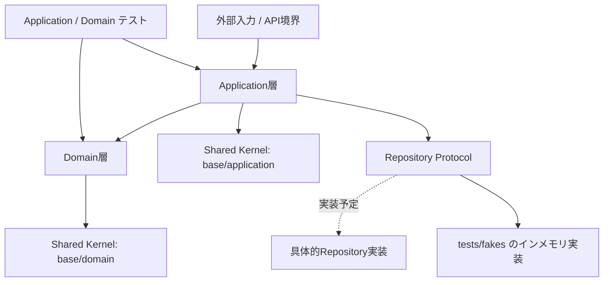
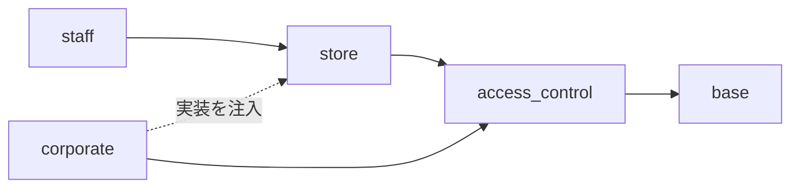

# PharmacyDomain Knowledge Base

PharmacyDomain プロジェクトの設計方針、DDDのガイドライン、現在の実装構成を確認するための入口です。

現在は、法人（`Corporate`）・店舗（`Store`）・スタッフ（`Staff`）・患者（`Patient`）・患者資格（`Coverage`）の5コンテキストについて、ドメインモデルとApplicationユースケースを実装しています。認証基盤とは分離したApplication側のAccess Control境界も定義しています。
APIのシステムエンドポイントは `app/main.py` にありますが、これらのユースケースをHTTPへ接続するAPIルートはまだ実装していません。
Repositoryは`Protocol`のみで、具体的な永続化実装もまだありません（テスト用のインメモリ実装だけが存在します）。

## アーキテクチャ概要



このプロジェクトでは、Application層がユースケースの処理順序を調整し、Domain層が業務ルールと集約の振る舞いを持ちます。
RepositoryはDomain側で抽象化し、具体的なデータストアへの依存を内側へ持ち込みません。

## ナレッジ一覧

| 文書 | 内容 |
| :--- | :--- |
| [Domain層の実装ガイドライン](ddd/domain.md) | Domain Primitive、Value Object、Entity、Aggregate Root、Domain Service、Repository、各コンテキスト |
| [Application層の実装ガイドライン](ddd/application.md) | UseCase、Command / Response DTO、DI、例外、ユースケースの処理フロー、テスト方針 |
| Access Control（`app/application/access_control/`） | `ActorContext`、ロール・権限、法人スコープ、対象法人の存在・有効状態の確認 |
| [テスト層の実装ガイドライン](testing.md) | AAAパターン、Domain / Applicationテスト、Fake Repository、例外、非同期テスト |
| [コードレビューの方針](review.md) | 仕組みで守る原則、依存・壊れやすさ・明示性・検証可能性の観点、機械化しないもの |

## 現在の実装マップ

### Shared Kernel

`app/base/` は複数コンテキストで共有する基盤です。

**Domain（`app/base/domain/`）**

- `primitives/base.py` — `DomainPrimitive[T]`（frozen、生成時に `_normalize()` → `validate()`）
- `primitives/primitives.py` — `EntityUUID`（UUIDv7）、`EntityStringId`、`BaseNormalizedString`、`BasePostalCode`、`BaseAddress`、`BaseFreeText`、`BaseDate`、`BaseTelephoneNumber`、`BaseEmailAddress`、`BaseNonNegativeInt` / `BasePositiveInt`、`BaseNonNegativeFloat` / `BasePositiveFloat`
- `primitives/person_primitives.py` — `BasePersonName`、`BasePersonNameKana`（NFKCで半角カナを全角へ正規化）
- `entity.py` — `Entity[ID]` と `AggregateRoot[ID]`（いずれも `frozen=True, eq=False, kw_only=True`）
- `value_object.py` — `PersonName`、`PersonNameKana`、`PersonNames`
- `exceptions.py` — `DomainError` と `DomainValidationError`

**Application（`app/base/application/`）**

- `exceptions.py` — `ApplicationError`、`NotFoundError`（404相当）、`AuthorizationError`（403相当）

### Corporateコンテキスト

#### Domain層

実装場所: `app/domain/corporate/`

- `corporate.py` — `Corporate` Aggregate Root
- `primitives.py` — `CorporateId`、`CorporateName`、`CorporateRepresentativeName`、`CorporateStatus`
- `repository.py` — `CorporateRepository`、`CorporateCatalogRepository`
- `services.py` — `CorporateNameUniquenessService`
- `exceptions.py` — `CorporateDomainError`、`CorporateNameAlreadyExistsError`

`Corporate`は複数の薬局店舗を束ねるマルチテナント境界です。状態変更は `change_name()`、`change_representative()`、`activate()`、`deactivate()`を通して行い、いずれも新しい `Corporate` を返します。管理者ユーザーやロールはCorporate集約に保持しません。

#### Application層

実装場所: `app/application/corporate/`（ユースケース、DTO、`CorporateAccessService`、例外、サポート関数を `__init__.py` で再エクスポートします）

| ユースケース | 入力 / 出力 | 主な責務 |
| :--- | :--- | :--- |
| `RegisterCorporateUseCase` | `RegisterCorporateCommand` / `CorporateId` | 法人の新規登録 |
| `ChangeCorporateNameUseCase` | `ChangeCorporateNameCommand` / `None` | 同値なら保存せず、重複確認後に法人名を変更 |
| `ChangeRepresentativeUseCase` | `ChangeRepresentativeCommand` / `None` | 同値なら保存せず代表者名を変更 |
| `GetCorporateUseCase` | 法人ID文字列 / `CorporateResponseDto` | 法人の取得と外部向けDTO変換 |
| `ChangeCorporateStatusUseCase` | `ChangeCorporateStatusCommand` / `None` | ベンダーシステム管理者専用の有効化・無効化 |

`GetCorporateUseCase.execute()`だけはQuery DTOを取らず、法人IDの文字列を直接受け取ります（店舗・スタッフの取得系は`GetStoreQuery` / `GetStaffQuery`を取ります）。

`app/application/access_control/` の `ActorContext` は認証・セッション層から渡される信頼済み操作主体です。`AuthorizationService` がベンダーシステム管理者（全法人）と法人管理者（自法人のみ）を判定し、`app/application/corporate/` の `CorporateAccessService` が対象法人の存在・有効状態を確認します。Command / Queryの `corporate_id` は操作対象であり、認証情報そのものではありません。
`support.py` の `load_corporate_or_raise()` と `load_active_corporate_or_raise()` は、法人取得と有効状態確認を共通化します。有効状態の判定（`_ensure_active()`）は同モジュール内部に閉じています。

Store / Staff のユースケースは、この `CorporateAccessService` ではなく `access_control/boundary.py` の `CorporateAccessBoundary`（`require_active` だけを持つ Protocol）に依存します。実装へ直接依存させると、`app/application/corporate/__init__.py` の再エクスポートを通じて法人ユースケース群まで読み込まれ、依存グラフが実態より太くなるためです。
`GetCorporateUseCase`は外部境界へ `CorporateResponseDto`を返す一方、更新ユースケースは変更対象の`Corporate`集約そのものを必要とするため、両者は統合しません。

### Storeコンテキスト

#### Domain層

実装場所: `app/domain/store/`

- `store.py` — `Store` Aggregate Root
- `primitives.py` — `StoreId`、`StoreName`／`StoreNameKana`／`StoreNameRomaji`（および複合VOの`StoreNames`）、`StoreCode`、`StorePostalCode`／`StoreAddressLine`（および複合VOの`StoreAddress`）、`StorePhoneNumber`／`StoreFaxNumber`／`StoreEmailAddress`（および複合VOの`ContactInfo`）、`InsurancePharmacyNumber`
- `repository.py` — `StoreRepository`、`StoreCatalogRepository`
- `services.py` — `StoreNameUniquenessService`、`StoreCodeUniquenessService`、`InsurancePharmacyNumberUniquenessService`
- `exceptions.py` — `StoreDomainError`、`StoreNameAlreadyExistsError`、`StoreCodeAlreadyExistsError`、`InsurancePharmacyNumberAlreadyExistsError`

`Store`は`corporate_id`で所属法人をIDのみ参照します。店舗名・店舗コードの一意性は**法人単位**で閉じており、別法人の同名・同コードは許可されます。保険薬局指定番号だけは法人をまたいでシステム全体で一意です。

#### Application層

実装場所: `app/application/store/`

| ユースケース | 入力 / 出力 | 主な責務 |
| :--- | :--- | :--- |
| `RegisterStoreUseCase` | `RegisterStoreCommand` / `StoreId` | 店舗の新規登録（名称・コード・保険薬局指定番号の重複確認を含む） |
| `ChangeStoreNamesUseCase` | `ChangeStoreNamesCommand` / `None` | 店舗名一式の変更 |
| `ChangeStoreCodeUseCase` | `ChangeStoreCodeCommand` / `None` | 店舗コードの設定・解除 |
| `ChangeStoreAddressUseCase` | `ChangeStoreAddressCommand` / `None` | 所在地の変更 |
| `ChangeStoreContactInfoUseCase` | `ChangeStoreContactInfoCommand` / `None` | 連絡先の変更 |
| `ChangeInsurancePharmacyNumberUseCase` | `ChangeInsurancePharmacyNumberCommand` / `None` | 保険薬局指定番号の設定・解除 |
| `GetStoreUseCase` | `GetStoreQuery` / `StoreDto` | 店舗詳細の取得 |
| `ListStoresUseCase` | `ListStoresQuery` / `list[StoreSummaryDto]` | 要求元法人の店舗一覧 |

`ChangeStore*` の6ユースケースはいずれも、変更後の値が現在値と等しければ保存せずに戻ります。

`CorporateAccessService.require_active()` で対象法人の認可・存在・有効状態を確認してから、`support.py` の `load_store_or_raise()` で要求対象法人に所属する店舗だけを取得します。存在しない場合と別法人の店舗である場合を同じ`StoreNotFoundError`に潰し、他テナントの店舗IDの存在を推測できないようにしています。
同じく `support.py` の `to_optional_text()` は、任意項目の空文字・空白のみを`None`へ揃えるための正規化です。

### Staffコンテキスト

#### Domain層

実装場所: `app/domain/staff/`

- `staff.py` — `Staff` Aggregate Root
- `primitives.py` — `StaffId`、`StaffCode`、`JobTitle`、`StaffQualification`（`StrEnum`）、`StaffQualifications`（ファーストクラスコレクション）、`PharmacistProfile`／`DietitianProfile`／`RegisteredSellerProfile`（`BaseQualificationProfile`の派生）、`PharmacistLicenseNumber`／`DietitianRegistrationNumber`／`SellerRegistrationNumber`、`InsurancePharmacistRegistration`、`CertifiedPharmacistInfo`、`HealthSupportPharmacistInfo`、`StoreAffiliation`、`AffiliationPeriod`
- `repository.py` — `StaffRepository`（法人境界付き `get`）、`StaffCatalogRepository`
- `services.py` — `StaffCodeUniquenessService`、`StaffStoreAssignmentService`（無状態ドメインサービス）
- `exceptions.py` — `StaffDomainError`、`StaffCodeAlreadyExistsError`、`StaffNotFoundError`、`InvalidCorporateAssignmentError`、`StaffAffiliationError`（`AffiliationDateConflictError`、`ConcurrentStoreConflictError`、`PrimaryAffiliationDuplicationError`）

`Staff` は `corporate_id` を保持し、`Store` 集約には直接依存せず `StoreId` をもとに所属履歴（`affiliations`）を管理します。
主所属店舗・兼務店舗のフィールドは持たず、`current_home_store_id(today)` / `current_concurrent_store_ids(today)` が履歴から導出します。
所属履歴の期間重複禁止は `Staff.validate()` が全生成経路（`create()` / `dataclasses.replace()` / Repository復元 / テストの直接構築）で強制します。

なお `app/domain/staff/exceptions.py` にも `StaffNotFoundError`（`DomainError`系）がありますが、ユースケースが送出するのは `app/application/staff/exceptions.py` の同名例外（`ApplicationError`系）です。import 元を取り違えないでください。

#### Application層

実装場所: `app/application/staff/`

| ユースケース | 入力 / 出力 | 主な責務 |
| :--- | :--- | :--- |
| `RegisterStaffUseCase` | `RegisterStaffCommand` / `Staff` | スタッフ新規登録、資格情報の初期登録、初期配属 |
| `ChangeStaffNamesUseCase` | `ChangeStaffNamesCommand` / `None` | 氏名（漢字・カナ）の変更 |
| `ChangeStaffJobTitleUseCase` | `ChangeStaffJobTitleCommand` / `None` | 役職・肩書の変更・解除 |
| `UpdateStaffQualificationsUseCase` | `UpdateStaffQualificationsCommand` / `None` | 資格情報の一括更新 |
| `DeactivateStaffUseCase` | `DeactivateStaffCommand` / `None` | 退職等による無効化 |
| `ActivateStaffUseCase` | `ActivateStaffCommand` / `None` | 復職等による有効化 |
| `TransferStaffHomeStoreUseCase` | `TransferStaffHomeStoreCommand` / `None` | 主所属店舗の異動 |
| `AssignStaffConcurrentStoreUseCase` | `AssignStaffConcurrentStoreCommand` / `None` | 兼務店舗の追加 |
| `RemoveStaffConcurrentStoreUseCase` | `RemoveStaffConcurrentStoreCommand` / `None` | 兼務店舗の解除 |
| `GetStaffUseCase` | `GetStaffQuery` / `StaffDto` | スタッフ詳細の取得 |
| `ListStaffsUseCase` | `ListStaffsQuery` / `list[StaffSummaryDto]` | 要求元法人のスタッフ一覧 |

`UpdateStaffQualificationsUseCase`はCommandの内容から資格一式を組み立て直して**置き換え**ます。Commandに含めなかった資格は失われます。

`RegisterStaffUseCase`は現状 `Staff` 集約をそのまま返します。他の参照系ユースケースがDTOを返すのとは揃っていません。

スタッフの変更系ユースケースには、法人・店舗のような「同値なら保存しない」判定を実装していません。常に `save()` を呼びます。

`CorporateAccessService.require_active()` で対象法人の認可・存在・有効状態を確認してから、`support.py` の `load_staff_or_raise()` で要求対象法人に所属するスタッフのみを取得します。境界外アクセスは `StaffNotFoundError`（404相当）として防御します。この境界チェックは `StaffRepository.get()` 自体が `corporate_id` を受け取って行うため、店舗（ユースケース側で `corporate_id` を突き合わせる）とは方式が異なります。
`support.py` は店舗側の `load_store_or_raise()` を再エクスポートしていますが、`to_optional_text()` は店舗側と同じ実装を独自に持っています。

### Patientコンテキスト

#### Domain層

実装場所: `app/domain/patient/`

- `patient.py` — `Patient` Aggregate Root
- `primitives.py` — `PatientId`（UUIDv7）、`PatientNumber`、`PatientBirthDate`、外部ID用プリミティブ、共有の `PersonNames`
- `external_identifier.py` — `PatientExternalIdentifier` Aggregate
- `repository.py` — `PatientRepository`、`PatientExternalIdentifierRepository`（法人境界付き）

`Patient` は `corporate_id` を保持し、患者の氏名、任意の生年月日、法人内で再利用しない患者番号を管理します。外部患者IDは連携先ごとに複数持てる `PatientExternalIdentifier` 別Aggregateで管理し、患者集約には埋め込みません。保険・公費の資格情報は独立した `coverage` コンテキストで管理します。処方箋は別コンテキストとして実装し、患者を参照するときは `PatientId` のみを使います。

#### Application層

実装場所: `app/application/patient/`

| ユースケース | 入力 / 出力 | 主な責務 |
| :--- | :--- | :--- |
| `RegisterPatientUseCase` | `RegisterPatientCommand` / `PatientId` | 患者の新規登録 |
| `ChangePatientNamesUseCase` | `ChangePatientNamesCommand` / `None` | 患者氏名の変更 |
| `ChangePatientBirthDateUseCase` | `ChangePatientBirthDateCommand` / `None` | 生年月日の設定・解除 |
| `GetPatientUseCase` | `GetPatientQuery` / `PatientDto` | 患者詳細の取得 |
| `RegisterPatientExternalIdentifierUseCase` | `RegisterPatientExternalIdentifierCommand` / `PatientExternalIdentifierDto` | 連携先ごとの外部患者ID登録 |
| `ListPatientExternalIdentifiersUseCase` | `ListPatientExternalIdentifiersQuery` / `list[PatientExternalIdentifierDto]` | 患者に紐付く外部患者ID一覧 |
| `DeactivatePatientExternalIdentifierUseCase` | `DeactivatePatientExternalIdentifierCommand` / `None` | 外部患者ID対応付けの無効化 |

全ユースケースは `CorporateAccessBoundary` による認可・法人の存在・有効状態確認後に処理します。患者が存在しない場合と別法人の患者を指定した場合は `PatientNotFoundError`（404相当）に統一し、他テナントの存在を隠蔽します。認証済みの操作主体はCommand / Queryへ入れず、注入されたアクセス境界で検証します。

Patientの患者番号・外部ID・法人境界・認可・404隠蔽・DTO変換のテストは、Coverageのテストと合わせて後段のテスト設計で追加します。

### Coverageコンテキスト

#### Domain層

実装場所: `app/domain/coverage/`

- `patient_coverage.py` — `PatientCoverage` Aggregate Root
- `primitives.py` — `PatientCoverageId`、保険／公費種別、制度期間、有効化区間、優先順位、制度別詳細
- `combination.py` — 適用資格のID・値投影と `CoverageSelectionService`
- `services.py` — 同一患者・同一制度・同一優先順位の実効期間競合検証
- `repository.py` — `PatientCoverageRepository`（法人・患者境界付き）

`PatientCoverage` は `corporate_id` と `patient_id` をIDだけで保持し、`Patient` や `Corporate` のエンティティは保持しません。制度期間 `[valid_from, valid_to]` と台帳行の有効化区間 `[activated_on, deactivated_on)` を分け、両者の交差を実効期間とします。「最後に使った組み合わせ」は資格台帳へ持たせず、受付時の元資格IDと固定値をReception側へ保存します。

#### Application層

実装場所: `app/application/coverage/`

| ユースケース | 入力 / 出力 | 主な責務 |
| :--- | :--- | :--- |
| `RegisterPatientCoverageUseCase` | `RegisterPatientCoverageCommand` / `PatientCoverageDto` | 患者資格の登録、期間競合の検証 |
| `GetPatientCoverageUseCase` | `GetPatientCoverageQuery` / `PatientCoverageDto` | 患者資格の取得 |
| `ListPatientCoveragesUseCase` | `ListPatientCoveragesQuery` / `list[PatientCoverageDto]` | 患者単位の資格一覧 |
| `ChangePatientCoveragePeriodUseCase` | `ChangePatientCoveragePeriodCommand` / `PatientCoverageDto` | 適用期間変更と競合検証 |
| `DeactivatePatientCoverageUseCase` | `DeactivatePatientCoverageCommand` / `PatientCoverageDto` | 資格の無効化 |

CoverageのApplication層は `CorporateAccessBoundary` Protocolだけで法人の認可・存在・有効状態を確認し、患者の存在確認も `PatientReferenceBoundary` で `PatientId` だけを受け取ります。他コンテキストのApplication実装やAggregateはimportしません。別法人の資格は `PatientCoverageNotFoundError`（404相当）として隠蔽し、非アクティブ法人の通常操作は拒否します。

### Receptionコンテキスト

#### Domain層

実装場所: `app/domain/reception/`

- `coverage_selection.py` — `CoverageSelection` / `SelectedInsuranceSource` / `SelectedPublicExpenseSource`（元資格IDと請求固定値を枠ごとに1対1で束ねる値）
- `coverage_selection_record.py` — `CoverageSelectionRecord` 選択履歴Aggregate Root
- `primitives.py` — 履歴ID、業務上の適用日、元資格ID、UTC記録時刻、記録者
- `repository.py` — `CoverageSelectionRecordRepository`（法人・店舗・患者単位）

Receptionは資格台帳のAggregateを保持せず、正規化済みの元資格ID列とClaim専用の不変 `CoverageSnapshot` を同居させます。業務日 `applied_on` と監査用の `recorded_at` / `recorded_by` を分離し、最新順は `(recorded_at, id)` で決定します。

#### Application層

実装場所: `app/application/reception/`

| ユースケース | 入力 / 出力 | 主な責務 |
| :--- | :--- | :--- |
| `RecordCoverageSelectionUseCase` | `RecordCoverageSelectionCommand` / `CoverageSelectionRecordDto` | Boundaryで検証した選択を認可Actor・注入Clock由来の監査値とともに保存 |
| `GetLastCoverageSelectionUseCase` | `GetLastCoverageSelectionQuery` / `LastCoverageSelectionCandidateDto \| None` | 最新履歴を元IDとSnapshotの両方で再検証して候補として返す |

Reception Applicationは `CorporateAccessBoundary` と店舗・患者・資格選択の参照Boundaryだけに依存し、Coverage Applicationや各Aggregateを直接参照しません。実 `CoverageSelectionAdapter` はComposition層に置き、Coverage Repository / Domain ServiceとClaim Snapshot変換を接続します。最新履歴は初期候補にすぎず、`is_still_valid=False` の候補を自動適用してはなりません。

### Claimコンテキスト

実装場所: `app/domain/claim/`

Claimには請求時点で固定する `CoverageSnapshot` と専用プリミティブだけを置きます。Snapshotは医療保険0〜1件、公費0〜4件を表現し、公費順位の重複・欠番を最終防衛として拒否します。現在は到達可能なClaim Applicationユースケースがないため、Claim権限や `app/application/claim/` は定義しません。

### テスト

実装場所: `tests/`

- `tests/domain/corporate/`、`tests/domain/store/`、`tests/domain/staff/` — 集約、値オブジェクト、Domain Service、Repository契約
- `tests/domain/test_error_messages.py` — 例外の既定メッセージ
- `tests/domain/test_person_names.py` — Shared Kernel の人名Value Object
- `tests/application/corporate/`、`tests/application/store/`、`tests/application/staff/` — 各ユースケース
- `tests/application/access_control/` — Actorのロール、法人スコープ、存在・有効状態の検証
- `tests/fakes/` — インメモリRepository（`Corporate` / `Store` / `Staff`）
- `tests/factories/` — フィールドの多い集約を組み立てる既定値付きファクトリ（`store_factory.py` / `staff_factory.py`）

インメモリRepositoryの`save()`は、本番の永続化層が持つ一意制約を模して重複時に例外を送出します。ユースケース側の事前チェックを外しても検知できる状態を保つためです。あわせて`save_count`を記録し、「変更が無ければ保存しない」ことを検証できるようにしています。

現時点で `ActivateStaffUseCase`、`ChangeStaffJobTitleUseCase`、`AssignStaffConcurrentStoreUseCase`、`RemoveStaffConcurrentStoreUseCase` には専用のテストファイルがありません。

テストではAAAパターンを使い、Domainモデルをモックせず、実際の集約とValue Objectを使って振る舞いを確認します。詳細は[テスト層の実装ガイドライン](testing.md)を参照してください。

## 重要な設計判断

- 集約は`frozen=True`とし、`change_*`は`dataclasses.replace()`で新しいインスタンスを返す。呼び出し側は戻り値を受け直して`save()`する。
- `Entity.__eq__`は型と`id`だけで判定する。変更前後のインスタンスは等値になるため、値の比較にはフィールドを使う。
- ユースケースは責務ごとに分割し、登録・更新・取得を1つの巨大なサービスへ統合しない。
- 外部へ返すデータはResponse DTOへ変換し、Domainエンティティを直接公開しない（`RegisterStaffUseCase`だけは現状 `Staff` を返している）。
- `CorporateNameUniquenessService`は、単一の法人だけでは判断できない法人名の一意性を担当する。
- 複数集約に跨る境界ルール（例：スタッフと店舗の法人一致検証）は、エンティティ内に他集約を import せず、無状態な Domain Service（`StaffStoreAssignmentService`）が本物の集約を受け取って検証・調整する。
- Repositoryの保存操作は、新規登録と変更保存の両方を表す`save()`とする。
- 法人名変更時は`excluding_id`で自身を重複判定から除外する。
- 事前の重複確認に加え、実際の永続化層でも一意性制約を持たせる。
- 「入力値が不正（400相当）」と「対象が見つからない（404相当）」を別の例外型で表す。前者は`DomainValidationError`、後者は`CorporateNotFoundError` / `StoreNotFoundError` / `StaffNotFoundError`。ただし継承元は揃っておらず、`CorporateNotFoundError`だけが`NotFoundError`を継承し、店舗・スタッフは各コンテキストの`XxxApplicationError`を継承している。
- 他法人の店舗やスタッフへのアクセスは、権限エラーではなく未検出として扱う。存在の推測を許さないため。
- 任意項目の空文字・空白のみは、Application層の境界で`None`へ正規化する。登録と変更で空文字の意味がぶれないようにするため。
- 店舗名・店舗コード・スタッフコードの一意性は法人単位で閉じる（別法人の同名・同コードは許可）。保険薬局指定番号だけはシステム全体で一意とする。
- `Base*`プリミティブは継承専用とし、フィールドの型にはコンテキスト固有の派生クラスを使う。TELとFAXの取り違えを型で防ぎ、エラーメッセージに内部クラス名を出さないため。ただし`Staff.phone_number` / `Staff.email` と `InsurancePharmacistRegistration.registration_number` は現状 基底クラスをそのままフィールド型に使っている。
- エラーメッセージの項目名を差し込む仕組みは、`EntityUUID.identifier_name`（ID用）と`BaseTelephoneNumber.field_name`（TEL/FAX用）の2つだけで、全プリミティブ共通の仕組みは持たない。それ以外のプリミティブは`validate()`内にメッセージを直接書く。
- 集約の`change_*`に同値チェックを置かず、「変更が無ければ保存しない」判定はユースケース側に一本化する（法人・店舗では実装済み、スタッフは未実装）。
- 店舗・スタッフの操作では、Command / Queryの対象`corporate_id`だけで権限を得られないよう、信頼済み`ActorContext`を`CorporateAccessService`で検証する。通常操作は存在・有効状態の確認後に進める。
- スタッフの所属は`affiliations`の履歴だけを持ち、主所属・兼務は対象日を与えて導出する。期間の重なりは`Staff.validate()`が構築時に拒否し（主所属同士は`PrimaryAffiliationDuplicationError`、同一店舗は`ConcurrentStoreConflictError`）、導出メソッドは例外を送出しない。

## 品質ゲート

- `mypy` は `strict = true` で運用する。型注釈の抜けを検出できないと「通った」ことに意味が無くなるため。
- `ruff` の lint と format を`pyproject.toml`に固定する。日本語の全角記号を許容するため `RUF001` / `RUF002` / `RUF003` のみ無効化する。

### アーキテクチャ規則の自動検証

設計ルールをドキュメントだけで守らず、壊れたら落ちる形にしています（[コードレビューの方針](review.md)の「規約ではなく仕組みで守る」）。
`tools/` のチェッカは [tests/tools/test_architecture_rules.py](../tests/tools/test_architecture_rules.py) から呼ばれるため、`uv run pytest -q` に含まれます。

| チェッカ | 設定 | 強制する規則 |
| :--- | :--- | :--- |
| `tools/check_imports.py` | `[tool.import_rules.forbidden]` | 依存の向き（外 → 内）とApplicationコンテキスト間の一方向依存 |
| `tools/check_lcom.py` | `[tool.lcom]` | `app/application/` のクラス凝集度（LCOM4 < 2） |

Applicationコンテキストの依存は次の一方向に限定し、逆向きの `import` は `check_imports` が違反として検出します。



`app/domain/` と `app/base/` が `app/application/` や FastAPI / DB ライブラリを `import` することも同じチェッカで禁止しています。
判定は保守的で、`if TYPE_CHECKING:` 配下の `import` や `from app.application import store` の形も依存として数えます。

**検証範囲は各ファイルの直接 `import` に限ります。** `corporate → shared → staff` のような間接依存や、
パッケージ `__init__.py` の再エクスポートを経由して読み込まれるモジュールは検出しません。
到達可能性まで含めた結合の判断は、[コードレビューの方針](review.md)の観点1としてレビュー時に行います。

個別に実行する場合は次のとおりです。

```bash
uv run python -m tools.check_imports --verbose --fail-on-violation
uv run python -m tools.check_lcom --verbose --fail-on-violation
```

## 開発・検証

```bash
uv sync --locked
uv run pytest -q
uv run mypy app tests
uv run ruff check .
uv run ruff format --check .
```

プロジェクトの起動方法とテスト方針の概要は、ルートの [README.md](../README.md) を参照してください。
