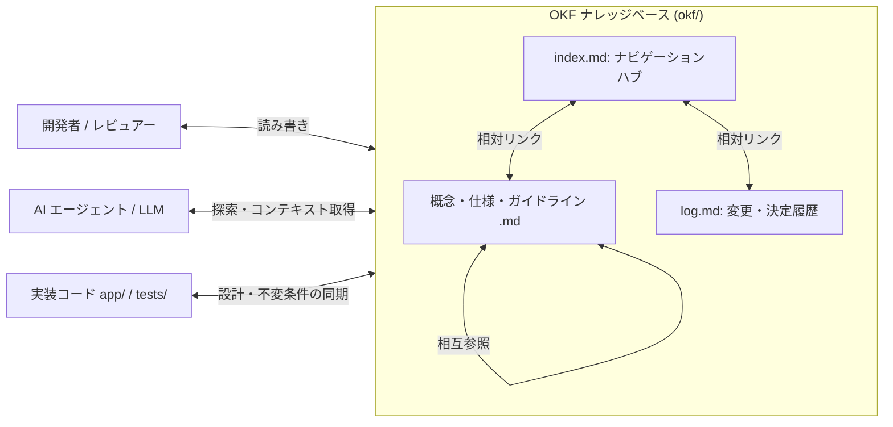

# OKF 実装・記述・運用ルール

本ドキュメントは、Google Cloud Platform が提唱する **Open Knowledge Format (OKF v0.2)** 仕様（[GoogleCloudPlatform/knowledge-catalog](https://github.com/GoogleCloudPlatform/knowledge-catalog)）に準拠した、当プロジェクト（`okf/` ディレクトリ配下）におけるナレッジベースの実装・記述・運用ルールを定義します。

---

## 1. OKF (Open Knowledge Format) とは

OKF は、組織・ドメイン・システムのナレッジ（仕様、設計判断、アーキテクチャ原則、コンテキスト）を、**人間と AI エージェント（LLM）の双方が高い精度で理解・探索・更新できる**ように標準化するオープン仕様です。



### 1.1 設計思想

1. **LLM Wiki パターン**:
   各ドキュメントを独立した「概念（Concept）」または凝集度の高いテーマとしてファイル化し、Markdown リンクで相互に結びつけることで、分散されたナレッジをグラフ構造として保持します。
2. **最小主義（Minimalism）と軽量性**:
   中央集権的なスキーマレジストリや専用プラットフォーム、特定 SDK に依存せず、リポジトリ内の Markdown + YAML Frontmatter だけで完結します（Git によるバージョン管理が可能）。
3. **寛容な消費（Permissive Consumption / Open-World Assumption）**:
   パーサーや AI エージェントは未知の Frontmatter フィールドや軽微なリンク切れに寛容であり、エラーで中断することなく利用可能な情報を最大限活用します。
4. **高情報密度（High Signal-to-Noise Ratio）**:
   冗長な装飾を排し、AI エージェントのコンテキストウィンドウを圧迫しない簡潔かつ密度の高い構造化テキスト（表、Mermaid 図、コードブロック）で記述します。

---

## 2. ディレクトリ構成と予約ファイル規約

`okf/` ディレクトリ配下は、以下の予約ファイルと構造規約に従って配置します。

```text
okf/
├── index.md            # [予約ファイル] ナレッジベース全体のエントリポイント・索引
├── log.md              # [予約ファイル] ナレッジベースの変更履歴・意思決定ログ (ADR)
├── rules.md            # [本ドキュメント] OKF 実装・記述ルール
├── review.md           # コードレビュー方針
├── testing.md          # テスト層の実装ガイドライン
├── ddd/                # トピック別サブディレクトリ (例: DDD 関連)
│   ├── domain.md              # Domain層 実装ガイドライン & 詳細仕様書
│   ├── application.md         # Application層の実装ガイドライン
│   ├── prescription.md        # Prescriptionコンテキスト 詳細仕様書
│   ├── dispensing.md          # Dispensingコンテキスト 詳細仕様書
│   └── medication_history.md  # MedicationHistoryコンテキスト 詳細仕様書
└── refa/               # 外部参照資料 (PDF、公的文書等)
```

### 2.1 予約ファイル

| ファイル名 | 役割 | 必須性 |
| :--- | :--- | :--- |
| `index.md` | ナレッジベースの目次、概要、全ドキュメントへのリンクハブ。 | **必須** |
| `log.md` | 設計判断（ADR）、仕様変更、ナレッジ更新の時系列ログ。 | **必須** |

### 2.2 サブディレクトリの運用

- 概念やコンテキストの数が増加した場合は、テーマごとにサブディレクトリ（例: `ddd/`, `architecture/`, `workflows/`）を作成して分類します。
- サブディレクトリ内のファイルも、必ずルートの `index.md`（または上位の `index.md`）から到達可能なリンクを維持します。

---

## 3. YAML Frontmatter 仕様

`okf/` 配下のすべての Markdown ファイルは、ファイルの先頭（1行目）に `---` で囲まれた YAML Frontmatter を持たなければなりません。

### 3.1 スキーマ定義

```yaml
---
type: Guideline                    # [必須] ドキュメントの種別・分類
title: Domain層 実装ガイドライン    # [推奨] ドキュメントの表示名称
description: ドメイン層の設計思想... # [推奨] 1〜2文の簡潔な要約（エージェント検索用）
okf_version: "0.2"                 # [推奨] OKF 仕様バージョン
timestamp: 2026-08-23T00:00:00Z    # [推奨] 最終更新日時 (ISO 8601 UTC)
status: active                     # [任意] ライフサイクル状態
tags: [backend, domain, ddd]       # [任意] 検索用タグの配列
sources:                           # [任意] 根拠法令・外部仕様書の参照
  - "厚生労働省 保険薬局仕様書"
---
```

### 3.2 フィールド詳細

| フィールド | 型 | 必須/推奨 | 説明 |
| :--- | :--- | :--- | :--- |
| **`type`** | `string` | **必須** | ナレッジの分類型。下記「標準 type 一覧」を参照。 |
| **`title`** | `string` | 推奨 | ドキュメントの正式名称。 |
| **`description`** | `string` | 推奨 | ドキュメント全体の要約。AI エージェントが全文を読み込む前のルーティング・適合性判定に使用。 |
| **`okf_version`** | `string` | 推奨 | OKF 仕様のバージョン。本プロジェクトでは `"0.2"` を指定。 |
| **`timestamp`** | `string` (ISO 8601) | 推奨 | 最終更新日時（UTC 表記: `YYYY-MM-DDTHH:MM:SSZ`）。 |
| **`status`** | `string` | 任意 | 文書の有効性状態: `draft`, `proposed`, `active`, `stable`, `deprecated`, `superseded`。 |
| **`tags`** | `list[string]` | 任意 | 分類・検索キーワード。 |
| **`sources`** / **`references`** | `list[string]` | 任意 | 設計の根拠となった外部 URL、法令、仕様書、関連ファイルパス。 |

### 3.3 標準 `type` 一覧

| `type` 値 | 用途 |
| :--- | :--- |
| `Index` | ナレッジベースまたはサブディレクトリの目次・索引ファイル (`index.md`) |
| `Guideline` | 開発規約、コーディング規約、テスト・レビュー方針などの行動指針 |
| `Specification` | ドメインモデル、API、データモデル等の詳細仕様書 |
| `Architecture` | システム全体のアーキテクチャ構造、コンテキストマップ、境界定義 |
| `Concept` | 個別のビジネス概念、用語定義、Domain Primitive の解説 |
| `Log` | 変更履歴、意思決定記録（ADR）、時系列ログ (`log.md`) |
| `Playbook` | 障害対応、デプロイ手順、移行手順等の運用手順書 |

---

## 4. 本文の記述・構造化ガイドライン

### 4.1 GitHub Flavored Markdown (GFM) の使用

- 見出し（`#`, `##`, `###`）を階層構造に従って論理的に構成します。
- 一覧性・比較性が必要な情報は Markdown テーブル（表）を活用します。

### 4.2 相対リンクによるナレッジグラフの形成

- 他の OKF ドキュメントを参照する場合は、必ず**相対パス**で Markdown リンクを記述します。
  ```markdown
  詳細は [Application層の実装ガイドライン](ddd/application.md) を参照してください。
  ```
- **孤立ファイルの禁止**: 作成したすべてのドキュメントは、`okf/index.md` または関連ドキュメントからリンクされ、辿れる状態に保ちます。

### 4.3 Mermaid 図による可視化

- アーキテクチャ構成、依存関係、集約関連図、処理フロー、状態遷移は Mermaid 図（` ```mermaid `）で記述します。
- 特殊文字を含むノード名は `["名前 (詳細)"]` のようにダブルクォートで囲みます。

### 4.4 「規約ではなく仕組みで守る」原則との連動

- ルールを記述する際は、単なる文章上の取り決め（規約）に留めず、**コード・型・テスト・静的チェッカのどこで機械的に強制されているか**を明記します。
- 該当する実装ファイル（`app/...`）、テストファイル（`tests/...`）、ツール（`tools/...`）への参照パスを併記します。

---

### 4.5 外部規格を引用するときの出典表記

法令・公的規格の条番号や別表番号を引用する場合は、**どの規格のどの番号か**が一意に定まるように書きます。

- **NG**: `（JAHIS レコードNo.201 / 別表15）` — レコード番号は JAHIS、別表番号は電子処方箋（処方編）のものであり、2つの規格の番号が混ざっている。
- **OK**: `（処方編Ver2.4 別表15 / JAHIS Ver.1.11 レコードNo.201 備考欄）`

複数の規格が**同じ対象に異なる値集合を定めている**場合は、値を1つの表にまとめず、規格ごとの可否を列で分けます（例: [prescription.md](ddd/prescription.md) の「`MedicineCodeType` の規格別の可否」）。混ぜると、片方の規格では送信不能な値を正当な値として実装してしまいます。

原典で確認できなかった数値（桁数・上限など）は、**推測で書かず「要確認」と明記**します。未確認の桁数がそのまま不変条件として実装されると、正当な値を弾く実装になります。

---

## 5. 運用・保守ライフサイクル

### 5.1 コードとナレッジの完全同期

- ドメインモデル、不変条件、ユースケース、アクセス制御の設計を変更した際は、**プルリクエスト / コミット内で `okf/` のドキュメントも同時に更新**します。
- ドキュメントが古くなりコードと乖離することは「設計負債」とみなします。

### 5.2 `okf/log.md` への変更記録

- 重要なアーキテクチャ判断（ADR）、コンテキスト境界の変更、不変条件の追加・修正を行った場合は、`okf/log.md` に更新日付・変更内容・判断理由を記録します。

### 5.3 レビュー時のチェック項目

コードレビューおよび AI エージェントによるタスク完了時には、以下の OKF 整合性を確認します:

1. 新規 Markdown ファイルに必須の `type` を含む YAML Frontmatter が正しく付与されているか。
2. `okf/index.md` のナレッジ一覧に登録され、リンクが正しく機能しているか。
3. 文書、docstring、エラーメッセージが**日本語**で統一されているか。
4. 設計変更に伴う更新内容が `okf/log.md` に記録されているか。
